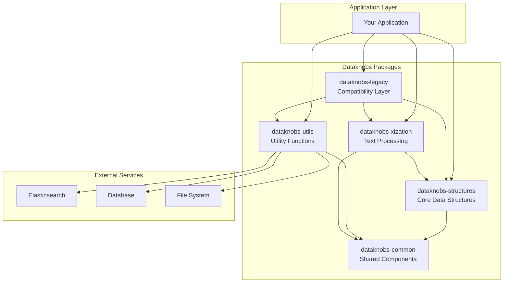
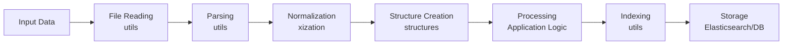

# Architecture

## Overview

Dataknobs is designed as a modular monorepo with clear separation of concerns. Each package has a specific responsibility and can be used independently or as part of the complete ecosystem.

## System Architecture



## Package Architecture

### Core Design Principles

1. **Modularity**: Each package is self-contained with minimal dependencies
2. **Composability**: Packages can be combined to build complex solutions
3. **Extensibility**: Easy to extend without modifying core code
4. **Testability**: Clear interfaces enable comprehensive testing
5. **Performance**: Optimized for large-scale data processing

### Package Responsibilities

#### dataknobs-common
- **Purpose**: Shared utilities and base classes
- **Key Components**:
  - Base exceptions
  - Type definitions
  - Shared constants
  - Common utilities

#### dataknobs-structures
- **Purpose**: Core data structures for knowledge representation
- **Key Components**:
  - `Tree`: Hierarchical data structure
  - `Document`: Document abstraction
  - `RecordStore`: Key-value storage
  - `ConditionalDict`: Rule-based dictionary

#### dataknobs-utils
- **Purpose**: Utility functions for various operations
- **Key Components**:
  - File I/O utilities
  - JSON processing
  - Elasticsearch integration
  - LLM utilities
  - Request handling

#### dataknobs-xization
- **Purpose**: Text processing and normalization
- **Key Components**:
  - Tokenization
  - Text normalization
  - Pattern masking
  - Language processing

#### dataknobs-legacy
- **Purpose**: Backward compatibility layer
- **Status**: Deprecated, for migration only

## Data Flow Architecture

### Typical Processing Pipeline



### Component Interactions

```python
# Example: Document processing pipeline
from dataknobs_utils import file_utils
from dataknobs_xization import normalize
from dataknobs_structures import Document, Tree
from dataknobs_utils import elasticsearch_utils

# 1. Read input
content = file_utils.read_file("input.txt")

# 2. Normalize text
normalized = normalize.basic_normalization_fn(content)

# 3. Create structure
doc = Document(normalized, metadata={"source": "input.txt"})
tree = Tree(doc)

# 4. Process (application-specific)
tree.process_nodes(custom_function)

# 5. Index for search
index = elasticsearch_utils.ElasticsearchIndex(...)
index.index_document(doc)
```

## Deployment Architecture

### Monorepo Structure

```
dataknobs/
├── packages/           # Independent packages
│   ├── common/
│   ├── structures/
│   ├── utils/
│   ├── xization/
│   └── legacy/
├── docs/              # Documentation
├── tests/             # Integration tests
├── bin/               # Utility scripts
└── pyproject.toml     # Workspace configuration
```

### Deployment Options

1. **Individual Package Installation**:
   ```bash
   pip install dataknobs-structures
   ```

2. **Complete Installation**:
   ```bash
   pip install dataknobs-structures dataknobs-utils dataknobs-xization
   ```

3. **Development Installation**:
   ```bash
   uv pip install -e packages/structures
   ```

## Performance Considerations

### Memory Management

- Lazy loading for large datasets
- Streaming interfaces for file processing
- Efficient tree traversal algorithms
- Caching strategies for repeated operations

### Scalability

- Horizontal scaling through parallel processing
- Batch processing capabilities
- Async I/O for network operations
- Connection pooling for database access

### Optimization Techniques

1. **Vectorization**: NumPy/Pandas for numerical operations
2. **Caching**: LRU caches for expensive computations
3. **Indexing**: Efficient data structures for lookups
4. **Streaming**: Process data without loading entirely into memory

## Security Architecture

### Security Layers

1. **Input Validation**: Sanitize all external inputs
2. **Access Control**: Permission-based file/resource access
3. **Data Encryption**: Support for encrypted storage
4. **Secure Communication**: HTTPS for external services
5. **Dependency Management**: Regular security updates

### Best Practices

- No hardcoded credentials
- Environment-based configuration
- Secure token storage
- Input sanitization
- Output encoding

## Extension Points

### Plugin Architecture

Dataknobs supports extensions through:

1. **Custom Processors**: Implement processing interfaces
2. **Storage Backends**: Add new storage adapters
3. **Normalization Rules**: Define custom text normalization
4. **Tree Traversal**: Custom traversal strategies

### Example Extension

```python
from dataknobs_structures import Tree

class CustomProcessor:
    """Custom tree processor implementation."""
    
    def process(self, tree: Tree) -> Tree:
        """Process tree with custom logic."""
        # Custom implementation
        return tree

# Register and use
processor = CustomProcessor()
result = processor.process(my_tree)
```

## Future Architecture Goals

### Short Term (Q1-Q2)
- Async/await support throughout
- GraphQL API layer
- WebAssembly bindings

### Medium Term (Q3-Q4)
- Distributed processing support
- Real-time streaming capabilities
- Cloud-native deployments

### Long Term (Next Year)
- AI/ML integration layer
- Multi-language support
- Federated architecture

## Related Documentation

- [Development Guide](index.md)
- [API Reference](../api/index.md)
- [Contributing](contributing.md)