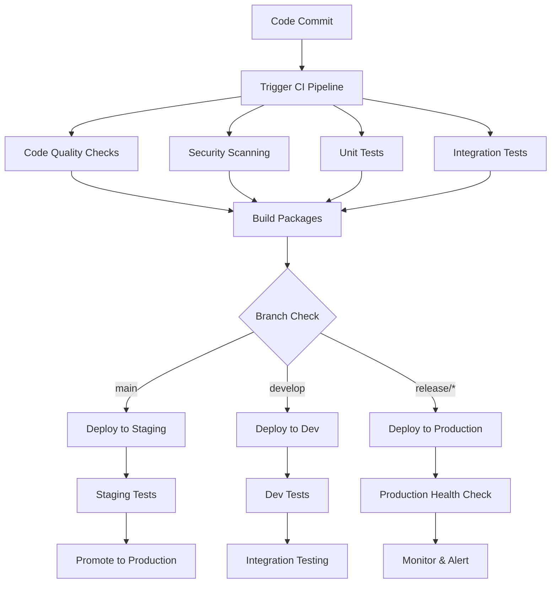

# CI/CD Pipeline

This document describes the Continuous Integration and Continuous Deployment (CI/CD) pipeline for the Dataknobs project. Our pipeline ensures code quality, runs comprehensive tests, and automates deployment processes.

## Table of Contents

- [Overview](#overview)
- [Pipeline Architecture](#pipeline-architecture)
- [GitHub Actions Workflows](#github-actions-workflows)
- [Code Quality Checks](#code-quality-checks)
- [Testing Pipeline](#testing-pipeline)
- [Build and Package](#build-and-package)
- [Deployment Strategy](#deployment-strategy)
- [Security Scanning](#security-scanning)
- [Monitoring and Alerts](#monitoring-and-alerts)
- [Troubleshooting](#troubleshooting)

## Overview

Our CI/CD pipeline is built on GitHub Actions and provides:

- **Continuous Integration**: Automated testing and quality checks on every commit
- **Continuous Deployment**: Automated releases and package publishing
- **Multi-environment Support**: Development, staging, and production deployments
- **Security Integration**: Automated security scanning and vulnerability detection
- **Performance Monitoring**: Performance regression detection

## Pipeline Architecture



## GitHub Actions Workflows

### Main CI Workflow

```yaml
# .github/workflows/ci.yml
name: CI Pipeline

on:
  push:
    branches: [ main, develop ]
  pull_request:
    branches: [ main, develop ]
  schedule:
    # Run daily at 6 AM UTC
    - cron: '0 6 * * *'

env:
  PYTHON_VERSION: '3.11'
  POETRY_VERSION: '1.6.1'

jobs:
  code-quality:
    name: Code Quality Checks
    runs-on: ubuntu-latest
    
    steps:
    - name: Checkout code
      uses: actions/checkout@v4
    
    - name: Set up Python
      uses: actions/setup-python@v4
      with:
        python-version: ${{ env.PYTHON_VERSION }}
    
    - name: Install Poetry
      uses: snok/install-poetry@v1
      with:
        version: ${{ env.POETRY_VERSION }}
    
    - name: Install dependencies
      run: |
        poetry install --with dev,test
    
    - name: Run Black (formatting)
      run: |
        poetry run black --check packages/ tests/
    
    - name: Run isort (import sorting)
      run: |
        poetry run isort --check-only packages/ tests/
    
    - name: Run flake8 (linting)
      run: |
        poetry run flake8 packages/ tests/
    
    - name: Run mypy (type checking)
      run: |
        poetry run mypy packages/
    
    - name: Run pylint (code analysis)
      run: |
        poetry run pylint packages/ --output-format=github

  security-scan:
    name: Security Scanning
    runs-on: ubuntu-latest
    
    steps:
    - name: Checkout code
      uses: actions/checkout@v4
    
    - name: Run Bandit (security linting)
      run: |
        pip install bandit[toml]
        bandit -r packages/ -f json -o bandit-report.json
    
    - name: Upload Bandit results
      uses: actions/upload-artifact@v3
      if: always()
      with:
        name: bandit-results
        path: bandit-report.json
    
    - name: Run Safety (dependency vulnerabilities)
      run: |
        pip install safety
        safety check --json --output safety-report.json
    
    - name: Upload Safety results
      uses: actions/upload-artifact@v3
      if: always()
      with:
        name: safety-results
        path: safety-report.json

  test:
    name: Test Suite
    runs-on: ${{ matrix.os }}
    strategy:
      matrix:
        os: [ubuntu-latest, windows-latest, macos-latest]
        python-version: ['3.8', '3.9', '3.10', '3.11']
        exclude:
          # Reduce matrix size for faster builds
          - os: windows-latest
            python-version: '3.8'
          - os: macos-latest
            python-version: '3.8'
    
    steps:
    - name: Checkout code
      uses: actions/checkout@v4
    
    - name: Set up Python ${{ matrix.python-version }}
      uses: actions/setup-python@v4
      with:
        python-version: ${{ matrix.python-version }}
    
    - name: Install Poetry
      uses: snok/install-poetry@v1
      with:
        version: ${{ env.POETRY_VERSION }}
    
    - name: Install dependencies
      run: |
        poetry install --with dev,test
    
    - name: Run unit tests
      run: |
        poetry run pytest tests/unit/ \
          --cov=packages/ \
          --cov-report=xml \
          --cov-report=term-missing \
          --junit-xml=junit-unit.xml
    
    - name: Run integration tests
      run: |
        poetry run pytest tests/integration/ \
          --junit-xml=junit-integration.xml
    
    - name: Upload test results
      uses: actions/upload-artifact@v3
      if: always()
      with:
        name: test-results-${{ matrix.os }}-${{ matrix.python-version }}
        path: |
          junit-*.xml
          coverage.xml
    
    - name: Upload coverage to Codecov
      uses: codecov/codecov-action@v3
      if: matrix.os == 'ubuntu-latest' && matrix.python-version == '3.11'
      with:
        file: ./coverage.xml
        flags: unittests
        name: codecov-umbrella
        fail_ci_if_error: true

  build:
    name: Build Packages
    runs-on: ubuntu-latest
    needs: [code-quality, security-scan, test]
    
    steps:
    - name: Checkout code
      uses: actions/checkout@v4
      with:
        fetch-depth: 0  # Full history for versioning
    
    - name: Set up Python
      uses: actions/setup-python@v4
      with:
        python-version: ${{ env.PYTHON_VERSION }}
    
    - name: Install Poetry
      uses: snok/install-poetry@v1
      with:
        version: ${{ env.POETRY_VERSION }}
    
    - name: Build packages
      run: |
        cd packages/common && poetry build
        cd ../structures && poetry build
        cd ../utils && poetry build
        cd ../xization && poetry build
    
    - name: Upload build artifacts
      uses: actions/upload-artifact@v3
      with:
        name: packages
        path: packages/*/dist/
    
    - name: Test package installation
      run: |
        pip install packages/common/dist/*.whl
        pip install packages/structures/dist/*.whl
        pip install packages/utils/dist/*.whl
        pip install packages/xization/dist/*.whl
        python -c "import dataknobs_common, dataknobs_structures, dataknobs_utils, dataknobs_xization"
```

### Release Workflow

```yaml
# .github/workflows/release.yml
name: Release Pipeline

on:
  push:
    tags:
      - 'v*.*.*'
  release:
    types: [published]

jobs:
  release:
    name: Build and Publish Release
    runs-on: ubuntu-latest
    
    steps:
    - name: Checkout code
      uses: actions/checkout@v4
      with:
        fetch-depth: 0
    
    - name: Set up Python
      uses: actions/setup-python@v4
      with:
        python-version: '3.11'
    
    - name: Install Poetry
      uses: snok/install-poetry@v1
      with:
        version: '1.6.1'
    
    - name: Build packages
      run: |
        cd packages/common && poetry build
        cd ../structures && poetry build
        cd ../utils && poetry build
        cd ../xization && poetry build
    
    - name: Publish to PyPI
      env:
        POETRY_PYPI_TOKEN_PYPI: ${{ secrets.PYPI_API_TOKEN }}
      run: |
        cd packages/common && poetry publish
        cd ../structures && poetry publish
        cd ../utils && poetry publish
        cd ../xization && poetry publish
    
    - name: Create GitHub Release
      uses: softprops/action-gh-release@v1
      with:
        files: packages/*/dist/*
        generate_release_notes: true
      env:
        GITHUB_TOKEN: ${{ secrets.GITHUB_TOKEN }}
```

### Documentation Workflow

```yaml
# .github/workflows/docs.yml
name: Documentation

on:
  push:
    branches: [ main ]
  pull_request:
    branches: [ main ]
    paths: [ 'docs/**', 'packages/**/*.py', 'mkdocs.yml' ]

jobs:
  docs:
    name: Build and Deploy Documentation
    runs-on: ubuntu-latest
    
    steps:
    - name: Checkout code
      uses: actions/checkout@v4
    
    - name: Set up Python
      uses: actions/setup-python@v4
      with:
        python-version: '3.11'
    
    - name: Install dependencies
      run: |
        pip install -r docs/requirements.txt
    
    - name: Build documentation
      run: |
        mkdocs build --strict
    
    - name: Deploy to GitHub Pages
      if: github.ref == 'refs/heads/main'
      uses: peaceiris/actions-gh-pages@v3
      with:
        github_token: ${{ secrets.GITHUB_TOKEN }}
        publish_dir: ./site
```

## Code Quality Checks

### Code Formatting

```bash
# Black - Code formatting
black --line-length 88 packages/ tests/

# isort - Import sorting
isort packages/ tests/

# Configuration in pyproject.toml
[tool.black]
line-length = 88
target-version = ['py38']
include = '\.pyi?$'

[tool.isort]
profile = "black"
multi_line_output = 3
line_length = 88
```

### Linting

```bash
# flake8 - Style and error checking
flake8 packages/ tests/

# pylint - Advanced code analysis
pylint packages/ --output-format=colorized

# Configuration in setup.cfg
[flake8]
max-line-length = 88
extend-ignore = E203, W503
exclude = __pycache__,*.egg-info,.tox,.venv
```

### Type Checking

```bash
# mypy - Static type checking
mypy packages/

# Configuration in pyproject.toml
[tool.mypy]
python_version = "3.8"
warn_return_any = true
warn_unused_configs = true
disallow_untyped_defs = true
```

## Testing Pipeline

### Test Execution Strategy

```bash
# Unit tests - Fast, isolated
pytest tests/unit/ -x --ff

# Integration tests - Slower, component interaction
pytest tests/integration/ --maxfail=5

# End-to-end tests - Slowest, full workflows
pytest tests/e2e/ --dist=loadscope

# Performance tests - Benchmark critical paths
pytest tests/performance/ --benchmark-only
```

### Test Configuration

```toml
# pyproject.toml
[tool.pytest.ini_options]
testpaths = ["tests"]
addopts = [
    "--strict-markers",
    "--strict-config",
    "--cov=packages",
    "--cov-branch",
    "--cov-report=term-missing:skip-covered",
    "--cov-report=html:reports/coverage",
    "--cov-report=xml",
    "--junit-xml=reports/junit.xml",
]
markers = [
    "slow: marks tests as slow",
    "integration: marks tests as integration tests",
    "e2e: marks tests as end-to-end tests",
    "performance: marks tests as performance benchmarks",
]
```

## Build and Package

### Package Building

```bash
# Build all packages
for package in common structures utils xization; do
    cd packages/$package
    poetry build
    cd ../..
done

# Verify package contents
tar -tzf packages/structures/dist/dataknobs-structures-*.tar.gz

# Test installation
pip install packages/structures/dist/*.whl
python -c "import dataknobs_structures; print('✓ Package imports successfully')"
```

### Version Management

```bash
# Semantic versioning with poetry
poetry version patch    # 1.0.0 -> 1.0.1
poetry version minor    # 1.0.0 -> 1.1.0
poetry version major    # 1.0.0 -> 2.0.0

# Automatic versioning with commitizen
cz bump --changelog
```

## Deployment Strategy

### Environment Configuration

```yaml
# environments/development.yml
apiVersion: v1
kind: ConfigMap
metadata:
  name: dataknobs-config-dev
data:
  ENVIRONMENT: "development"
  LOG_LEVEL: "DEBUG"
  DATABASE_URL: "postgresql://dev-db:5432/dataknobs_dev"
  ELASTICSEARCH_URL: "http://dev-elasticsearch:9200"
```

### Deployment Scripts

```bash
#!/bin/bash
# scripts/deploy.sh

set -e

ENVIRONMENT=${1:-development}
VERSION=${2:-latest}

echo "Deploying to $ENVIRONMENT (version: $VERSION)"

# Validate environment
case $ENVIRONMENT in
  development|staging|production)
    echo "Valid environment: $ENVIRONMENT"
    ;;
  *)
    echo "Invalid environment: $ENVIRONMENT"
    exit 1
    ;;
esac

# Deploy packages
for package in common structures utils xization; do
    echo "Deploying dataknobs-$package..."
    pip install --upgrade "dataknobs-$package==$VERSION"
done

# Health check
python -c "
import dataknobs_common, dataknobs_structures, dataknobs_utils, dataknobs_xization
print('✓ All packages deployed successfully')
"

echo "Deployment complete!"
```

### Container Deployment

```dockerfile
# docker/Dockerfile.prod
FROM python:3.11-slim

# Set working directory
WORKDIR /app

# Install system dependencies
RUN apt-get update && apt-get install -y \
    gcc \
    && rm -rf /var/lib/apt/lists/*

# Copy requirements
COPY requirements.txt .

# Install Python dependencies
RUN pip install --no-cache-dir -r requirements.txt

# Copy application
COPY packages/ ./packages/

# Install dataknobs packages
RUN pip install -e packages/common \
    && pip install -e packages/structures \
    && pip install -e packages/utils \
    && pip install -e packages/xization

# Health check
HEALTHCHECK --interval=30s --timeout=30s --start-period=5s --retries=3 \
    CMD python -c "import dataknobs_common, dataknobs_structures, dataknobs_utils, dataknobs_xization" || exit 1

# Run application
CMD ["python", "-m", "your_application"]
```

## Security Scanning

### Dependency Scanning

```bash
# Safety - Check for known vulnerabilities
safety check
safety check --json --output safety-report.json

# pip-audit - Alternative vulnerability scanner
pip-audit --format=json --output=audit-report.json
```

### Code Security Scanning

```bash
# Bandit - Security linting
bandit -r packages/ -f json -o bandit-report.json

# Semgrep - Static analysis security scanner
semgrep --config=python packages/
```

### Container Security

```yaml
# .github/workflows/security.yml
- name: Run Trivy vulnerability scanner
  uses: aquasecurity/trivy-action@master
  with:
    image-ref: 'dataknobs:latest'
    format: 'sarif'
    output: 'trivy-results.sarif'

- name: Upload Trivy scan results
  uses: github/codeql-action/upload-sarif@v2
  with:
    sarif_file: 'trivy-results.sarif'
```

## Monitoring and Alerts

### Pipeline Monitoring

```yaml
# Slack notifications for failures
- name: Notify Slack on failure
  if: failure()
  uses: 8398a7/action-slack@v3
  with:
    status: failure
    channel: '#ci-cd'
    text: 'CI Pipeline failed for ${{ github.repository }}'
  env:
    SLACK_WEBHOOK_URL: ${{ secrets.SLACK_WEBHOOK }}
```

### Performance Monitoring

```python
# tests/performance/test_benchmarks.py
import pytest

@pytest.mark.benchmark
def test_tree_creation_performance(benchmark):
    """Benchmark tree creation performance."""
    from dataknobs_structures import Tree
    
    def create_large_tree():
        root = Tree("root")
        for i in range(1000):
            child = root.add_child(f"child_{i}")
            for j in range(10):
                child.add_child(f"grandchild_{i}_{j}")
        return root
    
    result = benchmark(create_large_tree)
    assert result.num_children == 1000
```

### Health Checks

```bash
#!/bin/bash
# scripts/health-check.sh

set -e

echo "Running health checks..."

# Check package imports
python -c "
import dataknobs_common, dataknobs_structures, dataknobs_utils, dataknobs_xization
print('✓ All packages import successfully')
"

# Check basic functionality
python -c "
from dataknobs_structures import Tree
tree = Tree('test')
child = tree.add_child('child')
assert tree.num_children == 1
print('✓ Basic functionality works')
"

echo "Health checks passed!"
```

## Troubleshooting

### Common Pipeline Issues

1. **Test Failures**:
   ```bash
   # Debug test failures locally
   pytest tests/unit/test_failing.py -vv --tb=long
   
   # Run tests with same environment as CI
   docker run --rm -v $(pwd):/app python:3.11-slim bash -c "
   cd /app && 
   pip install poetry && 
   poetry install --with dev,test && 
   poetry run pytest
   "
   ```

2. **Build Failures**:
   ```bash
   # Check build locally
   cd packages/structures
   poetry build
   pip install dist/*.whl
   python -c "import dataknobs_structures"
   ```

3. **Dependency Conflicts**:
   ```bash
   # Check dependency resolution
   poetry lock --check
   poetry show --tree
   
   # Update dependencies
   poetry update
   ```

### Pipeline Debugging

```yaml
# Add debug step to workflow
- name: Debug Environment
  run: |
    echo "Python version: $(python --version)"
    echo "Pip version: $(pip --version)"
    echo "Poetry version: $(poetry --version)"
    echo "Installed packages:"
    pip list
    echo "Environment variables:"
    env | sort
```

### Performance Issues

```bash
# Profile test execution
pytest --profile

# Run tests in parallel
pytest -n auto

# Use test result caching
pytest --cache-clear  # Clear cache
pytest --lf           # Run last failed
pytest --ff           # Run failures first
```

## Best Practices

### Pipeline Optimization

1. **Parallel Execution**: Run independent jobs in parallel
2. **Caching**: Cache dependencies and build artifacts
3. **Fail Fast**: Stop on first critical failure
4. **Incremental Testing**: Only test changed code when possible

### Security Best Practices

1. **Secret Management**: Use GitHub secrets for sensitive data
2. **Least Privilege**: Grant minimal required permissions
3. **Dependency Scanning**: Regularly scan for vulnerabilities
4. **Code Signing**: Sign releases for authenticity

### Monitoring and Alerting

1. **Pipeline Metrics**: Track build times and failure rates
2. **Quality Gates**: Enforce code quality thresholds
3. **Early Warning**: Alert on degrading metrics
4. **Post-deployment Monitoring**: Monitor application health

## Resources

- [GitHub Actions Documentation](https://docs.github.com/en/actions)
- [Poetry Documentation](https://python-poetry.org/docs/)
- [pytest Documentation](https://docs.pytest.org/)
- [Docker Best Practices](https://docs.docker.com/develop/dev-best-practices/)
- [Security Scanning Tools](https://github.com/analysis-tools-dev/static-analysis)

---

This CI/CD pipeline ensures high code quality, comprehensive testing, and reliable deployments for the Dataknobs project. For questions or improvements, please create an issue or start a discussion on GitHub.