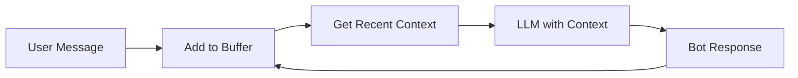

# Memory Chatbot Example

A chatbot with conversation memory for context-aware responses.

## Overview

This example demonstrates:

- Buffer memory for conversation context
- Context-aware responses using message history
- Configuration-based memory setup

## Prerequisites

```bash
# Install Ollama: https://ollama.ai/

# Pull the required model
ollama pull gemma3:3b

# Install dataknobs-bots
pip install dataknobs-bots
```

## What Changed from Simple Chatbot?

We added a `memory` section to the configuration:

```python
config = {
    "llm": {
        "provider": "ollama",
        "model": "gemma3:3b"
    },
    "conversation_storage": {
        "backend": "memory"
    },
    "memory": {
        "type": "buffer",        # Buffer memory (sliding window)
        "max_messages": 10        # Keep last 10 messages
    }
}
```

## How It Works

### Buffer Memory

Buffer memory maintains a sliding window of recent messages:

1. User sends message → Added to buffer
2. Bot responds → Response added to buffer
3. Buffer exceeds max_messages → Oldest messages removed
4. Next message → Recent history included in context

### Memory Flow



## Complete Code

```python title="02_chatbot_with_memory.py"
--8<-- "packages/bots/examples/02_chatbot_with_memory.py"
```

## Running the Example

```bash
cd packages/bots
python examples/02_chatbot_with_memory.py
```

## Expected Output

The bot now remembers previous messages:

```
User: My name is Alice.
Bot: Hello Alice! Nice to meet you.

User: What's my name?
Bot: Your name is Alice.

User: What did I just tell you?
Bot: You told me your name is Alice.
```

## Memory Types

### Buffer Memory

Simple sliding window (used in this example):

```python
"memory": {
    "type": "buffer",
    "max_messages": 10  # Last 10 messages
}
```

**Pros**: Fast, simple, predictable
**Cons**: Limited context, doesn't prioritize important information

### Vector Memory

Semantic search over conversation history:

```python
"memory": {
    "type": "vector",
    "max_messages": 100,
    "top_k": 5,  # Retrieve 5 most relevant messages
    "embedding_provider": "ollama",
    "embedding_model": "nomic-embed-text"
}
```

**Pros**: Finds relevant messages regardless of recency
**Cons**: Slower, requires embedding model

## Choosing max_messages

| max_messages | Use Case | Token Usage |
|-------------|----------|-------------|
| 5-10 | Short conversations | Low |
| 10-20 | Standard conversations | Medium |
| 20-50 | Long conversations | High |
| 50+ | Document-length conversations | Very High |

**Recommendation**: Start with 10-20 for most use cases.

## Key Takeaways

1. ✅ **Context Awareness** - Bot remembers conversation history
2. ✅ **Easy Configuration** - Just add `memory` section
3. ✅ **Sliding Window** - Automatic management of context size
4. ✅ **Token Efficiency** - Only recent messages included

## Customization

### Longer Memory

```python
"memory": {
    "type": "buffer",
    "max_messages": 20  # Remember more messages
}
```

### Semantic Memory

```python
"memory": {
    "type": "vector",
    "max_messages": 100,
    "embedding_provider": "ollama",
    "embedding_model": "nomic-embed-text"
}
```

## What's Next?

To add knowledge retrieval, see the [RAG Chatbot Example](rag-chatbot.md).

## Related Examples

- [Simple Chatbot](simple-chatbot.md) - Basic bot without memory
- [RAG Chatbot](rag-chatbot.md) - Add knowledge base
- [Multi-Tenant Bot](multi-tenant.md) - Multiple clients

## Related Documentation

- [User Guide - Memory Systems](../guides/user-guide.md#tutorial-2-adding-memory)
- [Configuration Reference](../guides/configuration.md)
- [API Reference - Memory](../api/reference.md#memory)
