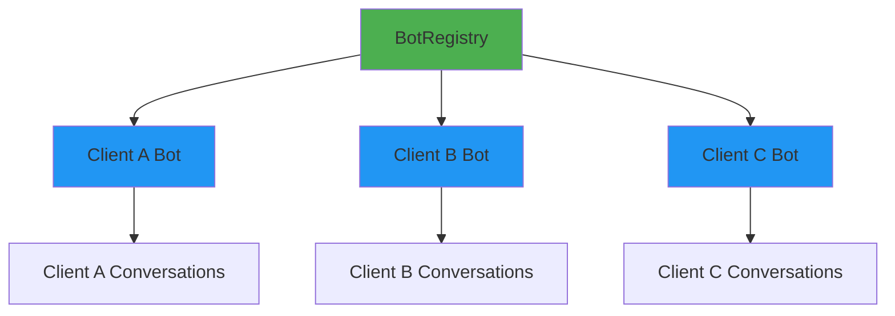

# Multi-Tenant Bot Example

Single bot instance serving multiple clients with isolated conversations.

## Overview

This example demonstrates:

- BotRegistry for multi-tenant management
- Client-specific configurations
- Conversation isolation
- Bot caching and performance

## Prerequisites

```bash
# Install Ollama: https://ollama.ai/

# Pull the required model
ollama pull gemma3:3b

# Install dataknobs-bots
pip install dataknobs-bots
```

## What is Multi-Tenancy?

**Multi-tenancy** allows a single bot deployment to serve multiple clients (tenants) where:

- Each client has isolated conversations
- Each client can have custom configuration
- Bots are cached for performance
- Horizontal scaling is supported

### Architecture



## Configuration

### Base Configuration

```python
base_config = {
    "llm": {
        "provider": "ollama",
        "model": "gemma3:3b"
    },
    "conversation_storage": {
        "backend": "postgres",  # Shared storage
        "connection": {
            "host": "localhost",
            "database": "bots_db"
        }
    }
}

registry = BotRegistry(
    config=base_config,
    cache_ttl=300,          # Cache bots for 5 minutes
    max_cache_size=1000     # Max 1000 cached bots
)
```

### Client-Specific Configuration

```python
# Register Client A with custom memory
await registry.register_client(
    "client-a",
    {
        "memory": {"type": "buffer", "max_messages": 10},
        "prompts": {
            "system": "You are a customer support assistant."
        }
    }
)

# Register Client B with different settings
await registry.register_client(
    "client-b",
    {
        "memory": {"type": "buffer", "max_messages": 20},
        "prompts": {
            "system": "You are a technical expert."
        }
    }
)
```

## Complete Code

```python title="05_multi_tenant.py"
--8<-- "packages/bots/examples/05_multi_tenant.py"
```

## Running the Example

```bash
cd packages/bots
python examples/05_multi_tenant.py
```

## Expected Output

```
============================================================
Multi-Tenant Bot Example
============================================================

Registering clients...
✓ Client A registered (customer support)
✓ Client B registered (technical expert)

--- Client A Conversation ---
User: How do I reset my password?
Bot: To reset your password, please follow these steps...

--- Client B Conversation ---
User: Explain async/await in Python
Bot: Async/await is a feature in Python for writing...

--- Client A Again (from cache) ---
User: Do you remember me?
Bot: Yes, you asked about password reset earlier.
```

## How It Works

### 1. Bot Registry

The registry manages multiple bots:

```python
registry = BotRegistry(
    config=base_config,
    cache_ttl=300,      # Bots cached for 5 minutes
    max_cache_size=1000 # LRU cache of 1000 bots
)
```

### 2. Client Registration

Register clients with custom configs:

```python
await registry.register_client(
    client_id="client-a",
    bot_config={
        "memory": {"type": "buffer", "max_messages": 10},
        "prompts": {"system": "Custom system prompt"}
    }
)
```

### 3. Getting Bots

Retrieve bot for a client:

```python
bot = await registry.get_bot("client-a")
# First call: Creates new bot
# Subsequent calls: Returns cached bot
```

### 4. Conversation Isolation

Each client uses their own context:

```python
context_a = BotContext(
    conversation_id="conv-a-001",
    client_id="client-a"  # Isolates data
)

context_b = BotContext(
    conversation_id="conv-b-001",
    client_id="client-b"  # Different client
)
```

## Caching Strategy

### LRU Cache

Least Recently Used (LRU) caching:

```python
registry = BotRegistry(
    config=base_config,
    cache_ttl=300,          # 5 minutes
    max_cache_size=1000     # Max size
)
```

- Frequently used bots stay in cache
- Inactive bots are evicted
- TTL ensures fresh configurations

### Cache Management

```python
# Force refresh a bot
bot = await registry.get_bot("client-a", force_refresh=True)

# Get cached client IDs
cached = registry.get_cached_clients()

# Clear entire cache
registry.clear_cache()

# Remove specific client
await registry.remove_client("client-a")
```

## Storage Backend

### PostgreSQL (Recommended)

```python
"conversation_storage": {
    "backend": "postgres",
    "connection": {
        "host": "localhost",
        "port": 5432,
        "database": "bots_db",
        "user": "postgres",
        "password": "password"
    },
    "pool_size": 20  # Connection pool
}
```

**Benefits**:
- Persistent storage
- Client isolation via client_id
- Connection pooling
- Transaction support

### Memory Backend

```python
"conversation_storage": {
    "backend": "memory"
}
```

**Use For**: Development and testing only

## Client Configuration Patterns

### Minimal Override

```python
await registry.register_client(
    "client-a",
    {
        "prompts": {"system": "Custom prompt"}
    }
)
```

Inherits everything from base_config except prompts.

### Complete Override

```python
await registry.register_client(
    "client-b",
    {
        "llm": {"provider": "openai", "model": "gpt-4"},
        "memory": {"type": "vector"},
        "knowledge_base": {"enabled": True}
    }
)
```

Overrides multiple settings.

## Scaling Patterns

### Horizontal Scaling

Deploy multiple instances behind a load balancer:

```
Load Balancer
    ├── Bot Instance 1 (BotRegistry)
    ├── Bot Instance 2 (BotRegistry)
    └── Bot Instance 3 (BotRegistry)
            ↓
    PostgreSQL Database
```

### Vertical Scaling

Increase cache size for single instance:

```python
registry = BotRegistry(
    config=base_config,
    cache_ttl=600,      # 10 minutes
    max_cache_size=5000 # 5000 bots cached
)
```

## Best Practices

### 1. Use PostgreSQL

```python
"conversation_storage": {
    "backend": "postgres"
}
```

### 2. Configure Connection Pooling

```python
"conversation_storage": {
    "backend": "postgres",
    "pool_size": 20,
    "max_overflow": 10
}
```

### 3. Set Appropriate Cache TTL

| Scenario | cache_ttl |
|----------|-----------|
| Frequent config changes | 60-300 |
| Stable configs | 600-1800 |
| Static configs | 3600+ |

### 4. Monitor Cache Size

```python
cached = registry.get_cached_clients()
print(f"Cached bots: {len(cached)}")
```

### 5. Client Isolation

Always include client_id in BotContext:

```python
context = BotContext(
    conversation_id=f"conv-{client_id}-{session_id}",
    client_id=client_id  # Critical for isolation
)
```

## Key Takeaways

1. ✅ **Client Isolation** - Each client has separate data
2. ✅ **Custom Configuration** - Per-client customization
3. ✅ **Performance** - LRU caching reduces overhead
4. ✅ **Scalable** - Stateless design supports horizontal scaling

## Common Use Cases

### SaaS Application

```python
# Each company is a client
await registry.register_client(
    "company-123",
    {
        "memory": {"type": "buffer"},
        "knowledge_base": {
            "documents_path": f"/data/company-123/docs"
        }
    }
)
```

### API Service

```python
# Different API keys = different clients
@app.post("/chat")
async def chat(api_key: str, message: str):
    bot = await registry.get_bot(api_key)
    context = BotContext(
        conversation_id=request.session_id,
        client_id=api_key
    )
    return await bot.chat(message, context)
```

## What's Next?

To learn about configuration-driven tools, see the [Custom Tools Example](custom-tools.md).

## Related Examples

- [Simple Chatbot](simple-chatbot.md) - Basic bot
- [ReAct Agent](react-agent.md) - Tool-using agent
- [Custom Tools](custom-tools.md) - Tool configuration

## Related Documentation

- [User Guide - Multi-Tenancy](../guides/user-guide.md#multi-tenant-deployment)
- [Architecture](../guides/architecture.md)
- [API Reference - Registry](../api/reference.md#core-classes)
