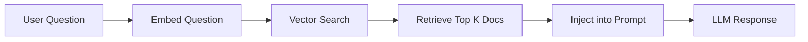

# RAG Chatbot Example

A chatbot with knowledge base integration using Retrieval Augmented Generation (RAG).

## Overview

This example demonstrates:

- Loading markdown documents into a knowledge base
- Vector search for relevant information
- Automatic context injection into prompts
- RAG-enhanced responses

## Prerequisites

```bash
# Install Ollama: https://ollama.ai/

# Pull required models
ollama pull gemma3:1b          # For chat
ollama pull nomic-embed-text   # For embeddings

# Install dataknobs-bots with FAISS
pip install dataknobs-bots[faiss]
```

## What is RAG?

**Retrieval Augmented Generation** enhances LLM responses by:

1. **Retrieval** - Finding relevant documents from a knowledge base
2. **Augmentation** - Adding retrieved context to the prompt
3. **Generation** - LLM generates response with context

### RAG Flow



## Configuration

Add a `knowledge_base` section:

```python
config = {
    "llm": {
        "provider": "ollama",
        "model": "gemma3:1b"
    },
    "conversation_storage": {
        "backend": "memory"
    },
    "knowledge_base": {
        "enabled": True,
        "documents_path": "./my_docs",  # Directory with markdown files
        "vector_store": {
            "backend": "faiss",         # FAISS vector database
            "dimension": 384            # Embedding dimension
        },
        "embedding_provider": "ollama",
        "embedding_model": "nomic-embed-text",
        "chunking": {
            "max_chunk_size": 500,      # Maximum chunk size
            "chunk_overlap": 50          # Overlap between chunks
        }
    }
}
```

## Complete Code

```python title="03_rag_chatbot.py"
--8<-- "packages/bots/examples/03_rag_chatbot.py"
```

## Running the Example

```bash
cd packages/bots
python examples/03_rag_chatbot.py
```

## How It Works

### 1. Document Preparation

Create markdown documents in your knowledge base:

```markdown
# Product Features

Our product offers:
- Fast processing
- Easy integration
- Scalable architecture

# Pricing

- Basic: $10/month
- Pro: $50/month
- Enterprise: Contact sales
```

### 2. Document Loading

The bot automatically:

1. Loads all markdown files from `documents_path`
2. Chunks documents intelligently (respects headers)
3. Creates embeddings for each chunk
4. Stores embeddings in FAISS vector database

### 3. Query Time

When a user asks a question:

1. Question is embedded using the same model
2. Vector search finds most similar chunks
3. Relevant chunks are injected into the prompt
4. LLM generates response with context

## Expected Output

```
Loading knowledge base...
Loading documents from: ./my_docs
Loaded 3 documents with 24 chunks
✓ Knowledge base ready

User: What are the product features?
Bot: According to our documentation, the product offers:
- Fast processing
- Easy integration
- Scalable architecture

User: How much does the Pro plan cost?
Bot: The Pro plan costs $50/month.
```

## Vector Store Backends

### FAISS (Recommended for Development)

```python
"vector_store": {
    "backend": "faiss",
    "dimension": 384
}
```

**Pros**: Fast, local, no dependencies
**Cons**: In-memory only, doesn't persist

### Chroma

```python
"vector_store": {
    "backend": "chroma",
    "persist_directory": "./chroma_db"
}
```

**Pros**: Persists to disk, easy to use
**Cons**: Requires separate package

### Pinecone (Production)

```python
"vector_store": {
    "backend": "pinecone",
    "api_key": "your-api-key",
    "environment": "us-west1-gcp",
    "index_name": "my-index"
}
```

**Pros**: Managed, scalable, persistent
**Cons**: Costs money, requires API key

## Chunking Strategies

### Default Chunking

```python
"chunking": {
    "max_chunk_size": 500,
    "chunk_overlap": 50
}
```

Good for general content.

### Larger Chunks

```python
"chunking": {
    "max_chunk_size": 1000,
    "chunk_overlap": 100
}
```

Better for dense technical content.

### Smaller Chunks

```python
"chunking": {
    "max_chunk_size": 300,
    "chunk_overlap": 30
}
```

Better for FAQ-style content.

## Query Parameters

Control retrieval behavior:

```python
results = await kb.query(
    query="What are the features?",
    k=5,                    # Top 5 chunks
    min_similarity=0.7,     # Minimum similarity threshold
    filter_metadata={       # Filter by metadata
        "category": "product"
    }
)
```

## Best Practices

### Document Organization

```
docs/
├── product/
│   ├── features.md
│   └── pricing.md
├── support/
│   ├── faq.md
│   └── troubleshooting.md
└── api/
    ├── getting-started.md
    └── reference.md
```

### Document Format

Use clear markdown structure:

```markdown
# Main Topic

## Subtopic 1

Content for subtopic 1...

## Subtopic 2

Content for subtopic 2...
```

### Metadata

Add metadata to documents for filtering:

```python
await kb.load_markdown_document(
    "docs/product.md",
    metadata={"category": "product", "version": "1.0"}
)
```

## Key Takeaways

1. ✅ **Grounded Responses** - Bot answers from your documents
2. ✅ **Smart Chunking** - Respects document structure
3. ✅ **Vector Search** - Finds relevant content semantically
4. ✅ **Easy Setup** - Just point to document directory

## Common Issues

### Embedding Model Not Found

```
Error: model 'nomic-embed-text' not found
```

**Solution**:
```bash
ollama pull nomic-embed-text
```

### FAISS Not Installed

```
ModuleNotFoundError: No module named 'faiss'
```

**Solution**:
```bash
pip install faiss-cpu
```

### No Documents Found

```
Warning: No documents found in ./my_docs
```

**Solution**: Ensure directory exists and contains `.md` files.

## What's Next?

To add tool use and reasoning, see the [ReAct Agent Example](react-agent.md).

## Related Examples

- [Memory Chatbot](memory-chatbot.md) - Add conversation memory
- [ReAct Agent](react-agent.md) - Add tools and reasoning
- [Custom Tools](custom-tools.md) - Configuration-driven tools

## Related Documentation

- [User Guide - RAG](../guides/user-guide.md#tutorial-4-building-a-rag-chatbot)
- [Configuration Reference](../guides/configuration.md)
- [API Reference - Knowledge Base](../api/reference.md#knowledge-base)
