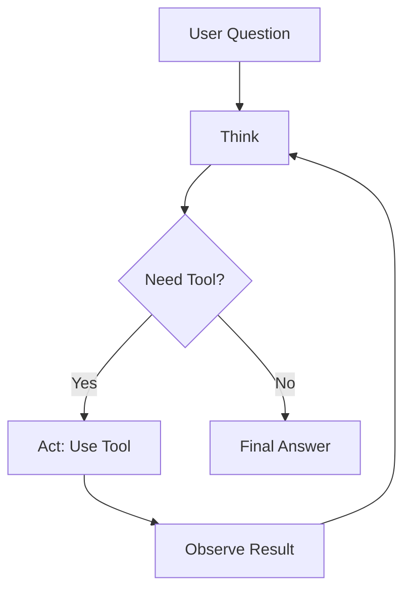

# ReAct Agent Example

A tool-using agent with Reasoning + Acting (ReAct) pattern.

## Overview

This example demonstrates:

- Custom tool creation
- ReAct reasoning strategy
- Tool execution and reasoning trace
- Configuration-driven tool loading

## Prerequisites

```bash
# Install Ollama: https://ollama.ai/

# Pull the required model (phi3 is better for tool use)
ollama pull phi3:mini

# Install dataknobs-bots
pip install dataknobs-bots
```

## What is ReAct?

**ReAct** (Reasoning + Acting) is a prompting pattern where the LLM:

1. **Thinks** - Reasons about what to do next
2. **Acts** - Decides to use a tool
3. **Observes** - Sees the tool result
4. **Repeats** - Until the answer is found

### ReAct Flow



## Configuration

Add `reasoning` and `tools` sections:

```python
config = {
    "llm": {
        "provider": "ollama",
        "model": "phi3:mini"  # Better for tool use
    },
    "conversation_storage": {
        "backend": "memory"
    },
    "reasoning": {
        "strategy": "react",
        "max_iterations": 5,  # Maximum reasoning steps
        "verbose": True        # Show reasoning trace
    },
    "tools": [
        {
            "class": "examples.tools.CalculatorTool",
            "params": {"precision": 2}
        }
    ]
}
```

## Creating a Custom Tool

Tools implement the `Tool` interface:

```python
from dataknobs_llm.tools import Tool
from typing import Dict, Any

class CalculatorTool(Tool):
    def __init__(self, precision: int = 2):
        super().__init__(
            name="calculator",
            description="Performs basic arithmetic operations"
        )
        self.precision = precision

    @property
    def schema(self) -> Dict[str, Any]:
        """JSON schema defining tool parameters."""
        return {
            "type": "object",
            "properties": {
                "operation": {
                    "type": "string",
                    "enum": ["add", "subtract", "multiply", "divide"]
                },
                "a": {"type": "number"},
                "b": {"type": "number"}
            },
            "required": ["operation", "a", "b"]
        }

    async def execute(
        self,
        operation: str,
        a: float,
        b: float,
        **kwargs
    ) -> float:
        """Execute the calculation."""
        if operation == "add":
            return round(a + b, self.precision)
        # ... other operations
```

## Complete Code

```python title="04_react_agent.py"
--8<-- "packages/bots/examples/04_react_agent.py"
```

## Running the Example

```bash
cd packages/bots
python examples/04_react_agent.py
```

## Expected Output

With `verbose: True`, you'll see the reasoning trace:

```
User: What is 15 multiplied by 23?

Thought: I need to use the calculator tool to multiply these numbers.
Action: calculator
Action Input: {"operation": "multiply", "a": 15, "b": 23}
Observation: 345.0

Thought: I now have the answer.
Final Answer: 15 multiplied by 23 equals 345.

Bot: 15 multiplied by 23 equals 345.
```

## Tool Configuration

### Direct Class Instantiation

```python
"tools": [
    {
        "class": "my_tools.CalculatorTool",
        "params": {"precision": 2}
    }
]
```

### XRef Pattern

Define tools once, reuse across configurations:

```yaml
# config.yaml
tools:
  calculator:
    class: my_tools.CalculatorTool
    params:
      precision: 2

bots:
  math_bot:
    tools:
      - xref:tools[calculator]
```

## Built-in Tools

### KnowledgeSearchTool

Automatically available when knowledge base is enabled:

```python
config = {
    "knowledge_base": {"enabled": True},
    "reasoning": {"strategy": "react"}
}
```

The bot can now search its knowledge base using the `knowledge_search` tool.

## Reasoning Strategies

### Simple Reasoning (Default)

Direct LLM response, no tools:

```python
"reasoning": {
    "strategy": "simple"
}
```

### ReAct Reasoning

Reasoning + Acting with tools:

```python
"reasoning": {
    "strategy": "react",
    "max_iterations": 5,
    "verbose": True,
    "store_trace": True  # Save reasoning trace
}
```

## Multiple Tools

Agents can use multiple tools:

```python
"tools": [
    {"class": "tools.CalculatorTool", "params": {}},
    {"class": "tools.WeatherTool", "params": {}},
    {"class": "tools.WebSearchTool", "params": {}}
]
```

## Best Practices

### Tool Design

1. **Clear Names** - Use descriptive tool names
2. **Good Descriptions** - Help LLM know when to use the tool
3. **Typed Parameters** - Use proper JSON schema
4. **Error Handling** - Handle errors gracefully
5. **Documentation** - Document what the tool does

### Reasoning Configuration

| max_iterations | Use Case |
|----------------|----------|
| 3 | Simple tools |
| 5 | Standard agents |
| 10 | Complex multi-step tasks |

### Model Selection

| Model | Use Case |
|-------|----------|
| gemma3:1b | Simple conversations |
| phi3:mini | Tool use, reasoning |
| llama3.1:8b | Complex reasoning |

## Key Takeaways

1. ✅ **Tool Integration** - Extend bot capabilities
2. ✅ **ReAct Pattern** - Systematic reasoning
3. ✅ **Configuration-Driven** - Load tools from config
4. ✅ **Visible Reasoning** - See how the bot thinks

## Common Issues

### Tool Not Called

**Problem**: Agent doesn't use the tool

**Solutions**:
- Improve tool description
- Use a better model (phi3, llama3.1)
- Increase max_iterations
- Enable verbose mode to see reasoning

### Invalid Tool Parameters

**Problem**: LLM provides wrong parameters

**Solutions**:
- Improve JSON schema descriptions
- Add parameter examples in tool description
- Validate parameters in execute()

## What's Next?

To set up multi-tenant bots, see the [Multi-Tenant Bot Example](multi-tenant.md).

## Related Examples

- [RAG Chatbot](rag-chatbot.md) - Knowledge base integration
- [Custom Tools](custom-tools.md) - Configuration patterns
- [Multi-Tenant Bot](multi-tenant.md) - Multiple clients

## Related Documentation

- [User Guide - Tools](../guides/user-guide.md#tutorial-5-creating-tool-using-agents)
- [Tools Development Guide](../guides/tools.md)
- [Configuration Reference](../guides/configuration.md)
- [API Reference - Tools](../api/reference.md#tools)
