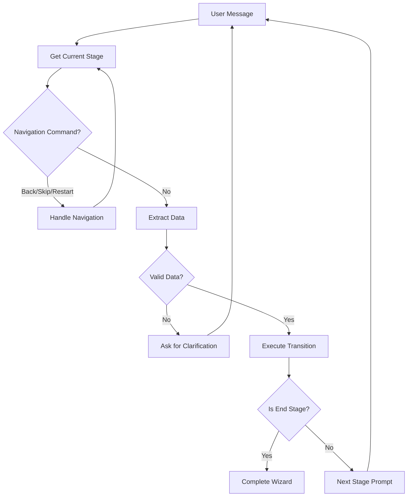

# Wizard Bot Example

A guided conversational wizard with FSM-backed state management.

## Overview

This example demonstrates:

- Wizard reasoning strategy for multi-step flows
- JSON Schema validation per stage
- Navigation commands (back, skip, restart)
- Lifecycle hooks for customization
- Data collection across stages

## Prerequisites

```bash
# Install Ollama: https://ollama.ai/

# Pull the required model
ollama pull gemma3:1b

# Install dataknobs-bots
pip install dataknobs-bots
```

## What is Wizard Reasoning?

**Wizard Reasoning** is a guided conversational pattern where the bot:

1. **Guides** - Leads users through predefined stages
2. **Validates** - Checks input against JSON Schema
3. **Collects** - Accumulates data across stages
4. **Branches** - Conditionally transitions based on input

### Wizard Flow



## Wizard Configuration

Create a wizard configuration file (`wizard.yaml`):

```yaml
# wizard.yaml - Onboarding wizard example
name: onboarding-wizard
version: "1.0"
description: Bot creation onboarding flow

stages:
  - name: welcome
    is_start: true
    prompt: "Welcome! What type of bot would you like to create?"
    schema:
      type: object
      properties:
        bot_type:
          type: string
          enum: [assistant, tutor, companion]
    suggestions:
      - "Personal assistant"
      - "Learning tutor"
      - "Chat companion"
    transitions:
      - target: name_bot
        condition: "data.get('bot_type')"

  - name: name_bot
    prompt: "Great choice! What would you like to name your bot?"
    help_text: "Choose a name between 3-20 characters."
    schema:
      type: object
      properties:
        bot_name:
          type: string
          minLength: 3
          maxLength: 20
      required: ["bot_name"]
    transitions:
      - target: personality
        condition: "data.get('bot_name')"

  - name: personality
    prompt: "What personality should {{bot_name}} have?"
    can_skip: true
    schema:
      type: object
      properties:
        personality:
          type: string
          enum: [friendly, professional, casual, formal]
    suggestions:
      - "Friendly and warm"
      - "Professional and focused"
      - "Casual and relaxed"
    transitions:
      - target: complete

  - name: complete
    is_end: true
    prompt: |
      Excellent! Here's your bot configuration:
      - Name: {{bot_name}}
      - Type: {{bot_type}}
      - Personality: {{personality}}

      Your bot is ready to use!
```

## Bot Configuration

Configure DynaBot to use wizard reasoning:

```python
config = {
    "llm": {
        "provider": "ollama",
        "model": "gemma3:1b"
    },
    "conversation_storage": {
        "backend": "memory"
    },
    "reasoning": {
        "strategy": "wizard",
        "wizard_config": "wizard.yaml",
        "strict_validation": True,
        "extraction_config": {
            "provider": "ollama",
            "model": "gemma3:1b"
        }
    }
}
```

## Complete Code

```python title="wizard_bot.py"
"""Wizard bot example - guided conversational flow."""

import asyncio
import tempfile
from pathlib import Path

import yaml

from dataknobs_bots import BotContext, DynaBot


async def main():
    # Create wizard config file
    wizard_config = {
        "name": "onboarding-wizard",
        "version": "1.0",
        "stages": [
            {
                "name": "welcome",
                "is_start": True,
                "prompt": "What type of bot would you like to create?",
                "schema": {
                    "type": "object",
                    "properties": {
                        "bot_type": {
                            "type": "string",
                            "enum": ["assistant", "tutor", "companion"],
                        }
                    },
                },
                "suggestions": ["Assistant", "Tutor", "Companion"],
                "transitions": [{"target": "name_bot", "condition": "data.get('bot_type')"}],
            },
            {
                "name": "name_bot",
                "prompt": "What would you like to name your bot?",
                "schema": {
                    "type": "object",
                    "properties": {
                        "bot_name": {"type": "string", "minLength": 3}
                    },
                    "required": ["bot_name"],
                },
                "transitions": [{"target": "complete"}],
            },
            {
                "name": "complete",
                "is_end": True,
                "prompt": "Your bot '{{bot_name}}' of type '{{bot_type}}' is ready!",
            },
        ],
    }

    # Write wizard config to temp file
    with tempfile.NamedTemporaryFile(mode="w", suffix=".yaml", delete=False) as f:
        yaml.dump(wizard_config, f)
        wizard_path = f.name

    # Bot configuration with wizard reasoning
    config = {
        "llm": {"provider": "ollama", "model": "gemma3:1b"},
        "conversation_storage": {"backend": "memory"},
        "reasoning": {
            "strategy": "wizard",
            "wizard_config": wizard_path,
            "strict_validation": False,  # Relaxed for demo
        },
    }

    # Create bot
    bot = await DynaBot.from_config(config)

    # Create context
    context = BotContext(
        conversation_id="wizard-demo",
        client_id="demo-client",
    )

    print("=== Wizard Bot Demo ===\n")

    # Simulate conversation
    messages = [
        "I want to create a tutor bot",
        "Call it StudyBuddy",
    ]

    for user_msg in messages:
        print(f"User: {user_msg}")
        response = await bot.chat(user_msg, context)
        print(f"Bot: {response}\n")


if __name__ == "__main__":
    asyncio.run(main())
```

## Running the Example

```bash
cd packages/bots
python examples/wizard_bot.py
```

## Expected Output

```
=== Wizard Bot Demo ===

User: I want to create a tutor bot
Bot: Great! You've chosen to create a tutor. What would you like to name your bot?

User: Call it StudyBuddy
Bot: Your bot 'StudyBuddy' of type 'tutor' is ready!
```

## Navigation Commands

Users can navigate the wizard naturally:

| Command | Action |
|---------|--------|
| "back" / "go back" / "previous" | Return to previous stage |
| "skip" / "skip this" | Skip current stage (if `can_skip: true`) |
| "restart" / "start over" | Start wizard from beginning |

Example:
```
User: Actually, go back
Bot: Returning to the previous step. What type of bot would you like to create?
```

## Adding Lifecycle Hooks

Customize wizard behavior with hooks:

```python
from dataknobs_bots.reasoning.wizard_hooks import WizardHooks


def log_stage_entry(stage: str, data: dict) -> None:
    print(f"[HOOK] Entering stage: {stage}")
    print(f"[HOOK] Current data: {data}")


async def save_results(data: dict) -> None:
    print(f"[HOOK] Wizard complete! Data: {data}")
    # Save to database, send notification, etc.


def handle_restart() -> None:
    print("[HOOK] Wizard restarted!")


# Create hooks
hooks = WizardHooks()
hooks.on_enter(log_stage_entry)
hooks.on_complete(save_results)
hooks.on_restart(handle_restart)

# Add to config
config = {
    "reasoning": {
        "strategy": "wizard",
        "wizard_config": wizard_path,
        "hooks": {
            "on_enter": ["myapp.hooks:log_stage_entry"],
            "on_complete": ["myapp.hooks:save_results"],
            "on_restart": ["myapp.hooks:handle_restart"],
        },
    },
    # ... other config
}
```

## Schema Validation

Validate user input with JSON Schema:

```yaml
stages:
  - name: email_collection
    prompt: "Please enter your email address:"
    schema:
      type: object
      properties:
        email:
          type: string
          format: email
          pattern: "^[a-zA-Z0-9._%+-]+@[a-zA-Z0-9.-]+\\.[a-zA-Z]{2,}$"
      required: ["email"]
    transitions:
      - target: next_stage
```

When validation fails, the wizard asks for clarification:
```
User: my-email
Bot: I didn't quite catch that. Could you please provide a valid email address?

User: user@example.com
Bot: Thanks! Moving on to the next step...
```

## Conditional Transitions

Branch based on collected data:

```yaml
stages:
  - name: experience_level
    prompt: "What's your experience level?"
    schema:
      type: object
      properties:
        level:
          type: string
          enum: [beginner, intermediate, advanced]
    transitions:
      - target: beginner_track
        condition: "data.get('level') == 'beginner'"
      - target: intermediate_track
        condition: "data.get('level') == 'intermediate'"
      - target: advanced_track
        condition: "data.get('level') == 'advanced'"
```

## Best Practices

### Stage Design

1. **Clear Prompts** - Make each stage's purpose obvious
2. **Helpful Suggestions** - Provide quick-reply options
3. **Validation** - Use schemas to ensure data quality
4. **Skip Options** - Allow skipping optional stages
5. **Help Text** - Provide additional guidance

### Wizard Structure

| Stages | Use Case |
|--------|----------|
| 2-3 | Quick data collection |
| 4-6 | Standard wizard flow |
| 7+ | Complex multi-step process |

### Model Selection

| Model | Use Case |
|-------|----------|
| gemma3:1b | Simple wizards, fast response |
| qwen3:1b | Better extraction accuracy |
| llama3.1:8b | Complex branching logic |

## Key Takeaways

1. **Guided Flows** - Lead users through structured processes
2. **Data Validation** - Ensure quality with JSON Schema
3. **Navigation** - Support natural back/skip/restart
4. **Lifecycle Hooks** - Customize behavior at each stage
5. **State Persistence** - Maintain progress across turns

## Common Issues

### Validation Too Strict

**Problem**: Users struggle to provide valid input

**Solutions**:
- Relax schema requirements
- Add better examples in prompts
- Set `strict_validation: false` initially
- Provide helpful suggestions

### Stage Transition Fails

**Problem**: Wizard doesn't move to next stage

**Solutions**:
- Check transition conditions
- Ensure data extraction is working
- Enable logging to debug
- Verify schema matches expected data

## Subflow Configuration

Subflows let a wizard delegate to a child wizard mid-flow and return when it completes.
Use the `_subflow` target in a transition:

```yaml
stages:
  - name: configure
    prompt: "Let's set up your project."
    transitions:
      - target: "_subflow"
        subflow:
          network: kb_setup        # Name of the subflow wizard
          return_stage: review      # Stage to resume after subflow
          data_mapping:             # Parent → child data
            project_name: name
          result_mapping:           # Child → parent data
            kb_path: knowledge_base_path
```

Subflow definitions can be inline (under a top-level `subflows:` key) or loaded
from a separate YAML file next to the main config. See the
[Wizard Subflows Guide](../guides/wizard-subflows.md) for full details.

## Template Responses

Use `response_template` on a stage to render a Jinja2 template instead of calling
the LLM. Collected wizard data is available as top-level template variables:

```yaml
stages:
  - name: summary
    prompt: "Here is your summary."
    response_template: |
      Thanks, {{ name }}! Here's what we collected:
      - Project: {{ project_name }}
      - Tools: {{ tools | join(', ') }}

      Stage: {{ stage_name }} ({{ stage_label }})
    transitions:
      - target: complete
```

The template context includes `stage_name`, `stage_label`, `collected_data`,
`history`, and `completed`. Undefined variables render as empty strings.

## Stage Labels

Add a `label` field to stages for human-readable display in breadcrumbs or
progress indicators:

```yaml
stages:
  - name: welcome
    label: "Getting Started"
    prompt: "Welcome!"
  - name: configure
    label: "Configuration"
    prompt: "Set things up."
```

Labels appear in the stages roadmap (`WizardStateSnapshot.stages`) with each
entry containing `name`, `label`, and `status` (`completed`, `current`, or
`pending`).

## Schema Normalization

The wizard automatically normalizes extracted data to match the JSON Schema
before storing it:

- **Boolean coercion** -- `"yes"`, `"true"`, `"1"` become `True`; `"no"`,
  `"false"`, `"0"` become `False`
- **Integer/number coercion** -- `"42"` becomes `42` for `integer` fields;
  `"3.14"` becomes `3.14` for `number` fields
- **Array wrapping** -- a bare string for an `array` field is wrapped in a list
- **Array shortcuts** -- `["all"]` expands to the full enum list;
  `["none"]` becomes `[]`

Normalization only applies to fields declared in the stage schema. Internal
fields (prefixed with `_`) and unknown fields are left unchanged.

## What's Next?

- [ReAct Agent](react-agent.md) - Tool-using agents
- [RAG Chatbot](rag-chatbot.md) - Knowledge base integration
- [Configuration Reference](../guides/configuration.md) - All options

## Related Documentation

- [User Guide](../guides/user-guide.md) - Comprehensive tutorials
- [Configuration Reference](../guides/configuration.md#wizard-reasoning) - Wizard config options
- [Wizard Subflows Guide](../guides/wizard-subflows.md) - Subflow configuration and data mapping
- [Architecture](../guides/architecture.md) - System design
