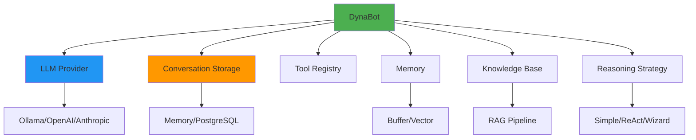

# dataknobs-bots

**Configuration-driven AI agents and chatbots for the DataKnobs ecosystem**

## Overview

The `dataknobs-bots` package provides a comprehensive framework for building sophisticated AI agents and chatbots with:

- **Configuration-First Design** - Define bot behavior entirely through YAML/JSON configuration
- **Multi-Tenant Architecture** - Single bot instance serves multiple clients with isolated conversations
- **Memory Management** - Buffer, summary, and vector memory implementations for context management
- **RAG Support** - Built-in knowledge base with document chunking and semantic search
- **Tool Integration** - Configuration-driven tool loading without code changes
- **Reasoning Strategies** - Simple, Chain-of-Thought, and ReAct reasoning patterns
- **Production Ready** - PostgreSQL storage, error handling, horizontal scaling, and logging

## Quick Start

```bash
# Install the package
pip install dataknobs-bots
```

```python
import asyncio
from dataknobs_bots import DynaBot, BotContext

async def main():
    # Configuration
    config = {
        "llm": {
            "provider": "ollama",
            "model": "gemma3:1b",
            "temperature": 0.7,
            "max_tokens": 1000
        },
        "conversation_storage": {
            "backend": "memory"
        },
        "memory": {
            "type": "buffer",
            "max_messages": 10
        }
    }

    # Create bot from configuration
    bot = await DynaBot.from_config(config)

    # Create conversation context
    context = BotContext(
        conversation_id="conv-001",
        client_id="demo-client",
        user_id="user-123"
    )

    # Chat with the bot
    response = await bot.chat("Hello! What can you help me with?", context)
    print(f"Bot: {response}")

if __name__ == "__main__":
    asyncio.run(main())
```

## Key Features

### 🤖 Configuration-Driven Architecture

- **Zero-Code Bot Creation** - Define entire bot behavior through configuration
- **Hot Reload** - Update bot configuration without restarting
- **Environment Overrides** - Override settings via environment variables
- **XRef System** - Reuse and compose configuration across bots

[Learn more →](guides/configuration.md)

### 👥 Multi-Tenancy & Scaling

- **Client Isolation** - Each client gets isolated conversations and data
- **Bot Registry** - Centralized bot management with LRU caching
- **Stateless Design** - Perfect for horizontal scaling in containerized environments
- **Connection Pooling** - PostgreSQL connection pooling for high concurrency

[Learn more →](guides/user-guide.md#multi-tenant-deployment)

### 🧠 Memory Systems

- **Buffer Memory** - Simple sliding window of recent messages
- **Vector Memory** - Semantic search over conversation history
- **Async Support** - Fully asynchronous for high throughput
- **Conversation Storage** - Memory, PostgreSQL, or custom backends

[Learn more →](guides/user-guide.md#tutorial-2-adding-memory)

### 📚 RAG (Retrieval Augmented Generation)

- **Document Ingestion** - Load markdown, JSON, JSONL documents from directories
- **Smart Chunking** - Uses dataknobs-xization for intelligent document chunking
- **Hybrid Search** - Combined text + vector search with RRF fusion
- **Vector Search** - FAISS, Chroma, Pinecone support
- **Context Injection** - Automatic context injection into prompts

[Learn more →](guides/rag-ingestion.md)

### 🛠️ Tool Integration

- **Configuration-Driven** - Load tools directly from configuration
- **XRef Support** - Reference predefined tools across configurations
- **Built-in Tools** - Knowledge search and common utilities
- **Custom Tools** - Easy-to-implement tool interface

[Learn more →](guides/tools.md)

### 🎯 Reasoning Strategies

- **Simple Reasoning** - Direct LLM response
- **ReAct Reasoning** - Reasoning + Acting pattern for tool-using agents
- **Wizard Reasoning** - Guided conversational flows with FSM-backed state management
- **Configurable** - Switch reasoning strategies via configuration
- **Extensible** - Implement custom reasoning strategies

[Learn more →](guides/user-guide.md#tutorial-5-creating-tool-using-agents)

### ⚙️ Per-Request Config Overrides

- **Dynamic Model Selection** - Switch models per-request without creating new bots
- **Parameter Tuning** - Override temperature, max_tokens, top_p per request
- **A/B Testing** - Compare models or parameters without redeployment
- **Cost Optimization** - Route simple queries to cheaper models
- **Usage Tracking** - Metadata tracks which overrides were applied

[Learn more →](guides/user-guide.md#per-request-config-overrides)

### 🔄 Dynamic Registration

- **Registry Backends** - Store bot configs in PostgreSQL, S3, or HTTP services
- **Caching with TTL** - LRU cache with time-based expiration
- **Hot Reload** - Update bot configs without application restarts
- **Event-Driven Invalidation** - Event bus integration for cache invalidation
- **Knowledge Storage** - S3/file storage for raw knowledge files before embedding

[Learn more →](guides/dynamic-registration.md)

## Architecture



## Package Structure

```
dataknobs_bots/
├── bot/                    # Core bot implementation
│   ├── base.py            # DynaBot class
│   ├── context.py         # BotContext dataclass
│   ├── manager.py         # BotManager for multi-tenant
│   └── registry.py        # Bot registry
├── middleware/            # Request/response middleware
│   ├── base.py           # Middleware interface
│   ├── cost.py           # Cost tracking
│   └── logging.py        # Logging middleware
├── api/                   # FastAPI integration
│   ├── dependencies.py   # Dependency injection
│   └── exceptions.py     # API exceptions
├── memory/                # Memory implementations
│   ├── base.py           # Memory interface
│   ├── buffer.py         # Buffer memory
│   └── vector.py         # Vector memory
├── knowledge/            # RAG implementation
│   └── rag.py           # RAGKnowledgeBase class
├── reasoning/           # Reasoning strategies
│   ├── base.py         # ReasoningStrategy interface
│   ├── simple.py       # Simple reasoning
│   ├── react.py        # ReAct reasoning
│   ├── wizard.py       # Wizard reasoning
│   ├── wizard_fsm.py   # FSM wrapper for wizards
│   ├── wizard_loader.py # Config loader
│   └── wizard_hooks.py # Lifecycle hooks
├── tools/              # Built-in tools
│   └── knowledge_search.py
└── utils/              # Utilities
```

## Documentation

### Guides

- [**User Guide**](guides/user-guide.md) - Complete tutorials from beginner to advanced
- [**RAG Ingestion & Hybrid Search**](guides/rag-ingestion.md) - Directory loading and hybrid queries
- [**RAG Retrieval**](guides/rag-retrieval.md) - Chunk merging and context formatting
- [**RAG Query**](guides/rag-query.md) - Query transformation and expansion
- [**Configuration Reference**](guides/configuration.md) - All configuration options
- [**Environment-Aware Configuration**](guides/environment-aware.md) - Portable configs for multi-environment deployments
- [**Dynamic Registration**](guides/dynamic-registration.md) - Runtime bot config and knowledge management with hot reload
- [**Migration Guide**](guides/migration.md) - Migrate existing configs to environment-aware pattern
- [**Bot Manager Guide**](guides/bot-manager.md) - Multi-tenant bot management and FastAPI integration
- [**Middleware Guide**](guides/middleware.md) - Request/response middleware for logging and cost tracking
- [**Tools Development**](guides/tools.md) - Creating and configuring custom tools
- [**Architecture**](guides/architecture.md) - System design and scaling considerations

### API Reference

- [**Complete API Reference**](api/reference.md) - Full API documentation for all classes and methods

### Examples

- [**Simple Chatbot**](examples/simple-chatbot.md) - Basic conversational bot
- [**Memory Integration**](examples/memory-chatbot.md) - Chatbot with memory
- [**RAG Chatbot**](examples/rag-chatbot.md) - Knowledge base integration
- [**ReAct Agent**](examples/react-agent.md) - Tool-using agent with reasoning
- [**Wizard Bot**](examples/wizard-bot.md) - Guided conversational wizard
- [**Multi-Tenant Bot**](examples/multi-tenant.md) - Multiple clients setup
- [**Custom Tools**](examples/custom-tools.md) - Creating and using custom tools

## Installation

### Basic Installation

```bash
pip install dataknobs-bots
```

### With Optional Dependencies

```bash
# PostgreSQL storage
pip install dataknobs-bots[postgres]

# Vector memory with FAISS
pip install dataknobs-bots[faiss]

# All optional dependencies
pip install dataknobs-bots[all]

# For development
pip install dataknobs-bots[dev]
```

## Requirements

- Python 3.10+
- dataknobs-config (automatically installed)
- dataknobs-llm (automatically installed)
- dataknobs-data (automatically installed)
- dataknobs-xization (automatically installed)

## Use Cases

### Customer Support Bot

Multi-tenant bot with knowledge base for customer support:

```python
config = {
    "llm": {"provider": "openai", "model": "gpt-4"},
    "conversation_storage": {"backend": "postgres"},
    "memory": {"type": "buffer", "max_messages": 20},
    "knowledge_base": {
        "enabled": True,
        "documents_path": "./support_docs"
    }
}

bot = await DynaBot.from_config(config)
```

### Personal Assistant

Agent with tools for task automation:

```python
config = {
    "llm": {"provider": "anthropic", "model": "claude-3-sonnet"},
    "reasoning": {"strategy": "react"},
    "tools": [
        {"class": "tools.CalendarTool", "params": {}},
        {"class": "tools.EmailTool", "params": {}},
        {"class": "tools.WeatherTool", "params": {}}
    ]
}

bot = await DynaBot.from_config(config)
```

### Document Q&A

RAG-powered document question answering:

```python
config = {
    "llm": {"provider": "ollama", "model": "llama3.1:8b"},
    "knowledge_base": {
        "enabled": True,
        "documents_path": "./company_docs",
        "chunking": {"max_chunk_size": 500, "chunk_overlap": 50}
    }
}

bot = await DynaBot.from_config(config)
```

## Testing

```bash
# Run tests
cd packages/bots
uv run pytest tests/ -v

# With coverage
uv run pytest tests/ --cov=src/dataknobs_bots --cov-report=html

# Run integration tests (requires Ollama)
TEST_OLLAMA=true uv run pytest tests/integration/ -v
```

## Contributing

Contributions are welcome! Please see the [Contributing Guide](../../development/contributing.md) for details.

## License

MIT License - see [LICENSE](../../license.md) for details.

## Related Packages

- [**dataknobs-llm**](../llm/index.md) - LLM providers and prompt management (used by bots)
- [**dataknobs-data**](../data/index.md) - Data storage backends (conversation storage)
- [**dataknobs-xization**](../xization/index.md) - Text processing (document chunking)
- [**dataknobs-config**](../config/index.md) - Configuration management (bot configuration)

## Support

- [GitHub Issues](https://github.com/kbs-labs/dataknobs/issues)
- [Documentation](https://kbs-labs.github.io/dataknobs/)
- [Examples](https://github.com/kbs-labs/dataknobs/tree/main/packages/bots/examples)

## Roadmap

- [x] Streaming responses
- [x] Per-request LLM config overrides (A/B testing, dynamic model selection)
- [ ] Multi-modal support (images, audio)
- [ ] Advanced memory strategies (hybrid, hierarchical)
- [ ] Tool marketplace
- [ ] Web UI for bot management
- [ ] Performance monitoring and analytics
- [ ] Voice interface support
