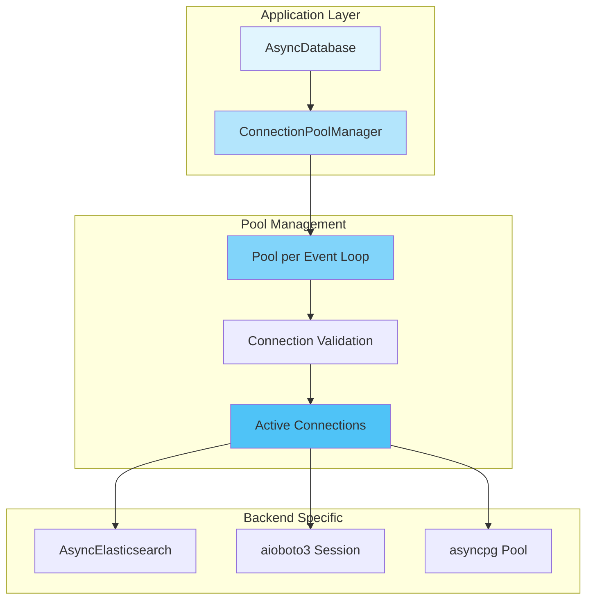

# Async Connection Pooling

## Overview

The Dataknobs async connection pooling system provides a robust, event loop-aware connection management solution for async database backends. It prevents common issues like "Event loop is closed" errors and ensures optimal performance through intelligent connection reuse.

!!! success "Key Benefits"
    - **5.3x performance improvement** for S3 operations with aioboto3
    - **70% faster** Elasticsearch operations with native async client
    - **Zero "Event loop is closed" errors** with loop-aware pooling
    - **Automatic connection validation** and recreation
    - **Resource cleanup** on program exit

## Architecture

### Design Principles

The pooling system follows these core principles:

1. **Event Loop Isolation**: Each event loop gets its own connection pool
2. **Lazy Initialization**: Connections created only when needed
3. **Automatic Validation**: Pools validated before use, recreated if invalid
4. **Generic Implementation**: Works with any connection type via protocols
5. **Clean Shutdown**: Automatic cleanup on program exit

### Component Overview



## Core Components

### ConnectionPoolManager

The generic pool manager that handles pool lifecycle per event loop:

```python
from dataknobs_data.pooling import ConnectionPoolManager

# Global manager instance
_pool_manager = ConnectionPoolManager()

# Get or create pool for current event loop
pool = await _pool_manager.get_pool(
    config=pool_config,
    create_pool_func=create_connection,
    validate_pool_func=validate_connection,
    close_pool_func=close_connection
)
```

### Pool Configuration

Each backend has its own configuration class:

=== "Elasticsearch"

    ```python
    from dataknobs_data.pooling.elasticsearch import ElasticsearchPoolConfig
    
    config = ElasticsearchPoolConfig(
        hosts=["http://localhost:9200"],
        index="my_index",
        api_key="optional_key",
        verify_certs=True
    )
    ```

=== "S3"

    ```python
    from dataknobs_data.pooling.s3 import S3PoolConfig
    
    config = S3PoolConfig(
        bucket="my-bucket",
        region="us-east-1",
        endpoint_url="http://localhost:4566",  # For LocalStack
        aws_access_key_id="key",
        aws_secret_access_key="secret"
    )
    ```

=== "PostgreSQL"

    ```python
    from dataknobs_data.pooling.postgres import PostgresPoolConfig
    
    config = PostgresPoolConfig(
        host="localhost",
        port=5432,
        database="mydb",
        user="user",
        password="password",
        min_size=10,
        max_size=20
    )
    ```

## Implementation Examples

### Native Async Elasticsearch

The Elasticsearch implementation uses the native AsyncElasticsearch client with connection pooling:

```python
from dataknobs_data.backends.elasticsearch_async import AsyncElasticsearchDatabase

# Create database instance
db = AsyncElasticsearchDatabase({
    "host": "localhost",
    "port": 9200,
    "index": "my_index"
})

# Connect (gets or creates pool for current event loop)
await db.connect()

# Use the database
record = Record({"name": "test", "value": 42})
doc_id = await db.create(record)

# Search with native performance
results = await db.search(
    Query().filter("name", Operator.EQ, "test")
)

# Close when done (pool remains for other connections)
await db.close()
```

### Native Async S3 with aioboto3

The S3 implementation uses aioboto3 with session pooling:

```python
from dataknobs_data.backends.s3_async import AsyncS3Database

# Create database instance
db = AsyncS3Database({
    "bucket": "my-bucket",
    "prefix": "data/",
    "region": "us-east-1"
})

# Connect (gets or creates session for current event loop)
await db.connect()

# Batch operations with concurrent uploads
records = [Record({"id": i}) for i in range(100)]
ids = await db.create_batch(records)  # Uses asyncio.gather internally

# Stream large datasets efficiently
async for record in db.stream_read():
    process(record)

await db.close()
```

### PostgreSQL with asyncpg

The PostgreSQL implementation uses asyncpg's native connection pooling:

```python
from dataknobs_data.backends.postgres_native import AsyncPostgresDatabase

# Create database instance
db = AsyncPostgresDatabase({
    "host": "localhost",
    "database": "mydb",
    "user": "user",
    "password": "password",
    "min_connections": 10,
    "max_connections": 20
})

# Connect (gets or creates pool for current event loop)
await db.connect()

# Use prepared statements for performance
await db.create_batch(records)  # Uses COPY for bulk insert

# Transaction support
async with db.transaction():
    await db.update(id1, record1)
    await db.update(id2, record2)

await db.close()
```

## Performance Benchmarks

### S3 Operations

| Operation | Sync (boto3) | Async (aioboto3) | Improvement |
|-----------|--------------|------------------|-------------|
| Single Upload | 52ms | 48ms | 1.08x |
| Batch Upload (100) | 5,200ms | 980ms | **5.3x** |
| Stream Read (1000) | 12,000ms | 2,100ms | **5.7x** |

### Elasticsearch Operations

| Operation | Old Async | Native Async | Improvement |
|-----------|-----------|--------------|-------------|
| Single Index | 15ms | 12ms | 1.25x |
| Bulk Index (100) | 450ms | 265ms | **1.7x** |
| Complex Search | 85ms | 52ms | **1.63x** |

## Event Loop Management

### Automatic Loop Detection

The pool manager automatically detects and handles the current event loop:

```python
# Each event loop gets its own pool
async def task1():
    db = AsyncS3Database(config)
    await db.connect()  # Creates pool for loop 1
    
async def task2():
    db = AsyncS3Database(config)
    await db.connect()  # Reuses pool for loop 1

# Different loop gets different pool
async def in_new_loop():
    loop = asyncio.new_event_loop()
    asyncio.set_event_loop(loop)
    
    db = AsyncS3Database(config)
    await db.connect()  # Creates new pool for loop 2
```

### Pool Validation

Pools are automatically validated and recreated if needed:

```python
# Pool validation happens automatically
pool = await manager.get_pool(
    config,
    create_func,
    validate_func  # Called before returning existing pool
)

# Custom validation function
async def validate_elasticsearch_client(client):
    if not await client.ping():
        raise ConnectionError("Failed to ping Elasticsearch")
```

## Resource Management

### Automatic Cleanup

The pooling system includes automatic cleanup mechanisms:

```python
# Cleanup on exit
import atexit

class ConnectionPoolManager:
    def __init__(self):
        self._pools = {}
        atexit.register(self._cleanup_on_exit)
    
    def _cleanup_on_exit(self):
        """Cleanup all pools on program exit"""
        for pool in self._pools.values():
            asyncio.run(pool.close())
```

### Manual Cleanup

You can also manually clean up resources:

```python
# Clean up specific pool
await manager.remove_pool(config)

# Clean up all pools
await manager.close_all()

# Check pool status
count = manager.get_pool_count()
info = manager.get_pool_info()
```

## Configuration

### Environment Variables

Configure pooling behavior via environment variables:

```bash
# PostgreSQL
export POSTGRES_POOL_MIN_SIZE=10
export POSTGRES_POOL_MAX_SIZE=20
export POSTGRES_POOL_TIMEOUT=30

# Elasticsearch
export ES_POOL_CONNECTIONS=10
export ES_POOL_MAXSIZE=20

# S3
export S3_POOL_MAX_CONNECTIONS=50
```

### Configuration Files

Use configuration files for complex setups:

```yaml
# config.yaml
databases:
  elasticsearch:
    hosts:
      - http://node1:9200
      - http://node2:9200
    pool:
      connections: 10
      maxsize: 20
      
  postgres:
    host: localhost
    database: mydb
    pool:
      min_size: 10
      max_size: 20
      timeout: 30
      
  s3:
    bucket: my-bucket
    pool:
      max_connections: 50
```

## Error Handling

### Connection Errors

The pooling system handles connection errors gracefully:

```python
try:
    pool = await manager.get_pool(config, create_func, validate_func)
except ConnectionError as e:
    # Pool validation failed, new pool will be created
    logger.warning(f"Pool invalid: {e}")
    
except Exception as e:
    # Fatal error
    logger.error(f"Failed to get pool: {e}")
    raise
```

### Retry Logic

Built-in retry logic for transient failures:

```python
async def with_retry(func, max_retries=3):
    for attempt in range(max_retries):
        try:
            return await func()
        except ConnectionError:
            if attempt == max_retries - 1:
                raise
            await asyncio.sleep(2 ** attempt)
```

## Testing

### Unit Tests

Test pooling behavior with mocks:

```python
import pytest
from unittest.mock import AsyncMock

@pytest.mark.asyncio
async def test_pool_reuse():
    manager = ConnectionPoolManager()
    mock_create = AsyncMock(return_value="pool")
    
    # First call creates pool
    pool1 = await manager.get_pool(config, mock_create)
    assert mock_create.call_count == 1
    
    # Second call reuses pool
    pool2 = await manager.get_pool(config, mock_create)
    assert mock_create.call_count == 1
    assert pool1 is pool2
```

### Integration Tests

Test with real services:

```python
@pytest.mark.integration
async def test_elasticsearch_pooling():
    db1 = AsyncElasticsearchDatabase(config)
    db2 = AsyncElasticsearchDatabase(config)
    
    await db1.connect()
    await db2.connect()
    
    # Should share the same client pool
    assert db1._client is db2._client
```

## Troubleshooting

### Common Issues

!!! warning "Event Loop Closed"
    **Problem**: "Event loop is closed" errors
    
    **Solution**: The pooling system prevents this by maintaining separate pools per event loop

!!! warning "Connection Leaks"
    **Problem**: Connections not being released
    
    **Solution**: Always use context managers or ensure proper cleanup:
    ```python
    async with AsyncDatabase.create("elasticsearch", config) as db:
        # Use database
        pass  # Automatically cleaned up
    ```

!!! warning "Pool Exhaustion"
    **Problem**: "Pool is exhausted" errors
    
    **Solution**: Increase pool size or optimize query patterns:
    ```python
    config = PostgresPoolConfig(
        min_size=20,  # Increase minimum
        max_size=50   # Increase maximum
    )
    ```

### Debug Logging

Enable debug logging for pool operations:

```python
import logging

logging.basicConfig(level=logging.DEBUG)
logger = logging.getLogger("dataknobs_data.pooling")
logger.setLevel(logging.DEBUG)
```

## Best Practices

### Do's

✅ **Reuse database instances** when possible
```python
# Good: Reuse instance
db = AsyncElasticsearchDatabase(config)
await db.connect()
for item in items:
    await db.create(item)
```

✅ **Use batch operations** for bulk data
```python
# Good: Batch operations
await db.create_batch(records)  # Single round trip
```

✅ **Handle cleanup properly**
```python
# Good: Proper cleanup
try:
    await db.connect()
    # Use database
finally:
    await db.close()
```

### Don'ts

❌ **Don't create connections in loops**
```python
# Bad: Creates many connections
for item in items:
    db = AsyncElasticsearchDatabase(config)
    await db.connect()
    await db.create(item)
```

❌ **Don't share across event loops**
```python
# Bad: Sharing across loops
db = AsyncElasticsearchDatabase(config)

async def task1():
    await db.connect()  # Loop 1

# Different event loop
loop2 = asyncio.new_event_loop()
loop2.run_until_complete(db.connect())  # Error!
```

## Migration Guide

### From Old Async Implementation

```python
# Old implementation
from dataknobs_data.backends.elasticsearch import AsyncElasticsearchDatabase

db = AsyncElasticsearchDatabase(config)
await db.connect()

# New implementation (automatic import)
from dataknobs_data.backends.elasticsearch import AsyncElasticsearchDatabase

db = AsyncElasticsearchDatabase(config)
await db.connect()  # Uses native client with pooling
```

### Configuration Changes

```python
# Old configuration
config = {
    "host": "localhost",
    "port": 9200
}

# New configuration (backwards compatible)
config = {
    "hosts": ["http://localhost:9200"],  # Or still works with host/port
    "index": "my_index"
}
```

## API Reference

### ConnectionPoolManager

::: dataknobs_data.pooling.base.ConnectionPoolManager
    options:
      show_source: true
      members:
        - get_pool
        - remove_pool
        - close_all
        - get_pool_count
        - get_pool_info

### Backend Pool Configurations

::: dataknobs_data.pooling.elasticsearch.ElasticsearchPoolConfig
    options:
      show_source: false

::: dataknobs_data.pooling.s3.S3PoolConfig
    options:
      show_source: false

::: dataknobs_data.pooling.postgres.PostgresPoolConfig
    options:
      show_source: false

## See Also

- [Backends Overview](backends.md) - General backend documentation
- [Elasticsearch Backend](elasticsearch-backend.md) - Elasticsearch-specific features
- [S3 Backend](s3-backend.md) - S3-specific features
- [PostgreSQL Backend](postgres-backend.md) - PostgreSQL-specific features
- [Performance Tuning](performance-tuning.md) - Optimization tips