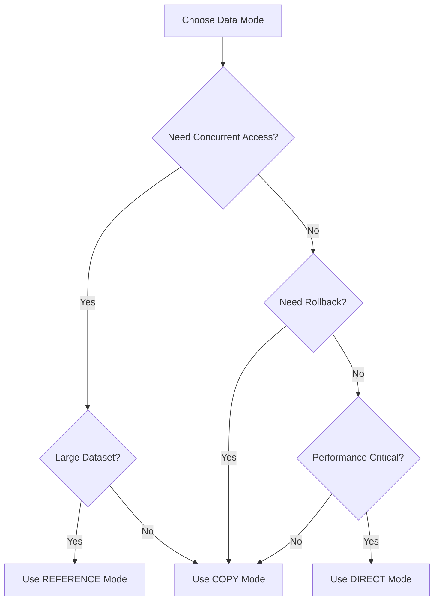

# Data Modes Guide

## Overview

The DataKnobs FSM package has two distinct mode concepts that are often confused:

1. **DataHandlingMode**: Controls HOW data is managed within states (memory safety and concurrency)
2. **ProcessingMode**: Controls HOW MANY records to process at once (throughput and batching)

This guide focuses on **DataHandlingMode** - the three distinct data handling modes that control memory management and concurrency safety.

## Understanding Data Handling Modes

Data handling modes control how the FSM manages data as it flows through states. The choice of mode affects:
- Memory usage
- Concurrency safety
- Performance characteristics
- Transaction behavior

### The Three Modes

| Mode | Safety | Memory | Speed | Concurrency | Use Case |
|------|--------|---------|--------|-------------|----------|
| **COPY** | High | High | Medium | Yes | Default; safe concurrent processing |
| **REFERENCE** | Medium | Low | Medium | Yes (with locking) | Large datasets with lazy loading |
| **DIRECT** | Low | Lowest | Fastest | No | Single-threaded, high performance |

## COPY Mode (Default)

Copy mode creates a deep copy of data before processing, ensuring complete isolation and safety.

### How It Works

1. Data is deep-copied when entering a state
2. All transformations operate on the copy
3. Original data remains unchanged until explicit commit
4. Each execution path has its own data copy

### When to Use

- **Concurrent Processing**: Multiple records processed simultaneously
- **Data Safety Critical**: Need rollback capability
- **Complex Transformations**: Multi-step changes that might fail
- **Default Choice**: When unsure, use COPY mode

### Example Usage

```python
from dataknobs_fsm.api.simple import SimpleFSM
from dataknobs_fsm.core.data_modes import DataHandlingMode

# Create FSM with COPY mode (default)
fsm = SimpleFSM(config)

# Or explicitly specify
fsm = SimpleFSM(config, data_mode=DataHandlingMode.COPY)

# Process data safely
result = fsm.process({
    "id": 123,
    "data": {"field": "value"}
})
```

### Configuration

```yaml
# In FSM configuration
networks:
  - name: main
    data_mode:
      default: copy  # Default mode for all states
      state_overrides:
        heavy_compute: direct  # Override for specific state
```

### Benefits

- ✅ **Thread-safe**: Safe for concurrent execution
- ✅ **Rollback Support**: Can undo changes on error via commit parameter
- ✅ **Isolation**: No side effects between executions
- ✅ **Predictable**: Easy to reason about

### Drawbacks

- ❌ **Memory Overhead**: Each copy uses additional memory
- ❌ **Copy Time**: Deep copy operation takes time
- ❌ **Not for Large Objects**: Inefficient for very large data

## REFERENCE Mode

Reference mode works with data references and uses optimistic locking for concurrent access.

### How It Works

1. Stores references to data (not copies)
2. Tracks modifications with version numbers
3. Uses optimistic locking for concurrent access
4. Multiple states can reference the same data

### When to Use

- **Large Datasets**: Data too large to copy efficiently
- **Shared State**: Multiple states need to access same data
- **Memory Constrained**: Need to minimize memory usage
- **Read-Heavy Operations**: When most operations are reads

### Example Usage

```python
from dataknobs_fsm.api.simple import SimpleFSM
from dataknobs_fsm.core.data_modes import DataHandlingMode

# Create FSM with REFERENCE mode
fsm = SimpleFSM(config, data_mode=DataHandlingMode.REFERENCE)

# Process with references
result = fsm.process({
    "large_data": huge_object,  # Not copied, just referenced
    "metadata": {"size": 1000000}
})
```

### Configuration

```yaml
networks:
  - name: main
    data_mode:
      default: reference
      reference_config:
        track_versions: true
        cleanup_on_exit: true
```

### Implementation Details

The REFERENCE mode handler:
- Maintains a registry of data references
- Tracks version numbers for optimistic locking
- Uses locks to protect version updates
- Cleans up references when no longer needed

### Benefits

- ✅ **Memory Efficient**: No data copying
- ✅ **Large Data Support**: Can handle objects larger than memory
- ✅ **Concurrent Access**: Supports multiple readers with locking
- ✅ **Version Tracking**: Detects concurrent modifications

### Drawbacks

- ❌ **No True Rollback**: Can't undo in-place changes
- ❌ **Complexity**: More complex than COPY mode
- ❌ **Lock Contention**: May have performance issues with many writers

## DIRECT Mode

Direct mode operates directly on source data without any copying or reference management.

### How It Works

1. Modifies data in-place
2. No copying or reference tracking
3. Single-threaded execution only (enforced)
4. Immediate changes to source data

### When to Use

- **Maximum Performance**: When speed is critical
- **Single-threaded**: No concurrent access needed
- **Simple Transformations**: Low risk of failure
- **Memory Constrained**: Minimal memory available

### Example Usage

```python
from dataknobs_fsm.api.simple import SimpleFSM
from dataknobs_fsm.core.data_modes import DataHandlingMode

# Create FSM with DIRECT mode
fsm = SimpleFSM(config, data_mode=DataHandlingMode.DIRECT)

# Process data directly (modifies input!)
data = {"field": "value"}
result = fsm.process(data)
# Note: 'data' is now modified
```

### Configuration

```yaml
networks:
  - name: main
    data_mode:
      default: direct
      direct_config:
        validate_single_thread: true
```

### Concurrency Protection

DIRECT mode actively prevents concurrent access:

```python
# The DirectModeHandler maintains an active_data lock
# If another state tries to use DIRECT mode while one is active:
# RuntimeError: "DIRECT mode does not support concurrent access"
```

### Benefits

- ✅ **Fastest Performance**: No copy overhead
- ✅ **Minimal Memory**: Lowest memory footprint
- ✅ **Simple**: No complex management
- ✅ **Immediate Effect**: Changes apply instantly

### Drawbacks

- ❌ **No Concurrency**: Single-threaded only (enforced)
- ❌ **No Rollback**: Cannot undo changes
- ❌ **Side Effects**: Modifies original data
- ❌ **Risk**: Errors can corrupt data

## Data Handler Interface

All modes implement the `DataHandler` interface:

```python
from dataknobs_fsm.core.data_modes import DataHandler, DataHandlingMode

class DataHandler(ABC):
    """Abstract base class for data mode handlers."""

    @abstractmethod
    def on_entry(self, data: Any) -> Any:
        """Handle data when entering a state."""
        pass

    @abstractmethod
    def on_modification(self, data: Any) -> Any:
        """Handle data modification within a state."""
        pass

    @abstractmethod
    def on_exit(self, data: Any, commit: bool = True) -> Any:
        """Handle data when exiting a state."""
        pass

    @abstractmethod
    def supports_concurrent_access(self) -> bool:
        """Check if this handler supports concurrent access."""
        pass
```

## Mode Selection Guide

### Decision Tree



### Quick Reference

| Scenario | Recommended Mode | Reason |
|----------|-----------------|---------|
| Web API processing | COPY | Concurrent requests, isolation needed |
| ETL pipeline | COPY | Transaction support, safety |
| Large file processing | REFERENCE | Memory efficiency |
| Batch database updates | COPY | Transaction support |
| Real-time processing | DIRECT | Minimum latency |
| Data validation | DIRECT | Simple, fast operations |
| Stream processing | REFERENCE | Memory efficiency |
| Multi-threaded workers | COPY or REFERENCE | Concurrency support |

## DataHandlingMode vs ProcessingMode - Critical Distinction

**Important**: These are two completely different concepts that work together:

### DataHandlingMode (This Guide)
Controls **HOW** data is managed in memory:
- **COPY**: Creates deep copies for safety (concurrent-safe)
- **REFERENCE**: Uses references with locking (memory-efficient)
- **DIRECT**: In-place modifications (fastest, single-thread only)

### ProcessingMode (Different Concept)
Controls **HOW MANY** records to process:
- **SINGLE**: One record at a time
- **BATCH**: Multiple records together
- **STREAM**: Continuous data flow

```python
from dataknobs_fsm.core.modes import ProcessingMode
from dataknobs_fsm.core.data_modes import DataHandlingMode

# These work together but solve different problems:
processing = ProcessingMode.BATCH      # Process 100 records at once
data_handling = DataHandlingMode.COPY  # Each of those 100 gets copied for safety

# Common combinations:
# Web API: ProcessingMode.SINGLE + DataHandlingMode.COPY (one request, safe)
# ETL: ProcessingMode.BATCH + DataHandlingMode.COPY (many records, transactions)
# Streaming: ProcessingMode.STREAM + DataHandlingMode.REFERENCE (continuous, efficient)
```

**Key Point**: You choose DataHandlingMode based on memory/safety needs, and ProcessingMode based on throughput needs. They're orthogonal concerns.

## State-Level Configuration

Override data modes for specific states:

```python
from dataknobs_fsm.core.state import StateDefinition
from dataknobs_fsm.core.data_modes import DataHandlingMode

state = StateDefinition(
    name="heavy_compute",
    data_mode=DataHandlingMode.DIRECT,  # Override for this state
    # ... other config
)
```

## Data Mode Manager

The `DataModeManager` handles mode selection:

```python
from dataknobs_fsm.core.data_modes import DataModeManager, DataHandlingMode

# Create manager with default mode
manager = DataModeManager(default_mode=DataHandlingMode.COPY)

# Get handler for specific mode
handler = manager.get_handler(DataHandlingMode.REFERENCE)

# Change default mode
manager.set_default_mode(DataHandlingMode.DIRECT)
```

## Usage in Patterns

Different patterns use different default modes:

```python
# From file_processing.py
if self.config.mode == ProcessingMode.STREAM:
    data_mode = DataHandlingMode.REFERENCE  # Streaming uses REFERENCE
elif self.config.mode == ProcessingMode.BATCH:
    data_mode = DataHandlingMode.COPY      # Batch uses COPY
else:
    data_mode = DataHandlingMode.DIRECT    # Whole file uses DIRECT
```

## Template Defaults

Use case templates have appropriate defaults:

- **DATABASE_ETL**: COPY mode (for transaction safety)
- **FILE_PROCESSING**: REFERENCE mode (for memory efficiency)
- **API_ORCHESTRATION**: COPY mode (for isolation)
- **LLM_WORKFLOW**: COPY mode (for safety)
- **DATA_VALIDATION**: DIRECT mode (for speed)
- **STREAM_PROCESSING**: REFERENCE mode (for efficiency)

## Best Practices

### 1. Default to COPY Mode

Unless you have specific requirements, use COPY mode:

```python
# Good - explicit about safety
fsm = SimpleFSM(config)  # COPY is default
```

### 2. Document Mode Choice

Always document why you chose a specific mode:

```python
# Using REFERENCE mode because input objects are >100MB
# and we only need to update metadata fields
fsm = SimpleFSM(config, data_mode=DataHandlingMode.REFERENCE)
```

### 3. Test Mode Behavior

Test your FSM with different modes:

```python
import pytest
from dataknobs_fsm.core.data_modes import DataHandlingMode

@pytest.mark.parametrize("mode", [
    DataHandlingMode.COPY,
    DataHandlingMode.REFERENCE,
    DataHandlingMode.DIRECT
])
def test_fsm_with_modes(mode):
    # Skip DIRECT mode for concurrent tests
    if mode == DataHandlingMode.DIRECT and is_concurrent_test():
        pytest.skip("DIRECT mode doesn't support concurrency")

    fsm = SimpleFSM(config, data_mode=mode)
    result = fsm.process(test_data)
    assert result["status"] == "success"
```

### 4. Handle Mode-Specific Behavior

Different modes have different characteristics:

```python
from dataknobs_fsm.core.data_modes import DataHandlingMode

def process_data(fsm, data):
    mode = fsm.data_mode

    if mode == DataHandlingMode.DIRECT:
        # Make a copy if we need to preserve original
        data_copy = data.copy()
        result = fsm.process(data)
        # data is now modified
    else:
        # COPY and REFERENCE modes don't modify input
        result = fsm.process(data)
        # data is unchanged

    return result
```

## Common Pitfalls

### 1. Using DIRECT Mode with Concurrent Access

```python
# ❌ Bad - DIRECT mode with threading
import threading
from dataknobs_fsm.core.data_modes import DataHandlingMode

fsm = SimpleFSM(config, data_mode=DataHandlingMode.DIRECT)

def process():
    fsm.process(shared_data)  # RuntimeError!

threads = [threading.Thread(target=process) for _ in range(10)]
# This will raise: "DIRECT mode does not support concurrent access"
```

### 2. Expecting Rollback in REFERENCE Mode

```python
# ❌ Bad - REFERENCE mode can't truly rollback
fsm = SimpleFSM(config, data_mode=DataHandlingMode.REFERENCE)
data = {"value": 100}
try:
    fsm.process(data)  # Modifies data in-place
except Exception:
    # data is already modified, no rollback!
    pass
```

### 3. Large Objects with COPY Mode

```python
# ❌ Bad - copying huge objects
huge_data = load_gigabyte_object()
fsm = SimpleFSM(config, data_mode=DataHandlingMode.COPY)
# This will use excessive memory!
result = fsm.process(huge_data)
```

## Implementation Notes

### Global Handlers

The system maintains global handler instances:

```python
# From data_modes.py
_GLOBAL_HANDLERS = {
    DataHandlingMode.COPY: CopyModeHandler(),
    DataHandlingMode.REFERENCE: ReferenceModeHandler(),
    DataHandlingMode.DIRECT: DirectModeHandler(),
}
```

### State Instance Behavior

State instances use the data mode manager:

```python
# From state.py StateInstance.__post_init__
if self.data_mode_manager is None:
    default_mode = DataHandlingMode.COPY
    if self.definition and self.definition.data_mode:
        default_mode = self.definition.data_mode
    self.data_mode_manager = DataModeManager(default_mode)
```

## Conclusion

Data handling modes are a powerful feature of the DataKnobs FSM that allow you to optimize for different requirements:

- **COPY Mode**: Choose safety and simplicity
- **REFERENCE Mode**: Choose memory efficiency with concurrent access
- **DIRECT Mode**: Choose maximum performance (single-threaded only)

Start with COPY mode and only switch to other modes when you have specific requirements that justify the trade-offs.

## Next Steps

- [Resource Management Guide](resources.md) - Learn about managing external resources
- [Streaming Guide](streaming.md) - Process large datasets efficiently
- [Pattern Catalog](../patterns/index.md) - FSM usage patterns
- [API Reference](../../../api/dataknobs-fsm.md) - Detailed API documentation