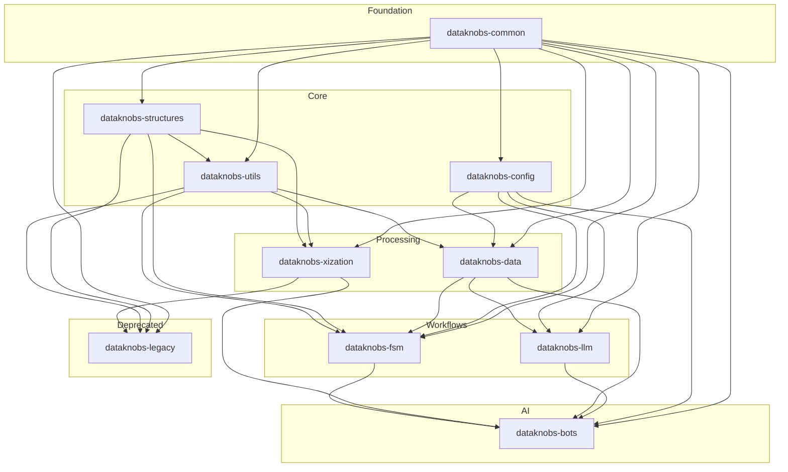

# Dataknobs Packages

Dataknobs is organized as a collection of modular packages, each serving a specific purpose.

## Package Overview

| Package | Purpose | Key Features |
|---------|---------|--------------|
| [dataknobs-bots](bots/index.md) | AI agents & chatbots | Configuration-driven bots, Multi-tenancy, RAG, Tool integration |
| [dataknobs-data](data/index.md) | Data abstraction layer | Records, Fields, Multiple backends, Async support |
| [dataknobs-config](config/index.md) | Configuration management | Modular configs, Environment overrides, Cross-references |
| [dataknobs-fsm](fsm/index.md) | Finite State Machine framework | Workflow orchestration, State management, Resource handling |
| [dataknobs-llm](llm/index.md) | LLM integration & prompt engineering | Unified LLM interface, Prompt templates, Conversations, A/B testing |
| [dataknobs-structures](structures/index.md) | Core data structures | Tree, Document, RecordStore, ConditionalDict |
| [dataknobs-utils](utils/index.md) | Utility functions | JSON, File, Elasticsearch, LLM utilities |
| [dataknobs-xization](xization/index.md) | Text processing | Chunking, Tokenization, Normalization, Masking |
| [dataknobs-common](common/index.md) | Shared components | Base classes, Common utilities |
| [dataknobs](legacy/index.md) | Legacy compatibility | Backward compatibility (deprecated) |

## Installation

Install the packages you need:

```bash
# Install all main packages
pip install dataknobs-bots dataknobs-data dataknobs-config dataknobs-fsm dataknobs-llm dataknobs-structures dataknobs-utils dataknobs-xization

# Or install individually
pip install dataknobs-bots
pip install dataknobs-data
pip install dataknobs-config
pip install dataknobs-fsm
pip install dataknobs-llm
pip install dataknobs-structures
```

## Package Dependencies

The diagram below shows how packages depend on each other. Arrows point from dependencies to dependents (e.g., `common --> config` means config depends on common).



## Choosing Packages

- **dataknobs-bots**: For building AI agents and chatbots with configuration-driven behavior, multi-tenancy, RAG, and tool integration
- **dataknobs-data**: For data abstraction with multiple backend support (memory, file, PostgreSQL, Elasticsearch, S3)
- **dataknobs-config**: For configuration management with environment overrides
- **dataknobs-fsm**: For building workflow orchestration and state machine-based processes
- **dataknobs-llm**: For LLM integration, prompt engineering, conversation management, and A/B testing
- **dataknobs-structures**: If you need tree structures, documents, or record storage
- **dataknobs-utils**: For JSON processing, file operations, or integrations
- **dataknobs-xization**: For text processing, tokenization, or normalization
- **dataknobs-common**: Automatically installed with other packages

## Migration from Legacy

See the [Migration Guide](../migration-guide.md) for upgrading from the legacy `dataknobs` package.
