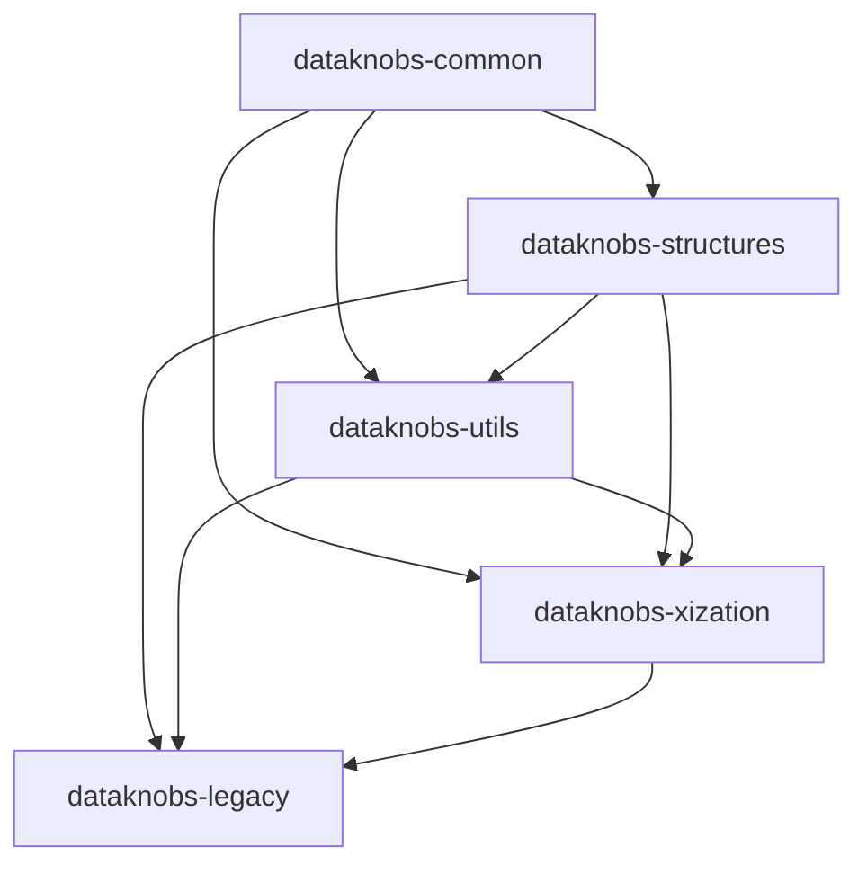

# Dataknobs Packages

Dataknobs is organized as a collection of modular packages, each serving a specific purpose.

## Package Overview

| Package | Purpose | Key Features |
|---------|---------|--------------|
| [dataknobs-structures](structures/index.md) | Core data structures | Tree, Document, RecordStore, ConditionalDict |
| [dataknobs-utils](utils/index.md) | Utility functions | JSON, File, Elasticsearch, LLM utilities |
| [dataknobs-xization](xization/index.md) | Text processing | Tokenization, Normalization, Masking |
| [dataknobs-common](common/index.md) | Shared components | Base classes, Common utilities |
| [dataknobs](legacy/index.md) | Legacy compatibility | Backward compatibility (deprecated) |

## Installation

Install the packages you need:

```bash
# Install all main packages
pip install dataknobs-structures dataknobs-utils dataknobs-xization

# Or install individually
pip install dataknobs-structures
```

## Package Dependencies



## Choosing Packages

- **dataknobs-structures**: If you need tree structures, documents, or record storage
- **dataknobs-utils**: For JSON processing, file operations, or integrations
- **dataknobs-xization**: For text processing, tokenization, or normalization
- **dataknobs-common**: Automatically installed with other packages

## Migration from Legacy

See the [Migration Guide](../migration-guide.md) for upgrading from the legacy `dataknobs` package.