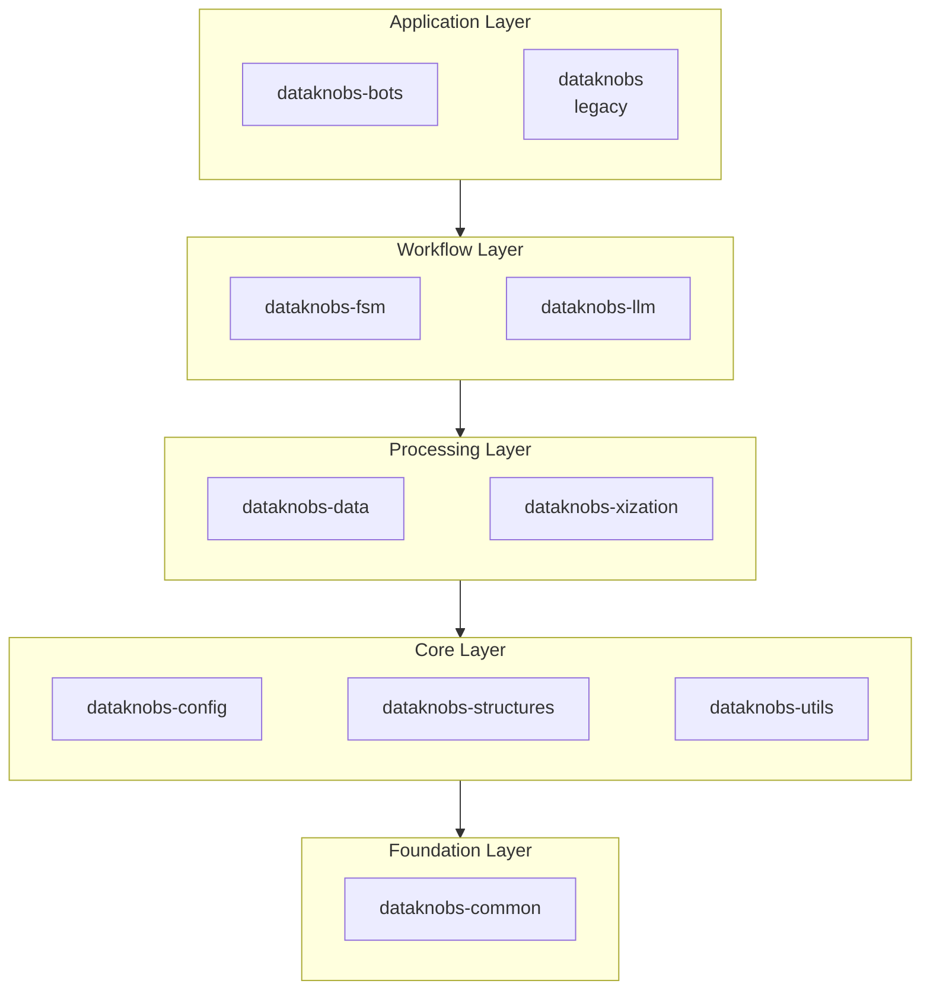

# Dataknobs Packages

Dataknobs is organized as a collection of modular packages, each serving a specific purpose.

## Package Overview

| Package | Purpose | Key Features |
|---------|---------|--------------|
| [dataknobs-bots](bots/index.md) | AI agents & chatbots | Configuration-driven bots, Multi-tenancy, RAG, Tool integration |
| [dataknobs-common](common/index.md) | Shared components | Base classes, Registries, Serialization, Event bus |
| [dataknobs-config](config/index.md) | Configuration management | Modular configs, Environment overrides, Object factories |
| [dataknobs-data](data/index.md) | Data abstraction layer | Records, Queries, Multiple backends, Async support |
| [dataknobs-fsm](fsm/index.md) | Finite State Machine framework | Workflow orchestration, Data modes, Resource handling |
| [dataknobs-llm](llm/index.md) | LLM integration & prompts | Multi-provider, Conversations, Tools, A/B testing |
| [dataknobs-structures](structures/index.md) | Core data structures | Tree, Document, RecordStore, ConditionalDict |
| [dataknobs-utils](utils/index.md) | Utility functions | JSON, File, HTTP, Elasticsearch utilities |
| [dataknobs-xization](xization/index.md) | Text processing | Chunking, Tokenization, Normalization, Annotation |
| [dataknobs](legacy/index.md) | Legacy compatibility | Backward compatibility (deprecated) |

## Installation

Install the packages you need:

```bash
# Install all main packages
pip install dataknobs-bots dataknobs-data dataknobs-config dataknobs-fsm dataknobs-llm dataknobs-structures dataknobs-utils dataknobs-xization

# Or install individually
pip install dataknobs-bots
pip install dataknobs-data
pip install dataknobs-config
pip install dataknobs-fsm
pip install dataknobs-llm
pip install dataknobs-structures
```

## Package Architecture

Dataknobs packages are organized in layers. Higher layers depend on lower layers.



**Layer descriptions:**

- **Foundation**: `common` provides base classes, registries, and shared utilities used by all packages
- **Core**: `config`, `structures`, and `utils` provide configuration, data structures, and utilities
- **Processing**: `data` and `xization` handle data storage/retrieval and text processing
- **Workflow**: `fsm` and `llm` enable workflow orchestration and LLM integration
- **Application**: `bots` combines lower layers to build AI agents; `legacy` provides backward compatibility

## Choosing Packages

- **dataknobs-bots**: AI agents and chatbots with RAG, memory, reasoning strategies, and tool integration
- **dataknobs-common**: Automatically installed; provides registries, exceptions, and base utilities
- **dataknobs-config**: Configuration management with environment variables, factories, and multi-environment support
- **dataknobs-data**: Data abstraction with multiple backends (Memory, File, PostgreSQL, Elasticsearch, S3, DuckDB)
- **dataknobs-fsm**: Workflow orchestration with state machines, data modes, and resource management
- **dataknobs-llm**: LLM integration with multi-provider support, conversations, tools, and prompt management
- **dataknobs-structures**: Data structures including trees, documents, record stores, and conditional dictionaries
- **dataknobs-utils**: Utilities for JSON processing, file I/O, HTTP requests, and data transformation
- **dataknobs-xization**: Text processing with normalization, tokenization, annotation, and markdown chunking

## Migration from Legacy

See the [Migration Guide](../migration-guide.md) for upgrading from the legacy `dataknobs` package.
