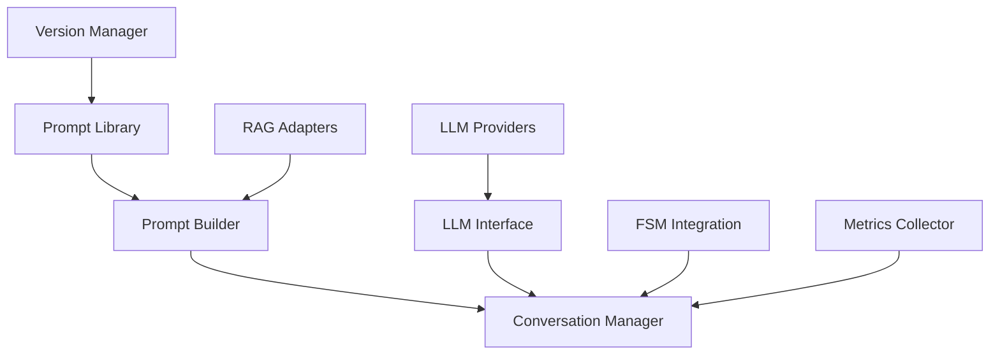

# dataknobs-llm

**Advanced LLM interaction library with prompt management, conversation flows, and FSM integration**

## Overview

The `dataknobs-llm` package provides a comprehensive toolkit for building sophisticated LLM-powered applications with:

- **Prompt Engineering**: Advanced prompt library with Jinja2 templates, validation, and RAG integration
- **Conversation Management**: Tree-structured conversation history with branching and time-travel
- **State Machine Integration**: FSM-based conversation flows for complex workflows
- **Provider Abstraction**: Unified interface for multiple LLM providers (OpenAI, Anthropic, etc.)
- **Performance**: Benchmarking tools, RAG caching, and optimization features
- **Versioning**: Full prompt versioning with A/B testing and metrics tracking

## Quick Start

```bash
# Install the package
pip install dataknobs-llm
```

```python
from dataknobs_llm import create_llm_provider, LLMConfig
from dataknobs_llm.prompts import FileSystemPromptLibrary, AsyncPromptBuilder
from pathlib import Path

# Initialize LLM provider
config = LLMConfig(provider="openai", api_key="your-key")
llm = create_llm_provider(config)

# Create prompt library
library = FileSystemPromptLibrary(prompt_dir=Path("prompts/"))

# Create prompt builder with RAG
builder = AsyncPromptBuilder(
    library=library,
    adapters={'docs': my_doc_adapter}
)

# Render and execute prompt
result = await builder.render_user_prompt(
    'code_analysis',
    params={'language': 'python', 'code': code_snippet}
)

response = await llm.chat([
    {"role": "system", "content": system_prompt},
    {"role": "user", "content": result.content}
])
```

## Key Features

### 🎯 Prompt Engineering

- **Template System**: Jinja2 integration with 50+ built-in filters
- **Conditional Logic**: Smart conditionals for optional content
- **RAG Integration**: Explicit placeholder-based RAG with multiple adapters
- **Validation**: Configurable parameter validation (ERROR/WARN/IGNORE)
- **Composition**: Template inheritance and includes for reusability

[Learn more →](guides/prompts.md)

### 💬 Conversation Management

- **Tree Structure**: Branch conversations to explore alternatives
- **Time Travel**: Navigate conversation history
- **FSM Integration**: State machine-based conversation flows
- **RAG Caching**: Conversation-level RAG metadata caching
- **Persistence**: Save and restore conversation state

[Learn more →](guides/conversations.md)

### 🔄 State Machine Flows

- **Flow Definition**: Define complex conversation workflows
- **Transition Conditions**: Keyword, regex, LLM classifier, sentiment-based
- **Loop Detection**: Automatic loop detection and prevention
- **Resource Integration**: Seamless FSM resource integration

[Learn more →](guides/flows.md)

### 📊 Versioning & A/B Testing

- **Semantic Versioning**: Track prompt evolution with major.minor.patch
- **A/B Testing**: Multi-variant experiments with traffic splitting
- **User-Sticky Assignment**: Deterministic variant assignment per user
- **Metrics Tracking**: Success rates, response times, user ratings
- **Performance Comparison**: Compare variants to find winners

[Learn more →](guides/versioning.md)

### ⚙️ Per-Request Config Overrides

- **Dynamic Configuration**: Override model, temperature, max_tokens per request
- **Named Presets**: Register common configurations for reuse
- **Callback Hooks**: Track override usage for logging/metrics
- **Options Merging**: Provider-specific options support
- **A/B Testing**: Easily switch models or parameters per request

[Learn more →](guides/config-overrides.md)

### ⚡ Performance

- **Benchmarking**: Comprehensive performance measurement framework
- **RAG Caching**: Query hash-based cache matching for reuse
- **Jinja2 Optimization**: Compiled templates for faster rendering
- **Async Support**: Full async/await support throughout

[Learn more →](guides/performance.md)

### 🧪 Testing Utilities

- **Response Builders**: Convenient functions to create test LLM responses
- **EchoProvider**: Test LLM provider with scripted responses and pattern matching
- **Sequence Builder**: Fluent API for building multi-turn test conversations
- **Extraction Helpers**: Utilities for testing schema extraction flows

[Learn more →](guides/testing.md)

### 📊 Extraction Observability

- **Extraction Tracking**: Record and query schema extraction operations
- **Statistics**: Success rates, confidence metrics, and error analysis
- **Schema-Based Extraction**: LLM-powered structured data extraction with JSON Schema validation
- **Provider Integration**: Track extraction across different LLM providers and models

[Learn more →](guides/extraction.md)

## Architecture



## Package Structure

```
dataknobs_llm/
├── llm/                    # LLM provider abstractions
│   ├── base.py            # Base LLM interface
│   └── providers.py       # Provider implementations
├── prompts/               # Prompt engineering
│   ├── base/             # Core abstractions
│   ├── rendering/        # Template rendering (Jinja2)
│   ├── adapters/         # RAG resource adapters
│   ├── implementations/  # Prompt library implementations
│   ├── builders/         # Prompt builders
│   ├── versioning/       # Version management & A/B testing
│   └── utils/            # Utilities
├── conversations/        # Conversation management
│   ├── manager.py       # Conversation manager
│   ├── storage.py       # Persistence
│   ├── middleware.py    # Middleware system
│   └── flow/            # FSM-based flows
├── extraction/          # Schema-based extraction
│   ├── schema_extractor.py  # LLM-powered data extraction
│   └── observability.py     # Extraction tracking & stats
├── tools/               # Tool management
│   ├── registry.py      # Tool registration & execution
│   ├── context.py       # Wizard context injection
│   └── observability.py # Tool execution tracking
├── testing.py           # Testing utilities for scripted responses
└── fsm_integration/     # FSM integration
    ├── functions.py     # LLM functions for FSM
    ├── resources.py     # LLMResource, AsyncLLMResource (async with rate limiting)
    └── workflows.py     # Pre-built workflow patterns
```

## Documentation

### Guides

- [**Prompt Engineering**](guides/prompts.md) - Complete prompt system guide
- [**Conversation Management**](guides/conversations.md) - Managing conversations
- [**FSM-Based Flows**](guides/flows.md) - Building conversation workflows
- [**Config Overrides**](guides/config-overrides.md) - Per-request configuration
- [**Versioning & A/B Testing**](guides/versioning.md) - Version control and experiments
- [**Performance & Benchmarking**](guides/performance.md) - Optimization and metrics
- [**Schema Extraction**](guides/extraction.md) - LLM-based data extraction with observability
- [**Testing Utilities**](guides/testing.md) - Builders for scripted test responses

### API Reference

- [**LLM Providers**](../../api/dataknobs-llm.md) - LLM interface and providers
- [**Prompt Library**](api/prompts.md) - Prompt management API
- [**Conversations**](api/conversations.md) - Conversation management API
- [**Versioning**](api/versioning.md) - Version management and A/B testing API

### Examples

- [**Basic Usage**](examples/basic-usage.md) - Getting started examples
- [**Advanced Prompting**](examples/advanced-prompting.md) - Complex prompt patterns (includes RAG)
- [**Conversation Flows**](examples/conversation-flows.md) - Building workflows (FSM integration)
- [**A/B Testing**](examples/ab-testing.md) - Running experiments

## Installation

### Basic Installation

```bash
pip install dataknobs-llm
```

### With Optional Dependencies

```bash
# With OpenAI support
pip install dataknobs-llm[openai]

# With Anthropic support
pip install dataknobs-llm[anthropic]

# With all LLM providers
pip install dataknobs-llm[all-providers]

# For development
pip install dataknobs-llm[dev]
```

## Requirements

- Python 3.10+
- dataknobs-fsm (automatically installed)
- Jinja2 (for template rendering)
- One or more LLM provider SDKs (OpenAI, Anthropic, etc.)

## Use Cases

### Customer Support Chatbot

```python
from dataknobs_llm.conversations import ConversationManager
from dataknobs_llm.conversations.flow import ConversationFlow, FlowState

# Define support flow
flow = ConversationFlow(
    name="customer_support",
    initial_state="greeting",
    states={
        "greeting": FlowState(
            prompt="support_greeting",
            transitions={
                "need_help": "collect_issue",
                "just_browsing": "end"
            }
        ),
        "collect_issue": FlowState(
            prompt="ask_issue_details",
            transitions={
                "technical": "technical_support",
                "billing": "billing_support"
            }
        ),
        # ... more states
    }
)

# Execute flow
manager = await ConversationManager.create(llm=llm, flow=flow)
await manager.execute_flow()
```

### Prompt A/B Testing

```python
from dataknobs_llm.prompts import VersionManager, ABTestManager, PromptVariant

# Create versions
vm = VersionManager()
v1 = await vm.create_version(
    name="greeting", prompt_type="system",
    template="Hello {{name}}!", version="1.0.0"
)
v2 = await vm.create_version(
    name="greeting", prompt_type="system",
    template="Hi {{name}}, welcome!"
)

# Create A/B test
ab = ABTestManager()
exp = await ab.create_experiment(
    name="greeting", prompt_type="system",
    variants=[
        PromptVariant("1.0.0", 0.5, "Control"),
        PromptVariant("1.0.1", 0.5, "Treatment")
    ]
)

# Get variant for user (sticky)
variant = await ab.get_variant_for_user(exp.experiment_id, "user123")
```

### RAG-Enhanced Prompting

```python
from dataknobs_llm.prompts import AsyncDictResourceAdapter

# Create RAG adapter
docs_adapter = AsyncDictResourceAdapter({
    "python_basics": {"content": "Python is..."},
    "decorators": {"content": "@decorator syntax..."},
})

# Use in prompt
builder = AsyncPromptBuilder(
    library=library,
    adapters={'docs': docs_adapter}
)

result = await builder.render_user_prompt(
    'code_question',  # Has {{RAG_CONTENT}} placeholder
    params={'question': 'How do decorators work?'}
)
# RAG content automatically injected
```

## Testing

```bash
# Run tests
cd packages/llm
uv run pytest tests/ -v

# With coverage
uv run pytest tests/ --cov=src/dataknobs_llm --cov-report=html

# Run specific test suite
uv run pytest tests/prompts/test_versioning.py -v
```

## Contributing

Contributions are welcome! Please see the [Contributing Guide](../../development/contributing.md) for details.

## License

MIT License - see [LICENSE](../../license.md) for details.

## Related Packages

- [**dataknobs-fsm**](../fsm/index.md) - Finite State Machine framework (used by conversation flows)
- [**dataknobs-data**](../data/index.md) - Data abstraction layer (for conversation persistence)
- [**dataknobs-utils**](../utils/index.md) - Utility functions (LLM helpers)

## Support

- [GitHub Issues](https://github.com/kbs-labs/dataknobs/issues)
- [Documentation](https://kbs-labs.github.io/dataknobs/)
- [Examples](https://github.com/kbs-labs/dataknobs/tree/main/packages/llm/examples)
