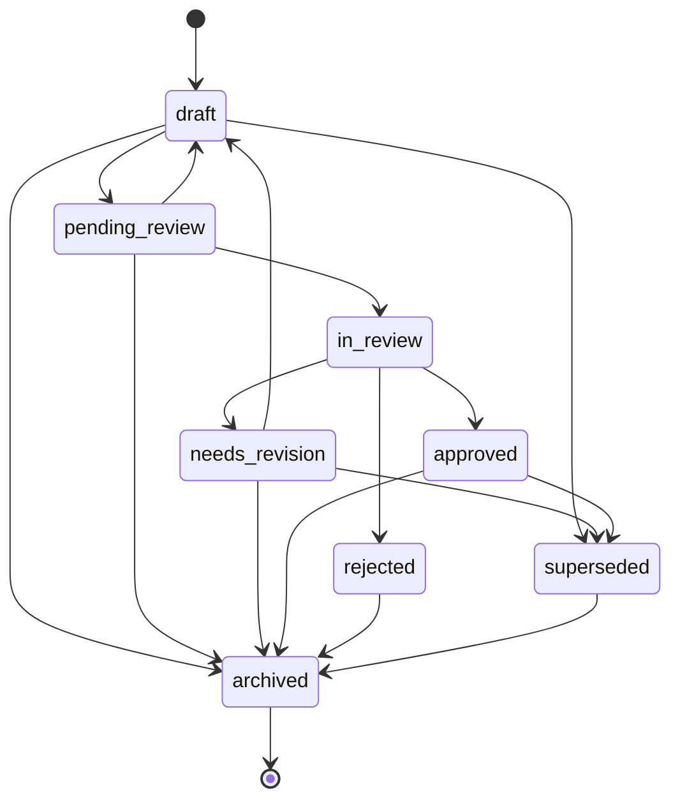

# Artifact System

The artifact system provides infrastructure for tracking versioned work products with full provenance, lifecycle management, rubric-based evaluation, and integration with wizard workflows.

## Overview

Artifacts are versioned, provenance-tracked work products produced during bot workflows:

- **Content** — generated text, questions, lesson plans
- **Configuration** — bot configs, settings, parameters
- **Assessment** — quizzes, tests, evaluation instruments
- **Data** — structured outputs, reports, analyses

Each artifact carries full creation provenance, follows a defined lifecycle with enforced transitions, and can be evaluated against rubrics for quality assurance.

## Core Models

### Artifact

An `Artifact` is the central data structure representing a work product.

```python
from dataknobs_bots.artifacts import Artifact, ArtifactStatus
from dataknobs_bots.artifacts.provenance import create_provenance

artifact = Artifact(
    type="content",
    name="Assessment Questions",
    content={"questions": ["What is photosynthesis?", "Explain mitosis."]},
    provenance=create_provenance(
        created_by="bot:edubot",
        creation_method="generator",
    ),
)

print(artifact.id)       # "art_..." (auto-generated)
print(artifact.version)  # "1.0.0"
print(artifact.status)   # ArtifactStatus.DRAFT
```

| Field | Type | Description |
|-------|------|-------------|
| `id` | `str` | Unique identifier (auto-generated `art_` prefix) |
| `type` | `str` | Extensible type string (e.g., `"content"`, `"config"`, `"assessment"`) |
| `name` | `str` | Human-readable name |
| `version` | `str` | Semantic version (e.g., `"1.0.0"`) |
| `status` | `ArtifactStatus` | Current lifecycle status |
| `content` | `dict[str, Any]` | The artifact content |
| `content_schema` | `str \| None` | JSON Schema ID for content validation |
| `provenance` | `ProvenanceRecord` | Full provenance record |
| `tags` | `list[str]` | Searchable tags |
| `rubric_ids` | `list[str]` | IDs of rubrics applicable to this artifact |
| `evaluation_ids` | `list[str]` | IDs of completed `RubricEvaluation` results |
| `created_at` | `str` | ISO 8601 creation timestamp |
| `updated_at` | `str` | ISO 8601 last update timestamp |

Properties:

- `is_approved` — `True` if status is `APPROVED`
- `is_reviewable` — `True` if status is `DRAFT`, `PENDING_REVIEW`, or `NEEDS_REVISION`

Serialization: `to_dict()` and `from_dict(data)` for round-trip serialization.

### ArtifactStatus

Eight lifecycle states:

| Status | Value | Description |
|--------|-------|-------------|
| `DRAFT` | `"draft"` | Initial creation, work in progress |
| `PENDING_REVIEW` | `"pending_review"` | Submitted, awaiting review |
| `IN_REVIEW` | `"in_review"` | Review in progress |
| `NEEDS_REVISION` | `"needs_revision"` | Review found issues |
| `APPROVED` | `"approved"` | Passed all required reviews |
| `REJECTED` | `"rejected"` | Failed review, won't proceed |
| `SUPERSEDED` | `"superseded"` | Replaced by a newer version |
| `ARCHIVED` | `"archived"` | No longer active (terminal state) |

### ArtifactTypeDefinition

Configuration-driven artifact type specification that defines default behaviors and constraints:

```python
from dataknobs_bots.artifacts import ArtifactTypeDefinition

type_def = ArtifactTypeDefinition(
    id="assessment_questions",
    description="Generated quiz questions",
    rubrics=["content_quality", "pedagogical_value"],
    auto_review=True,
    requires_approval=True,
    approval_threshold=0.8,
    tags=["assessment", "questions"],
)
```

| Field | Type | Default | Description |
|-------|------|---------|-------------|
| `id` | `str` | required | Type identifier |
| `description` | `str` | `""` | Human-readable description |
| `content_schema` | `str \| None` | `None` | JSON Schema reference for validation |
| `rubrics` | `list[str]` | `[]` | Default rubric IDs to apply |
| `auto_review` | `bool` | `False` | Auto-evaluate on creation |
| `requires_approval` | `bool` | `False` | Must pass evaluation to proceed |
| `approval_threshold` | `float` | `0.7` | Minimum score for approval |
| `tags` | `list[str]` | `[]` | Default tags |

Create from config: `ArtifactTypeDefinition.from_config(type_id, config_dict)`.

## Provenance

Every artifact carries a `ProvenanceRecord` that tracks its complete creation and revision history.

### ProvenanceRecord

```python
from dataknobs_bots.artifacts.provenance import (
    ProvenanceRecord,
    SourceReference,
    ToolInvocation,
    LLMInvocation,
    RevisionRecord,
    create_provenance,
)

provenance = create_provenance(
    created_by="system:generator:quiz_gen_v1",
    creation_method="generator",
)

# Add source references
provenance.sources.append(SourceReference(
    source_id="doc_123",
    source_type="document",
    source_location="/docs/biology.md",
    relevance="Source material for questions",
    confidence=0.95,
))

# Add tool chain
provenance.tool_chain.append(ToolInvocation(
    tool_name="quiz_generator",
    tool_version="2.1.0",
    parameters={"topic": "biology", "count": 10},
))

# Add LLM invocation
provenance.llm_invocations.append(LLMInvocation(
    purpose="generate_context",
    model="llama3.2",
    prompt_hash="a1b2c3d4",
))
```

| Field | Type | Description |
|-------|------|-------------|
| `created_by` | `str` | Who/what created it (e.g., `"system:generator:quiz_gen_v1"`, `"user:jane"`, `"bot:configbot"`) |
| `created_at` | `str` | ISO 8601 creation timestamp |
| `creation_method` | `str` | How it was created (`"generator"`, `"wizard"`, `"manual"`, `"derived"`, `"llm_assisted"`) |
| `creation_context` | `dict[str, Any]` | Parameters, configuration, and other context |
| `sources` | `list[SourceReference]` | References to source materials |
| `tool_chain` | `list[ToolInvocation]` | Tools used during creation |
| `llm_invocations` | `list[LLMInvocation]` | LLM calls made during creation |
| `review_history` | `list[str]` | IDs of `RubricEvaluation` results |
| `revision_history` | `list[RevisionRecord]` | Records of revisions |

### SourceReference

| Field | Type | Default | Description |
|-------|------|---------|-------------|
| `source_id` | `str` | required | ID of source artifact, document, or external reference |
| `source_type` | `str` | required | Category (`"artifact"`, `"document"`, `"vector_result"`, `"user_input"`, `"external"`) |
| `source_location` | `str \| None` | `None` | URI, file path, or vector store reference |
| `relevance` | `str` | `""` | Why this source was used |
| `excerpt` | `str \| None` | `None` | Relevant portion of the source |
| `confidence` | `float` | `1.0` | Relevance confidence (0.0 to 1.0) |

### ToolInvocation

| Field | Type | Default | Description |
|-------|------|---------|-------------|
| `tool_name` | `str` | required | Function or tool identifier |
| `tool_version` | `str \| None` | `None` | Version if applicable |
| `parameters` | `dict[str, Any]` | `{}` | Input parameters |
| `timestamp` | `str` | auto | ISO 8601 invocation time |

### LLMInvocation

| Field | Type | Default | Description |
|-------|------|---------|-------------|
| `purpose` | `str` | required | Why the LLM was called (`"decode_intent"`, `"encode_feedback"`, `"generate_context"`) |
| `model` | `str` | `""` | Model identifier used |
| `prompt_hash` | `str` | `""` | Hash of the prompt (for reproducibility, not the full prompt) |
| `timestamp` | `str` | auto | ISO 8601 invocation time |

### RevisionRecord

| Field | Type | Default | Description |
|-------|------|---------|-------------|
| `revision_id` | `str` | auto | Unique ID (`rev_` prefix) |
| `previous_version` | `str` | `""` | Version being revised |
| `reason` | `str` | `""` | Why the revision was made |
| `changes_summary` | `str` | `""` | What changed |
| `triggered_by` | `str` | `""` | Who/what triggered it (e.g., `"rubric_evaluation:eval_123"`, `"user:jane"`) |
| `timestamp` | `str` | auto | ISO 8601 timestamp |

### create_provenance()

Convenience factory:

```python
provenance = create_provenance(
    created_by="bot:edubot",
    creation_method="generator",
    # Additional ProvenanceRecord fields via **kwargs
    creation_context={"topic": "biology"},
)
```

## Status Transitions

Artifact status transitions are enforced by a `TransitionValidator` from `dataknobs-common`. Invalid transitions raise `InvalidTransitionError`.

### State Diagram



### Valid Transitions Table

| From | Allowed Targets |
|------|-----------------|
| `draft` | `pending_review`, `archived`, `superseded` |
| `pending_review` | `in_review`, `draft`, `archived` |
| `in_review` | `approved`, `needs_revision`, `rejected` |
| `needs_revision` | `draft`, `archived`, `superseded` |
| `approved` | `superseded`, `archived` |
| `rejected` | `archived` |
| `superseded` | `archived` |
| `archived` | *(terminal — no transitions)* |

### Using validate_transition()

```python
from dataknobs_bots.artifacts import validate_transition, ArtifactStatus

# Valid — no exception
validate_transition(ArtifactStatus.DRAFT, ArtifactStatus.PENDING_REVIEW)

# Invalid — raises InvalidTransitionError
from dataknobs_common.transitions import InvalidTransitionError
try:
    validate_transition(ArtifactStatus.DRAFT, ArtifactStatus.APPROVED)
except InvalidTransitionError as e:
    print(e)  # "Invalid transition..."
```

## ArtifactRegistry

The `ArtifactRegistry` is the primary interface for managing artifacts. It is backed by an `AsyncDatabase` and enforces lifecycle rules.

### Creating a Registry

```python
from dataknobs_data.backends.memory import AsyncMemoryDatabase
from dataknobs_bots.artifacts import ArtifactRegistry

db = AsyncMemoryDatabase()
registry = ArtifactRegistry(db)
```

With rubric evaluation support:

```python
from dataknobs_bots.rubrics import RubricRegistry, RubricExecutor, FunctionRegistry

rubric_db = AsyncMemoryDatabase()
rubric_registry = RubricRegistry(rubric_db)
rubric_executor = RubricExecutor(function_registry=FunctionRegistry())

registry = ArtifactRegistry(
    db=db,
    rubric_registry=rubric_registry,
    rubric_executor=rubric_executor,
)
```

With type definitions:

```python
from dataknobs_bots.artifacts import ArtifactTypeDefinition

type_defs = {
    "assessment": ArtifactTypeDefinition(
        id="assessment",
        rubrics=["content_quality"],
        auto_review=True,
        approval_threshold=0.8,
        tags=["assessment"],
    ),
}

registry = ArtifactRegistry(
    db=db,
    rubric_registry=rubric_registry,
    rubric_executor=rubric_executor,
    type_definitions=type_defs,
)
```

### from_config()

Create from a configuration dictionary:

```python
config = {
    "artifact_types": {
        "assessment_questions": {
            "description": "Generated quiz questions",
            "rubrics": ["content_quality", "pedagogical_value"],
            "auto_review": True,
            "requires_approval": True,
            "approval_threshold": 0.8,
            "tags": ["assessment", "questions"],
        },
        "bot_config": {
            "description": "Bot configuration",
            "rubrics": ["config_validation"],
            "approval_threshold": 1.0,
        },
    }
}

registry = await ArtifactRegistry.from_config(
    config, db=db,
    rubric_registry=rubric_registry,
    rubric_executor=rubric_executor,
)
```

### CRUD Operations

#### create()

```python
from dataknobs_bots.artifacts.provenance import create_provenance

artifact = await registry.create(
    artifact_type="content",
    name="Unit 1 Questions",
    content={"questions": ["What is 2+2?", "Explain gravity."]},
    provenance=create_provenance("bot:edubot", "generator"),
    tags=["math", "science"],
)

print(artifact.id)      # "art_..."
print(artifact.status)  # ArtifactStatus.DRAFT
print(artifact.version) # "1.0.0"
```

| Parameter | Type | Default | Description |
|-----------|------|---------|-------------|
| `artifact_type` | `str` | required | Type of artifact |
| `name` | `str` | required | Human-readable name |
| `content` | `dict[str, Any]` | required | Artifact content |
| `provenance` | `ProvenanceRecord \| None` | `None` | Provenance (auto-created if `None`) |
| `tags` | `list[str] \| None` | `None` | Tags (merged with type definition defaults) |

#### get()

```python
artifact = await registry.get("art_abc123def456")
if artifact:
    print(artifact.name)
```

#### get_version()

```python
# Get a specific version
artifact_v1 = await registry.get_version("art_abc123def456", "1.0.0")
```

#### query()

```python
# By type
content_artifacts = await registry.query(artifact_type="content")

# By status
drafts = await registry.query(status=ArtifactStatus.DRAFT)

# Combined filters
pending_content = await registry.query(
    artifact_type="content",
    status=ArtifactStatus.PENDING_REVIEW,
    tags=["assessment"],
)
```

| Parameter | Type | Default | Description |
|-----------|------|---------|-------------|
| `artifact_type` | `str \| None` | `None` | Filter by type |
| `status` | `ArtifactStatus \| None` | `None` | Filter by status |
| `tags` | `list[str] \| None` | `None` | Filter by tags (must have all) |

#### revise()

Creates a new version of an artifact. The old version is marked as `SUPERSEDED`.

```python
revised = await registry.revise(
    artifact_id="art_abc123def456",
    new_content={"questions": ["Updated question 1", "New question 2"]},
    reason="Improved question clarity after review",
    triggered_by="user:teacher_jane",
)

print(revised.version)  # "1.0.1" (patch version bumped)
print(revised.status)   # ArtifactStatus.DRAFT
```

#### set_status()

```python
await registry.set_status(
    "art_abc123def456",
    ArtifactStatus.PENDING_REVIEW,
    reason="Ready for review",
)
```

Raises `InvalidTransitionError` if the transition is not allowed.

#### submit_for_review()

Submits an artifact for rubric-based evaluation. Transitions through the review lifecycle automatically.

```python
evaluations = await registry.submit_for_review("art_abc123def456")

# evaluations is a list of evaluation result dicts
for eval_dict in evaluations:
    print(f"Rubric: {eval_dict['rubric_id']}")
    print(f"Score: {eval_dict['weighted_score']:.1%}")
    print(f"Passed: {eval_dict['passed']}")
```

The method:

1. Transitions `DRAFT` → `PENDING_REVIEW` → `IN_REVIEW`
2. Runs all rubrics listed in the artifact's `rubric_ids`
3. Transitions to `APPROVED` (all pass) or `NEEDS_REVISION` (any fail)

#### get_evaluations()

```python
evaluations = await registry.get_evaluations("art_abc123def456")
```

### Lifecycle Hooks

Register async callbacks for artifact events:

```python
async def on_created(artifact: Artifact) -> None:
    logger.info("Created: %s", artifact.name)

async def on_status_changed(artifact: Artifact) -> None:
    logger.info("Status changed to: %s", artifact.status.value)

async def on_review_done(artifact: Artifact) -> None:
    if artifact.is_approved:
        logger.info("Artifact approved: %s", artifact.name)

registry.on_create(on_created)
registry.on_status_change(on_status_changed)
registry.on_review_complete(on_review_done)
```

## Wizard Transforms

Pre-built async transform functions for integrating artifact lifecycle operations into wizard workflows. Each transform operates on a wizard data dict and uses a `TransformContext`.

### TransformContext

```python
from dataknobs_bots.artifacts import TransformContext

context = TransformContext(
    artifact_registry=registry,
    rubric_registry=rubric_registry,
    rubric_executor=rubric_executor,
    user_id="teacher_jane",
    session_id="sess_abc123",
)
```

| Field | Type | Default | Description |
|-------|------|---------|-------------|
| `artifact_registry` | `Any \| None` | `None` | Registry for artifact CRUD |
| `rubric_registry` | `Any \| None` | `None` | Registry for rubric lookups |
| `rubric_executor` | `Any \| None` | `None` | Executor for evaluations |
| `generator_registry` | `Any \| None` | `None` | Registry for content generation |
| `config` | `dict[str, Any]` | `{}` | Additional config for transforms |
| `user_id` | `str \| None` | `None` | Current user identifier |
| `session_id` | `str \| None` | `None` | Current session identifier |

### create_artifact

Creates an artifact from wizard data. Sets `data["_artifact_id"]`.

```python
from dataknobs_bots.artifacts import create_artifact

data = {"title": "My Quiz", "questions": ["Q1", "Q2"]}
await create_artifact(data, context, config={
    "artifact_type": "quiz",
    "name_template": "Quiz: {{ title }}",
    "content_fields": ["questions"],
    "tags": ["quiz", "auto-generated"],
})

print(data["_artifact_id"])  # "art_..."
```

| Config Key | Type | Default | Description |
|------------|------|---------|-------------|
| `artifact_type` | `str` | `"content"` | Artifact type identifier |
| `name_template` | `str` | — | Jinja2 template rendered with `data` |
| `name_field` | `str` | `"name"` | Fallback: key in `data` for name |
| `content_fields` | `list[str]` | — | Keys to extract; if absent, all non-`_` keys |
| `tags` | `list[str]` | `[]` | Tags to apply |

### submit_for_review

Submits an artifact for rubric evaluation. Sets `data["_evaluation_results"]` and `data["_review_passed"]`.

```python
from dataknobs_bots.artifacts import submit_for_review

await submit_for_review(data, context)

if data["_review_passed"]:
    print("All evaluations passed!")
else:
    print("Review failed:", data["_evaluation_results"])
```

| Config Key | Type | Default | Description |
|------------|------|---------|-------------|
| `artifact_id_field` | `str` | `"_artifact_id"` | Key in `data` holding the artifact ID |

### revise_artifact

Creates a new version with revised content. Updates `data["_artifact_id"]`.

```python
from dataknobs_bots.artifacts import revise_artifact

data["_revision_reason"] = "Improved clarity after feedback"
await revise_artifact(data, context, config={
    "content_fields": ["questions"],
})
```

| Config Key | Type | Default | Description |
|------------|------|---------|-------------|
| `artifact_id_field` | `str` | `"_artifact_id"` | Key holding the artifact ID |
| `content_fields` | `list[str]` | — | Keys to extract; if absent, all non-`_` keys |
| `reason_field` | `str` | `"_revision_reason"` | Key holding the revision reason |

### approve_artifact

Sets artifact status to `APPROVED`.

```python
from dataknobs_bots.artifacts import approve_artifact

await approve_artifact(data, context)
```

| Config Key | Type | Default | Description |
|------------|------|---------|-------------|
| `artifact_id_field` | `str` | `"_artifact_id"` | Key holding the artifact ID |

### save_artifact_draft

Incrementally saves wizard data as a draft. Creates a new artifact if none exists, revises existing if `data["_artifact_id"]` is set. Designed to run on every wizard transition for data safety.

```python
from dataknobs_bots.artifacts import save_artifact_draft

await save_artifact_draft(data, context, config={
    "artifact_type": "lesson_plan",
    "name_field": "lesson_title",
    "content_fields": ["objectives", "activities", "assessment"],
})
```

## LLM Tools

Five `ContextAwareTool` subclasses for managing artifacts within LLM conversations. Each tool integrates with the `ArtifactRegistry` and builds provenance from the execution context.

### CreateArtifactTool

```python
from dataknobs_bots.artifacts.tools import CreateArtifactTool
from dataknobs_llm.tools.context import ToolExecutionContext

tool = CreateArtifactTool(artifact_registry=registry)
result = await tool.execute_with_context(
    context=ToolExecutionContext.empty(),
    content={"questions": ["Q1", "Q2"]},
    name="Unit 1 Questions",
    artifact_type="content",
    tags=["assessment"],
)
# result: {"artifact_id": "art_...", "status": "draft", "name": "...", "version": "1.0.0", "message": "..."}
```

**Schema:** `content` (object, required), `name` (string, required), `artifact_type` (string), `tags` (array of strings)

### UpdateArtifactTool

Creates a new version via `registry.revise()`. The original is marked superseded.

```python
from dataknobs_bots.artifacts.tools import UpdateArtifactTool

tool = UpdateArtifactTool(artifact_registry=registry)
result = await tool.execute_with_context(
    context=ToolExecutionContext.empty(),
    artifact_id="art_abc123def456",
    content={"questions": ["Updated Q1"]},
    reason="Improved question clarity",
)
# result: {"artifact_id": "...", "version": "1.0.1", "status": "draft", "message": "..."}
```

**Schema:** `artifact_id` (string, required), `content` (object, required), `reason` (string)

### QueryArtifactsTool

```python
from dataknobs_bots.artifacts.tools import QueryArtifactsTool

tool = QueryArtifactsTool(artifact_registry=registry)
result = await tool.execute_with_context(
    context=ToolExecutionContext.empty(),
    status="draft",
    artifact_type="content",
    tags=["assessment"],
    include_content=False,
)
# result: {"artifacts": [...], "count": 3, "filters": {...}}
```

**Schema:** `status` (string, enum of all status values), `artifact_type` (string), `tags` (array of strings), `include_content` (boolean, default `false`)

### SubmitForReviewTool

```python
from dataknobs_bots.artifacts.tools import SubmitForReviewTool

tool = SubmitForReviewTool(artifact_registry=registry)
result = await tool.execute_with_context(
    context=ToolExecutionContext.empty(),
    artifact_id="art_abc123def456",
)
# result: {"artifact_id": "...", "status": "approved", "evaluations": [...], "message": "..."}
```

**Schema:** `artifact_id` (string, required)

### GetArtifactTool

```python
from dataknobs_bots.artifacts.tools import GetArtifactTool

tool = GetArtifactTool(artifact_registry=registry)
result = await tool.execute_with_context(
    context=ToolExecutionContext.empty(),
    artifact_id="art_abc123def456",
    include_evaluations=True,
)
# result: {"id": "...", "name": "...", "content": {...}, "provenance": {...}, ...}
```

**Schema:** `artifact_id` (string, required), `include_evaluations` (boolean, default `false`)

## Display Helpers

Four pure functions for rendering artifact and evaluation data as markdown strings.

### format_evaluation_summary()

```python
from dataknobs_bots.artifacts import format_evaluation_summary

summary = format_evaluation_summary(evaluation)
print(summary)
```

Output:

```markdown
## Evaluation Summary

**Rubric:** content_quality (v1.0.0)
**Score:** 85.0%
**Result:** PASSED

### Criteria Results

| Criterion | Level | Score |
|-----------|-------|-------|
| clarity | excellent | 90.0% |
| completeness | pass | 80.0% |

### Feedback

The content meets quality standards with strong clarity...
```

### format_criterion_detail()

```python
from dataknobs_bots.artifacts import format_criterion_detail

detail = format_criterion_detail(result, criterion=criterion_def)
```

Renders level, score, level description, indicators, evidence, and notes.

### format_comparison()

```python
from dataknobs_bots.artifacts import format_comparison

comparison = format_comparison([eval_v1, eval_v2])
```

Side-by-side comparison table with score change indicators (when comparing exactly two evaluations).

### format_provenance_chain()

```python
from dataknobs_bots.artifacts import format_provenance_chain

timeline = format_provenance_chain(artifact.provenance)
```

Renders creation context, sources, tool chain, LLM invocations, and revision history as a timeline.

## Assessment Sessions

Models and async functions for quiz and evaluation workflows, designed for integration with wizard transforms and the artifact registry.

### Models

#### StudentResponse

A single student response to an assessment question.

```python
from dataknobs_bots.artifacts import StudentResponse

response = StudentResponse(
    question_id="q1",
    response="Paris",
    correct=True,
    time_taken_ms=3500,
    attempt_number=1,
)
```

| Field | Type | Default | Description |
|-------|------|---------|-------------|
| `question_id` | `str` | `""` | Question identifier |
| `response` | `Any` | `None` | Student's answer |
| `correct` | `bool \| None` | `None` | Correct for deterministic scoring |
| `rubric_score` | `float \| None` | `None` | Score for rubric-scored responses |
| `time_taken_ms` | `int \| None` | `None` | Time spent in milliseconds |
| `attempt_number` | `int` | `1` | Which attempt (1-based) |

#### AssessmentSession

Tracks one student's attempt at a quiz or assessment.

```python
from dataknobs_bots.artifacts import AssessmentSession

session = AssessmentSession(
    student_id="student_001",
    assessment_artifact_id="art_quiz_123",
    assessment_version="1.0.0",
)
```

| Field | Type | Default | Description |
|-------|------|---------|-------------|
| `id` | `str` | auto | Unique session ID (`sess_` prefix) |
| `student_id` | `str` | `""` | Student identifier |
| `assessment_artifact_id` | `str` | `""` | Quiz artifact ID |
| `assessment_version` | `str` | `""` | Assessment version |
| `started_at` | `str` | auto | ISO 8601 start time |
| `completed_at` | `str \| None` | `None` | Completion time (`None` if ongoing) |
| `responses` | `list[StudentResponse]` | `[]` | Student responses |
| `score` | `float \| None` | `None` | Final score (`None` if not finalized) |
| `rubric_evaluation_id` | `str \| None` | `None` | Rubric evaluation ID if applicable |

Properties: `is_complete`, `correct_count`, `total_responses`.

#### CumulativePerformance

Aggregates performance across multiple sessions for learning progress tracking.

```python
from dataknobs_bots.artifacts import CumulativePerformance

perf = CumulativePerformance(
    student_id="student_001",
    topic="biology",
)
perf.update_from_session(completed_session)
print(f"Mastery: {perf.mastery_estimate:.0%}")
```

| Field | Type | Default | Description |
|-------|------|---------|-------------|
| `student_id` | `str` | `""` | Student identifier |
| `topic` | `str` | `""` | Topic or subject area |
| `total_sessions` | `int` | `0` | Sessions completed |
| `total_questions_attempted` | `int` | `0` | Total questions across sessions |
| `correct_count` | `int` | `0` | Total correct responses |
| `average_score` | `float` | `0.0` | Running average score |
| `mastery_estimate` | `float` | `0.0` | Estimated mastery (correct rate) |
| `last_session_at` | `str` | `""` | Last session timestamp |

### Async Functions

#### start_assessment_session()

```python
from dataknobs_bots.artifacts import start_assessment_session

session = await start_assessment_session(
    data=wizard_data,
    assessment_artifact_id="art_quiz_123",
    student_id="student_001",
    question_ids=["q1", "q2", "q3"],
)
```

Sets `data["_session"]`, `data["_session_id"]`, `data["_current_question_index"]`, `data["_total_questions"]`, and `data["_question_ids"]`.

#### record_response()

```python
from dataknobs_bots.artifacts import record_response

student_response = await record_response(
    data=wizard_data,
    question_id="q1",
    response="Paris",
    correct=True,
    time_taken_ms=3500,
)
```

Appends the response to the session, auto-tracks attempt number, and advances `data["_current_question_index"]`.

#### finalize_assessment()

```python
from dataknobs_bots.artifacts import finalize_assessment

session = await finalize_assessment(data=wizard_data)

print(f"Score: {session.score:.0%}")
print(f"Correct: {session.correct_count}/{session.total_responses}")
```

Marks the session as completed, calculates the score from correct responses, and sets `data["_assessment_score"]` and `data["_assessment_complete"]`.

## Related Documentation

- [Rubric Evaluation System](rubrics.md) — Evaluating artifacts with structured rubrics
- [Context Accumulator](context.md) — Building context from artifacts
