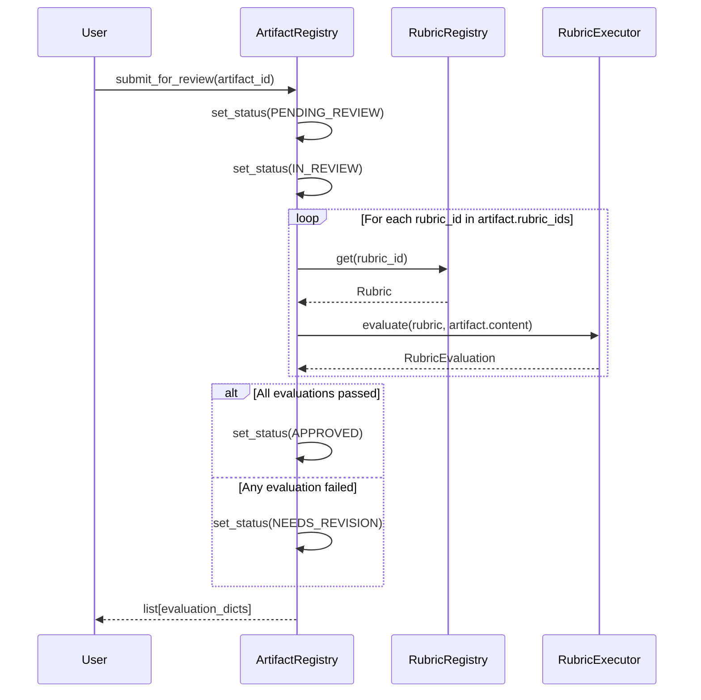

# Rubric Evaluation System

The rubric evaluation system provides structured, multi-criteria assessment of artifacts and content. It supports three scoring methods — deterministic Python functions, JSON Schema validation, and narrowly-scoped LLM classification — with weighted scoring, pass/fail determination, and feedback generation.

## Overview

A **rubric** defines how to evaluate a target across multiple **criteria**, each with defined quality **levels** and a **scoring method**. The system computes weighted aggregate scores and determines pass/fail against a configurable threshold.

Key capabilities:

- **Three scoring methods** — deterministic functions, JSON Schema, LLM decode
- **Weighted multi-criteria scoring** — each criterion has a configurable weight
- **Feedback generation** — LLM-enhanced or deterministic summaries
- **Persistent storage** — versioned rubrics backed by `AsyncDatabase`
- **Meta-rubric** — built-in rubric for validating rubric quality
- **Artifact integration** — automatic evaluation via `submit_for_review()`

## Core Models

### Rubric

A structured evaluation instrument.

```python
from dataknobs_bots.rubrics import (
    Rubric,
    RubricCriterion,
    RubricLevel,
    ScoringMethod,
    ScoringType,
)

rubric = Rubric(
    id="content_quality",
    name="Content Quality",
    description="Evaluates the quality of generated content",
    version="1.0.0",
    target_type="content",
    criteria=[...],  # List of RubricCriterion
    pass_threshold=0.7,
    metadata={"author": "system", "domain": "education"},
)
```

| Field | Type | Default | Description |
|-------|------|---------|-------------|
| `id` | `str` | required | Unique rubric identifier |
| `name` | `str` | required | Human-readable name |
| `description` | `str` | required | What this rubric evaluates |
| `version` | `str` | required | Semantic version (e.g., `"1.0.0"`) |
| `target_type` | `str` | required | Target type (e.g., `"content"`, `"rubric"`, `"assessment"`) |
| `criteria` | `list[RubricCriterion]` | required | Evaluation criteria |
| `pass_threshold` | `float` | required | Minimum weighted score to pass (0.0 to 1.0) |
| `metadata` | `dict[str, Any]` | `{}` | Additional metadata |

Serialization: `to_dict()` and `Rubric.from_dict(data)`.

### RubricCriterion

A single dimension of evaluation within a rubric.

```python
criterion = RubricCriterion(
    id="clarity",
    name="Clarity",
    description="How clear and understandable the content is",
    weight=0.4,
    levels=[
        RubricLevel(id="fail", label="Fail", description="Unclear", score=0.0),
        RubricLevel(id="pass", label="Pass", description="Understandable", score=0.7),
        RubricLevel(
            id="excellent", label="Excellent",
            description="Crystal clear with good examples",
            score=1.0,
            indicators=["Uses concrete examples", "Logical flow", "No jargon"],
        ),
    ],
    scoring_method=ScoringMethod(
        type=ScoringType.DETERMINISTIC,
        function_ref="myapp.scoring:check_clarity",
    ),
    required=True,
)
```

| Field | Type | Default | Description |
|-------|------|---------|-------------|
| `id` | `str` | required | Unique criterion identifier |
| `name` | `str` | required | Human-readable name |
| `description` | `str` | required | What this criterion measures |
| `weight` | `float` | required | Relative importance (weights should sum to 1.0) |
| `levels` | `list[RubricLevel]` | required | Quality levels (lowest to highest score) |
| `scoring_method` | `ScoringMethod` | required | How to evaluate |
| `required` | `bool` | `True` | Whether this criterion must be evaluated |

### RubricLevel

A quality tier within a criterion.

| Field | Type | Default | Description |
|-------|------|---------|-------------|
| `id` | `str` | required | Level identifier (e.g., `"fail"`, `"pass"`, `"excellent"`) |
| `label` | `str` | required | Human-readable display label |
| `description` | `str` | required | What qualifies content for this level |
| `score` | `float` | required | Numeric score (0.0 to 1.0) |
| `indicators` | `list[str]` | `[]` | Observable indicators for this quality level |

### ScoringType

Enum defining how a criterion is evaluated:

| Value | Description |
|-------|-------------|
| `DETERMINISTIC` | Python function evaluates against criteria |
| `SCHEMA` | JSON Schema validation for structural checks |
| `LLM_DECODE` | Narrowly-scoped LLM classification |

### ScoringMethod

Configuration for how a criterion is scored.

| Field | Type | Default | Description |
|-------|------|---------|-------------|
| `type` | `ScoringType` | required | Scoring approach |
| `function_ref` | `str \| None` | `None` | For `DETERMINISTIC`: dotted path `"module.path:function"` |
| `schema_ref` | `str \| None` | `None` | For `SCHEMA`: reference to external JSON Schema |
| `schema` | `dict[str, Any] \| None` | `None` | For `SCHEMA`: inline JSON Schema dict |
| `decode_prompt` | `str \| None` | `None` | For `LLM_DECODE`: Jinja2 prompt template |
| `decode_output_schema` | `dict[str, Any] \| None` | `None` | For `LLM_DECODE`: expected output schema |

## Scoring Methods in Detail

### Deterministic Scoring

Python functions registered in the `FunctionRegistry` evaluate content and return a `level_id` string.

**Function contract:** `(dict[str, Any]) -> str` — receives target content, returns a level ID.

```python
# Define a scoring function
def check_question_count(content: dict[str, Any]) -> str:
    """Check that content has enough questions."""
    questions = content.get("questions", [])
    if len(questions) >= 10:
        return "excellent"
    elif len(questions) >= 5:
        return "pass"
    return "fail"

# Register it
from dataknobs_bots.rubrics import FunctionRegistry

func_registry = FunctionRegistry()
func_registry.register("myapp.scoring:check_question_count", check_question_count)

# Reference in a criterion
scoring = ScoringMethod(
    type=ScoringType.DETERMINISTIC,
    function_ref="myapp.scoring:check_question_count",
)
```

The `FunctionRegistry` supports two resolution modes:

1. **Direct registration** — call `register(ref, func)` before evaluation
2. **Dynamic import** — if not registered, attempts `importlib.import_module()` using the `"module.path:function"` format

### Schema Scoring

Validates target content against a JSON Schema. Passes → highest-scoring level; fails → lowest-scoring level.

```python
scoring = ScoringMethod(
    type=ScoringType.SCHEMA,
    schema={
        "type": "object",
        "required": ["questions"],
        "properties": {
            "questions": {
                "type": "array",
                "minItems": 1,
                "items": {"type": "string"},
            }
        },
    },
)
```

Schema validation errors are captured as evidence in the `CriterionResult`.

### LLM Decode Scoring

Narrowly-scoped LLM classification using Jinja2 prompt templates. The LLM is instructed to classify content into exactly one of the criterion's levels.

```python
scoring = ScoringMethod(
    type=ScoringType.LLM_DECODE,
    decode_prompt="""Evaluate the following questions for pedagogical quality:


- {{ q }}


Consider: Are the questions age-appropriate? Do they test understanding vs. memorization?
""",
    decode_output_schema={
        "type": "object",
        "properties": {"level_id": {"type": "string"}},
        "required": ["level_id"],
    },
)
```

The executor:

1. Renders the Jinja2 template with the target content as context
2. Builds a system message listing valid levels and their descriptions
3. Instructs the LLM to respond with `{"level_id": "..."}` JSON
4. Parses the response (JSON first, then text matching against valid level IDs)
5. Records the LLM invocation (model, prompt hash, response hash, timestamp, usage) in the `CriterionResult`

Requires an `AsyncLLMProvider` to be configured on the `RubricExecutor`.

## RubricExecutor

The evaluation engine that applies rubrics to targets.

### Creating an Executor

```python
from dataknobs_bots.rubrics import FunctionRegistry, RubricExecutor

func_registry = FunctionRegistry()
func_registry.register("myapp.scoring:check_clarity", check_clarity)
func_registry.register("myapp.scoring:check_completeness", check_completeness)

executor = RubricExecutor(function_registry=func_registry)
```

With LLM support (required for `LLM_DECODE` scoring and LLM-enhanced feedback):

```python
from dataknobs_llm import OllamaProvider

llm = OllamaProvider(model="llama3.2")
executor = RubricExecutor(function_registry=func_registry, llm=llm)
```

### evaluate()

```python
evaluation = await executor.evaluate(
    rubric=rubric,
    target={"questions": ["Q1", "Q2", "Q3"]},
    target_id="art_abc123",
    target_type="content",
)

print(f"Score: {evaluation.weighted_score:.1%}")
print(f"Passed: {evaluation.passed}")
print(f"Feedback: {evaluation.feedback_summary}")
```

| Parameter | Type | Default | Description |
|-----------|------|---------|-------------|
| `rubric` | `Rubric` | required | Rubric to evaluate against |
| `target` | `dict[str, Any]` | required | Target content |
| `target_id` | `str` | `""` | Target identifier |
| `target_type` | `str` | `""` | Target type (defaults to rubric's `target_type`) |

Returns a `RubricEvaluation` with:

- Per-criterion results
- Weighted aggregate score
- Pass/fail determination
- Feedback summary (LLM-enhanced if provider available, else deterministic)

### Weighted Scoring

Each criterion's score is multiplied by its weight. The total weight is used as the divisor:

```
weighted_score = Σ(criterion.weight × result.score) / Σ(criterion.weight)
```

The evaluation passes if `weighted_score >= rubric.pass_threshold`.

## Evaluation Results

### RubricEvaluation

The complete result of evaluating a target against a rubric.

| Field | Type | Default | Description |
|-------|------|---------|-------------|
| `id` | `str` | auto | Unique ID (`eval_` prefix) |
| `rubric_id` | `str` | `""` | Rubric used |
| `rubric_version` | `str` | `""` | Rubric version |
| `target_id` | `str` | `""` | Evaluated target ID |
| `target_type` | `str` | `""` | Evaluated target type |
| `criterion_results` | `list[CriterionResult]` | `[]` | Per-criterion results |
| `weighted_score` | `float` | `0.0` | Aggregate weighted score |
| `passed` | `bool` | `False` | Whether the threshold was met |
| `feedback_summary` | `str` | `""` | Human-readable summary |
| `evaluated_at` | `str` | auto | ISO 8601 timestamp |
| `evaluated_by` | `str` | `"system"` | Who performed the evaluation |

### CriterionResult

Result of evaluating a single criterion.

| Field | Type | Default | Description |
|-------|------|---------|-------------|
| `criterion_id` | `str` | required | Criterion that was evaluated |
| `level_id` | `str` | required | Assigned quality level |
| `score` | `float` | required | Numeric score |
| `evidence` | `list[str]` | `[]` | Supporting evidence |
| `notes` | `str` | `""` | Additional context |
| `scoring_method_used` | `ScoringType` | `DETERMINISTIC` | Scoring approach used |
| `llm_invocation` | `dict[str, Any] \| None` | `None` | For `LLM_DECODE`: call details (model, prompt_hash, response_hash, timestamp, usage) |

Error handling: on evaluation failure, `level_id` is set to `"error"` with details in `notes`. For LLM decode failures, `level_id` is `"unable_to_evaluate"`.

## Feedback Generation

The feedback module generates human-readable summaries from evaluation results.

### generate_feedback_summary()

Primary function: uses LLM if available, falls back to deterministic.

```python
from dataknobs_bots.rubrics import generate_feedback_summary

summary = await generate_feedback_summary(rubric, evaluation, llm=llm_provider)
```

| Parameter | Type | Default | Description |
|-----------|------|---------|-------------|
| `rubric` | `Rubric` | required | The rubric used |
| `evaluation` | `RubricEvaluation` | required | Evaluation results |
| `llm` | `AsyncLLMProvider \| None` | `None` | LLM for enhanced summaries |

When an LLM is provided, it encodes the structured evaluation as a prompt and asks the LLM for a concise 3-5 sentence natural language summary focused on actionable feedback.

### generate_deterministic_summary()

Pure template-based summary (no LLM required):

```python
from dataknobs_bots.rubrics import generate_deterministic_summary

summary = generate_deterministic_summary(rubric, evaluation)
```

Output format:

```
Evaluation PASSED for rubric 'Content Quality'.
Overall score: 85%

- Clarity: excellent (score: 1.00)
- Completeness: pass (score: 0.70)

Suggestions for improvement:
  - Completeness: aim for 'Excellent' — Covers all required topics with depth
```

### generate_criterion_feedback()

Single-line feedback for one criterion:

```python
from dataknobs_bots.rubrics import generate_criterion_feedback

feedback = generate_criterion_feedback(criterion, result)
# "Clarity: excellent (score: 1.00)"
```

## RubricRegistry

Persistent rubric storage backed by `AsyncDatabase` with versioning support.

### Creating a Registry

```python
from dataknobs_data.backends.memory import AsyncMemoryDatabase
from dataknobs_bots.rubrics import RubricRegistry

db = AsyncMemoryDatabase()
registry = RubricRegistry(db)
```

### Operations

#### register()

Store a rubric (creates versioned and latest-pointer records):

```python
rubric_id = await registry.register(rubric)
```

#### get()

Retrieve by ID (latest version) or specific version:

```python
rubric = await registry.get("content_quality")
rubric_v1 = await registry.get("content_quality", version="1.0.0")
```

#### get_for_target()

Get all rubrics applicable to a target type:

```python
content_rubrics = await registry.get_for_target("content")
```

#### update()

Store a new version (rubric should have its version already bumped):

```python
rubric.version = "1.1.0"
await registry.update(rubric)
```

#### delete()

Remove the latest pointer (versioned records are retained for audit):

```python
deleted = await registry.delete("content_quality")
```

#### list_all()

List the latest version of all rubrics:

```python
all_rubrics = await registry.list_all()
```

### from_config()

Load rubrics from a configuration dictionary:

```python
config = {
    "rubrics": [
        {
            "id": "content_quality",
            "name": "Content Quality",
            "description": "Evaluates content quality",
            "version": "1.0.0",
            "target_type": "content",
            "criteria": [...],
            "pass_threshold": 0.7,
        },
    ]
}

registry = await RubricRegistry.from_config(config, db=db)
```

## Meta-Rubric

The meta-rubric is a built-in rubric that validates the structural quality of other rubric definitions. It uses five deterministic criteria:

```python
from dataknobs_bots.rubrics import build_meta_rubric

meta_rubric = build_meta_rubric()
```

### Quality Checks

| Criterion | Function | Checks | Levels |
|-----------|----------|--------|--------|
| **Criteria Coverage** | `check_criteria_coverage` | At least one criterion exists | pass / fail |
| **Criteria Independence** | `check_criteria_independence` | No duplicate names or descriptions | pass / partial / fail |
| **Weight Distribution** | `check_weight_distribution` | Weights sum to ~1.0 (±0.01 tolerance) | pass / fail |
| **Threshold Reasonableness** | `check_threshold` | `pass_threshold` is achievable and non-trivial | pass / too_high / too_low |
| **Level Ordering** | `check_level_ordering` | Levels within each criterion are consistently ordered by score | pass / fail |

Each criterion has equal weight (0.2) and the meta-rubric's `pass_threshold` is 0.7.

### Using the Meta-Rubric

```python
from dataknobs_bots.rubrics import build_meta_rubric, RubricExecutor, FunctionRegistry

meta_rubric = build_meta_rubric()

# The meta-rubric's function_refs point to dataknobs_bots.rubrics.meta,
# which will be resolved via dynamic import by the FunctionRegistry
executor = RubricExecutor(function_registry=FunctionRegistry())

# Evaluate another rubric's structural quality
evaluation = await executor.evaluate(
    meta_rubric,
    target=my_rubric.to_dict(),
    target_id=my_rubric.id,
    target_type="rubric",
)

print(f"Rubric quality score: {evaluation.weighted_score:.0%}")
print(f"Structurally valid: {evaluation.passed}")
```

## Integration with Artifacts

The rubric system integrates with the artifact lifecycle via `ArtifactRegistry.submit_for_review()`.

### Review Flow



### End-to-End Example

```python
from dataknobs_data.backends.memory import AsyncMemoryDatabase
from dataknobs_bots.artifacts import ArtifactRegistry, ArtifactTypeDefinition
from dataknobs_bots.artifacts.provenance import create_provenance
from dataknobs_bots.rubrics import (
    FunctionRegistry,
    Rubric,
    RubricCriterion,
    RubricExecutor,
    RubricLevel,
    RubricRegistry,
    ScoringMethod,
    ScoringType,
)


# 1. Define a scoring function
def check_question_count(content: dict) -> str:
    questions = content.get("questions", [])
    if len(questions) >= 5:
        return "pass"
    return "fail"


# 2. Set up the rubric system
func_registry = FunctionRegistry()
func_registry.register("scoring:check_question_count", check_question_count)

rubric = Rubric(
    id="quiz_quality",
    name="Quiz Quality",
    description="Validates quiz content",
    version="1.0.0",
    target_type="content",
    criteria=[
        RubricCriterion(
            id="question_count",
            name="Question Count",
            description="Sufficient number of questions",
            weight=1.0,
            levels=[
                RubricLevel(id="fail", label="Fail", description="Too few", score=0.0),
                RubricLevel(id="pass", label="Pass", description="Enough", score=1.0),
            ],
            scoring_method=ScoringMethod(
                type=ScoringType.DETERMINISTIC,
                function_ref="scoring:check_question_count",
            ),
        ),
    ],
    pass_threshold=0.7,
)

rubric_db = AsyncMemoryDatabase()
rubric_registry = RubricRegistry(rubric_db)
await rubric_registry.register(rubric)

rubric_executor = RubricExecutor(function_registry=func_registry)

# 3. Set up the artifact registry with rubric integration
artifact_db = AsyncMemoryDatabase()
artifact_registry = ArtifactRegistry(
    db=artifact_db,
    rubric_registry=rubric_registry,
    rubric_executor=rubric_executor,
    type_definitions={
        "quiz": ArtifactTypeDefinition(
            id="quiz",
            rubrics=["quiz_quality"],
        ),
    },
)

# 4. Create and evaluate an artifact
artifact = await artifact_registry.create(
    artifact_type="quiz",
    name="Biology Quiz",
    content={"questions": ["Q1", "Q2", "Q3", "Q4", "Q5"]},
    provenance=create_provenance("bot:quizbot", "generator"),
)

evaluations = await artifact_registry.submit_for_review(artifact.id)

# Check results
updated = await artifact_registry.get(artifact.id)
print(f"Status: {updated.status.value}")  # "approved"
print(f"Score: {evaluations[0]['weighted_score']:.0%}")  # "100%"
```

## Related Documentation

- [Artifact System](artifacts.md) — Core artifact models, provenance, registry, transforms, and tools
- [Context Accumulator](context.md) — Building context from evaluation results
