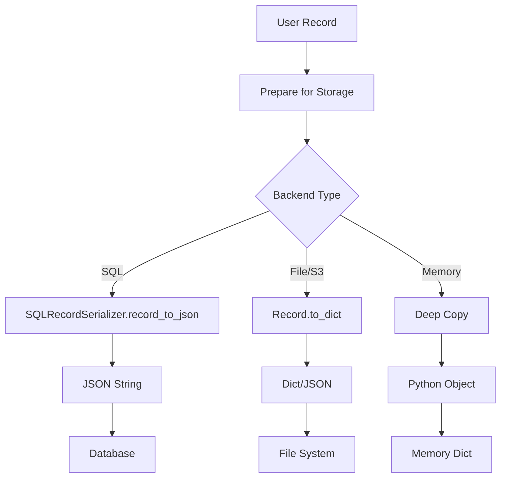
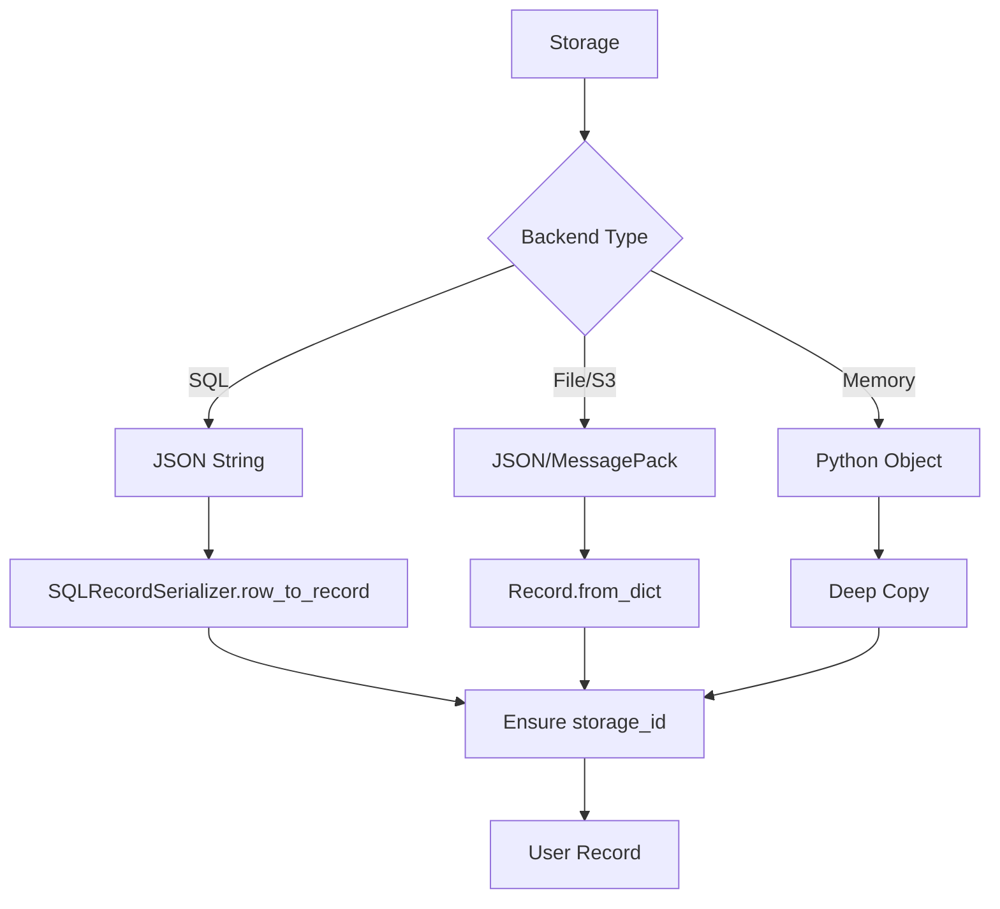

# Record Serialization Architecture

## Overview

Record serialization in DataKnobs is designed to handle complex data types, including vector embeddings, while maintaining consistency across all storage backends. The architecture provides a centralized serialization system that properly handles VectorField objects and other specialized field types.

## The Serialization Challenge

### Complex Field Types

Records can contain various field types:
- **Simple types**: strings, numbers, booleans
- **Complex types**: lists, dictionaries, nested objects  
- **VectorFields**: High-dimensional numpy arrays with metadata
- **Timestamps**: datetime objects
- **Binary data**: Files, images, etc.

### Backend Requirements

Different backends have different storage formats:
- **SQL databases**: JSON columns for flexible schema
- **File/S3**: JSON or MessagePack files
- **Memory**: Native Python objects
- **Elasticsearch**: Native JSON with special vector handling

## Centralized Serialization System

### SQLRecordSerializer

All SQL-based backends (SQLite, PostgreSQL) use the centralized `SQLRecordSerializer`:

```python
class SQLRecordSerializer:
    """Handles record serialization for SQL backends."""
    
    @staticmethod
    def record_to_json(record: Record) -> str:
        """Convert a Record to JSON string for storage."""
        data = {}
        
        for field_name, field_obj in record.fields.items():
            if isinstance(field_obj, VectorField):
                # Serialize VectorField with all metadata
                data[field_name] = field_obj.to_dict()
            else:
                # Regular field - store the value
                data[field_name] = field_obj.value
                
        return json.dumps(data)
    
    @staticmethod
    def row_to_record(row: dict[str, Any]) -> Record:
        """Convert a database row to a Record."""
        data_json = row.get("data", {})
        
        # Parse JSON if needed
        if isinstance(data_json, str):
            data_dict = json.loads(data_json)
        else:
            data_dict = data_json
        
        # Reconstruct fields with proper types
        fields = OrderedDict()
        for field_name, field_value in data_dict.items():
            if isinstance(field_value, dict) and "value" in field_value:
                # VectorField or other complex field
                if "dimensions" in field_value:
                    fields[field_name] = VectorField.from_dict(field_value)
                else:
                    fields[field_name] = Field.from_dict(field_value)
            else:
                # Simple field
                fields[field_name] = Field(name=field_name, value=field_value)
        
        # Create record with metadata
        metadata = json.loads(row.get("metadata", "{}"))
        record = Record(data=fields, metadata=metadata)
        
        # Ensure storage_id is set
        return ensure_record_id(record, row["id"])
```

## VectorField Serialization

### The VectorField Structure

```python
class VectorField(Field):
    """Field for storing vector embeddings."""
    
    value: np.ndarray           # The actual vector
    dimensions: int              # Vector dimensions
    source_field: str | None     # Source text field
    model_name: str | None       # Embedding model used
    model_version: str | None    # Model version
    metadata: dict               # Additional metadata
```

### Serialization Format

VectorFields are serialized to preserve all information:

```json
{
  "field_name": {
    "value": [0.1, 0.2, 0.3, ...],  // Vector as list
    "dimensions": 384,
    "source_field": "content",
    "model_name": "text-embedding-ada-002",
    "model_version": "v1",
    "metadata": {
      "content_hash": "abc123...",
      "created_at": "2024-01-01T00:00:00Z"
    },
    "type": "vector",
    "name": "field_name"
  }
}
```

### Deserialization Process

1. **Detection**: Check for dict with "value" and "dimensions" keys
2. **Type Creation**: Instantiate appropriate Field subclass
3. **Array Conversion**: Convert lists back to numpy arrays
4. **Metadata Preservation**: Maintain all field metadata

## Backend-Specific Implementations

### SQL Backends (SQLite, PostgreSQL)

```python
# Storage format
{
  "id": "uuid-123",
  "data": "{\"field1\": \"value1\", \"vector\": {\"value\": [...], ...}}",
  "metadata": "{\"created_at\": \"2024-01-01\"}",
  "created_at": "2024-01-01 00:00:00",
  "updated_at": "2024-01-01 00:00:00"
}
```

- Use `SQLRecordSerializer` for all serialization
- Store data as JSON string in `data` column
- Metadata stored separately for querying

### File/S3 Backends

```python
# File format (JSON)
{
  "uuid-123": {
    "fields": {
      "content": {"name": "content", "value": "text", "type": "string"},
      "embedding": {
        "name": "embedding",
        "value": [...],
        "type": "vector",
        "dimensions": 384,
        ...
      }
    },
    "metadata": {...}
  }
}
```

- Use `Record.to_dict()` and `Record.from_dict()`
- Support both JSON and MessagePack formats
- Preserve full field structure

### Memory Backend

```python
# In-memory storage
self._storage = {
    "uuid-123": Record(
        fields=OrderedDict([
            ("content", Field(name="content", value="text")),
            ("embedding", VectorField(value=np.array([...]), ...))
        ]),
        metadata={...},
        storage_id="uuid-123"
    )
}
```

- Store native Python objects
- No serialization needed for storage
- Deep copy on read/write for isolation

## Serialization Flow

### Write Path



### Read Path



## Best Practices

### 1. Always Use Centralized Serializers

```python
# Good - uses centralized serializer
data_json = SQLRecordSerializer.record_to_json(record)

# Bad - custom serialization
data_json = json.dumps(record.__dict__)  # Don't do this!
```

### 2. Preserve Field Types

```python
# Good - preserves VectorField type
if isinstance(field, VectorField):
    serialized = field.to_dict()

# Bad - loses type information
serialized = {"value": field.value.tolist()}  # Missing metadata!
```

### 3. Handle Storage IDs Properly

```python
# Good - ensures storage_id is set
record = SQLRecordSerializer.row_to_record(row)
record = ensure_record_id(record, row["id"])

# Bad - forgets to set storage_id
record = Record.from_dict(data)  # No storage_id!
```

## Migration and Compatibility

### Version Compatibility

The serialization format is designed to be forward and backward compatible:

1. **New fields**: Ignored by older versions
2. **Missing fields**: Use defaults
3. **Type changes**: Validated and coerced

### Migration Strategy

```python
def migrate_legacy_record(old_data: dict) -> Record:
    """Migrate old format to new format."""
    
    # Handle old vector format
    if "embedding" in old_data and isinstance(old_data["embedding"], list):
        old_data["embedding"] = {
            "value": old_data["embedding"],
            "type": "vector",
            "dimensions": len(old_data["embedding"])
        }
    
    # Create record with new format
    return Record.from_dict(old_data)
```

## Performance Considerations

### Serialization Overhead

- **JSON**: ~10-20% size overhead, fast parsing
- **MessagePack**: Minimal overhead, faster for binary data
- **Compression**: Can reduce vector storage by 50-70%

### Optimization Strategies

1. **Lazy Loading**: Don't deserialize vectors until needed
2. **Batch Operations**: Serialize multiple records together
3. **Caching**: Cache deserialized records in memory
4. **Compression**: Use compression for large vectors

```python
# Example: Lazy vector loading
class LazyVectorField(VectorField):
    def __init__(self, data_ref: str):
        self._data_ref = data_ref
        self._value = None
    
    @property
    def value(self):
        if self._value is None:
            self._value = load_vector(self._data_ref)
        return self._value
```

## Error Handling

### Common Issues and Solutions

1. **Corrupted JSON**
```python
try:
    data = json.loads(data_json)
except json.JSONDecodeError:
    # Log error and return empty record or raise
    logger.error(f"Invalid JSON: {data_json[:100]}")
    return Record()
```

2. **Missing Vector Dimensions**
```python
if "dimensions" not in vector_data:
    # Infer from value length
    vector_data["dimensions"] = len(vector_data["value"])
```

3. **Type Mismatches**
```python
if not isinstance(value, np.ndarray):
    # Convert to numpy array
    value = np.array(value)
```

## Testing Serialization

### Unit Test Example

```python
def test_vector_field_serialization():
    # Create record with vector
    vector = np.random.rand(384)
    record = Record({
        "content": "test",
        "embedding": VectorField(
            value=vector,
            dimensions=384,
            model_name="test-model"
        )
    })
    
    # Serialize
    json_str = SQLRecordSerializer.record_to_json(record)
    
    # Deserialize
    row = {"id": "test-id", "data": json_str, "metadata": "{}"}
    restored = SQLRecordSerializer.row_to_record(row)
    
    # Verify
    assert np.array_equal(
        restored.get_value("embedding"),
        vector
    )
    assert restored.fields["embedding"].model_name == "test-model"
```

## See Also

- [Record ID Architecture](RECORD_ID_ARCHITECTURE.md) - How record IDs are managed
- [Vector Store Design](VECTOR_STORE_DESIGN.md) - Vector-specific storage details
- [Architecture Overview](ARCHITECTURE.md) - General system architecture