# FSM Processing Flow

This document provides a comprehensive description of how data flows through a Finite State Machine (FSM) network, including state transitions, arc execution, function invocation, and subnetwork handling.

## Table of Contents

1. [Overview](#overview)
2. [Core Concepts](#core-concepts)
3. [Processing Flow](#processing-flow)
4. [Configuration Elements](#configuration-elements)
5. [Function Types and Interfaces](#function-types-and-interfaces)
6. [Execution Modes](#execution-modes)
7. [Network Stack and Subnetworks](#network-stack-and-subnetworks)

## Overview

An FSM processes input data by transitioning through a configured network of states connected by arcs. Processing begins at a designated start state and continues until reaching an end state or exhausting valid transitions.

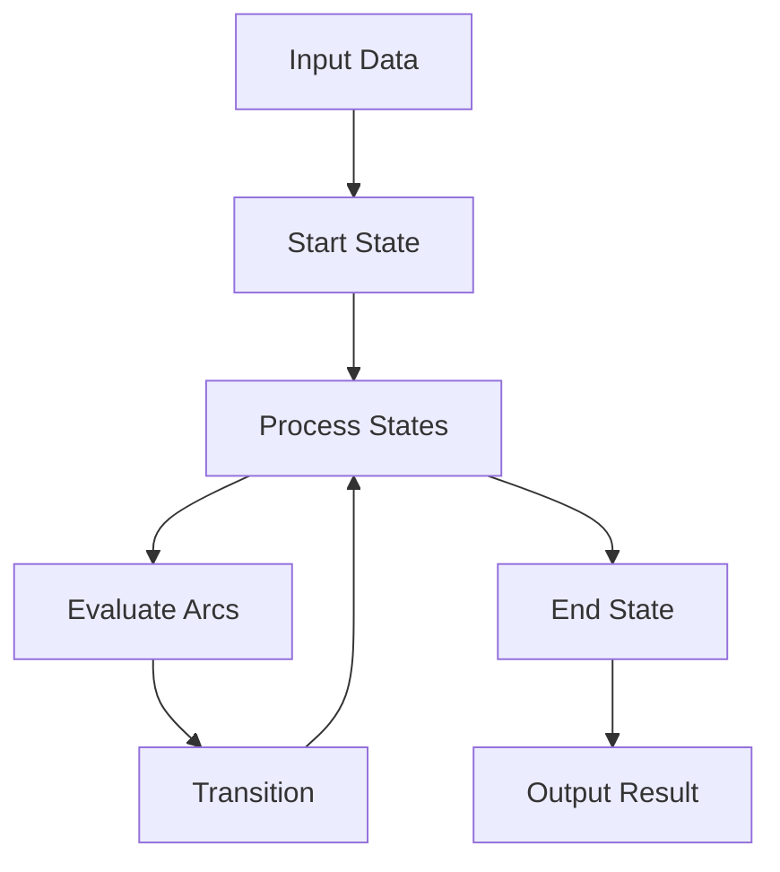

## Core Concepts

### States

States are the fundamental building blocks of an FSM network. Each state represents a distinct processing stage with:

- **Validators**: Functions that validate pre- and post- transformed data
- **Transforms**: Functions that modify data upon state entry
- **Arcs**: Outgoing transitions to other states
- **Resource Requirements**: External resources needed by the state
- **Metadata**: Additional configuration data

### Arcs

Arcs define transitions between states and control the flow of execution through:

- **Pre-test Conditions**: Functions that determine if a transition is valid (applies to both regular arcs and push arcs)
- **Transform Functions**: Functions that modify data during transition
- **Priority**: Determines arc evaluation order
- **Target State**: The destination state for the transition (regular arcs) or target network for push arcs

### Networks

Networks are collections of interconnected states that define complete processing workflows:

- **Main Network**: The primary entry point for FSM execution
- **Sub-networks**: Modular processing units that can be invoked via push arcs
- **Network Stack**: Manages hierarchical network execution

## Processing Flow

### 1. Initialization Phase

When FSM execution begins:


**ExecutionContext Creation**:
- Initializes with data mode (SINGLE, BATCH, or STREAM)
- Sets transaction mode configuration
- Prepares resource management structures
- Establishes network stack for subnetwork handling

**Initial State Selection**:
- Searches for states marked with `is_start: true`
- Falls back to states named 'start' if no explicit start state
- Validates that at least one start state exists

### 2. State Entry Processing

Upon entering a new state, three distinct phases occur:

1. **Pre-Validators** (on state entry): Verify incoming data meets state requirements
2. **State Transforms** (after pre-validation): Transform functions modify data
3. **Post-Validators** (before arc evaluation): Validate transformed data before transitions

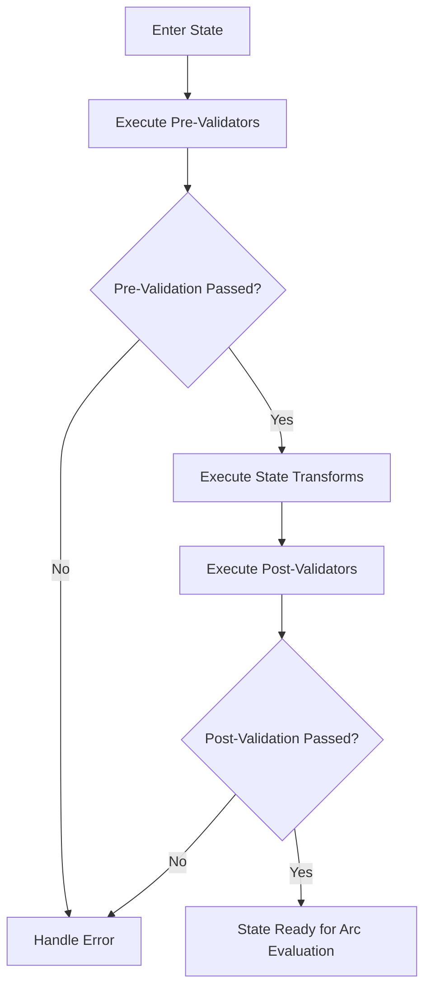

**Processing Phases**:
- **Pre-Validators**: Run immediately on state entry to ensure incoming data is suitable for the state's transforms
- **Transforms**: Modify data after pre-validation succeeds
- **Post-Validators**: Run after transforms, before evaluating arc conditions, to ensure transformed data is valid

#### Validation Functions (Pre and Post)

The FSM supports two types of validators that execute at different phases:

**Pre-Validators**: Verify incoming data before transforms
**Post-Validators**: Validate transformed data before arc evaluation

Both types can be defined as:
1. Classes implementing IValidationFunction interface
2. Regular functions accepting data and context
3. Inline lambdas for simple checks

```python
# Class-based validator (IValidationFunction)
def validate(self, data: Any, context: Dict[str, Any] | None = None) -> ExecutionResult:
    # Validate data
    # Return ExecutionResult with success/failure
    return ExecutionResult.success_result(validated_data)

# Function-based validator
def validate(data: Dict[str, Any], context: FunctionContext) -> Dict[str, Any]:
    # Validate data
    # Return validation results or raise exception
    return validated_data

# Inline lambda validator (receives StateDataWrapper)
lambda state: state.data.get('field') > threshold
```

**Arguments passed**:
- For class-based: `data` (Any type) and optional `context` dict
- For function-based: `data` (dict) and `context` (FunctionContext)
- For inline lambdas: `state` (StateDataWrapper with `.data` attribute)
- `context`: FunctionContext containing:
  - `state_name`: Current state name
  - `function_name`: Validator function name
  - `metadata`: State and execution metadata
  - `resources`: Available resource handles

**Expected output**:
- ExecutionResult object (for IValidationFunction)
- Dictionary with validation results (for functions)
- Boolean or truthy value (for lambdas)
- Returned data merges into `context.data`
- Exceptions halt processing

#### Transform Functions

Transforms execute after validation to modify data. Like validators, they support multiple forms:

```python
# Class-based transform (ITransformFunction)
def transform(self, data: Any, context: Dict[str, Any] | None = None) -> ExecutionResult:
    # Transform data
    return ExecutionResult.success_result(transformed_data)

# Function-based transform with state resources
def transform(data: Dict[str, Any], context: FunctionContext) -> Dict[str, Any]:
    # Access state-level resources
    db = context.resources.get('database')  # From state resources
    cache = context.resources.get('cache')   # From state resources

    if db:
        # Use database to enrich data
        user_data = db.query("SELECT * FROM users WHERE id = ?", [data['user_id']])
        data['user'] = user_data.first()

    if cache:
        # Store in cache for later
        cache.set(f"user:{data['user_id']}", data['user'])

    return data

# Inline lambda transform
lambda state: {**state.data, 'new_field': 'value'}
```

**Arguments passed**:
- For class-based: `data` (Any type) and optional `context` dict
- For function-based: `data` (dict) and `context` (FunctionContext with state resources)
- For inline lambdas: `state` (StateDataWrapper)
- `context`: FunctionContext containing state-allocated resources

**Expected output**:
- ExecutionResult object (for ITransformFunction)
- Dictionary with transformed data (for functions)
- Dictionary or modified data (for lambdas)
- Result replaces or updates `context.data`
- Exceptions may trigger retry logic

### 3. Arc Evaluation and Selection

After state functions complete, the engine evaluates available transitions:

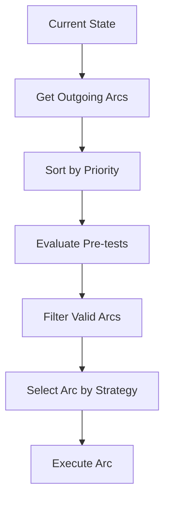

#### Pre-test Evaluation

Pre-test functions determine arc eligibility. They're typically defined as conditions in arc configuration:

```python
# Class-based test function (IStateTestFunction)
def test(self, data: Any, context: Dict[str, Any] | None = None) -> Tuple[bool, str | None]:
    # Evaluate condition
    return (condition_met, "reason if false")

# Function-based pre-test
def pre_test(data: Dict[str, Any], context: FunctionContext) -> bool:
    # Evaluate condition
    return condition_met

# Inline lambda condition (most common)
lambda state: state.data.get('status') == 'ready'
```

**Arguments passed**:
- For class-based: `data` and optional `context` dict
- For function-based: `data` (dict) and `context` (FunctionContext)
- For inline lambdas: `state` (StateDataWrapper)
- `context`: FunctionContext with current state information

**Expected output**:
- Tuple of (bool, reason) for IStateTestFunction
- Boolean for function-based tests
- Boolean or truthy value for lambdas
- `True` allows arc for selection
- `False` excludes arc from consideration

#### Arc Selection Strategy

The engine selects from valid arcs using a deterministic priority-based approach:

1. **Evaluate all outgoing arcs** from the current state
2. **Filter to valid arcs** whose pre-test conditions pass
3. **Sort by priority** (highest to lowest)
   - When priorities are equal, **definition order** is used as the tiebreaker
   - Arcs defined first in the configuration have higher precedence
4. **Select the highest priority arc** with available resources
5. **On downstream failure**: Fall back to the next priority valid arc

**Priority Rules**:
- Explicit `priority` values in arc configuration (default: 0)
- Higher numbers = higher priority (evaluated first)
- When priorities are equal, arcs maintain their definition order
- Definition order = the order arcs appear in the state's configuration

This ensures predictable, deterministic behavior where the best available path is always taken, with automatic fallback to alternative paths if the primary choice leads to failure downstream.

### 4. Arc Execution

Once selected, arc execution proceeds:

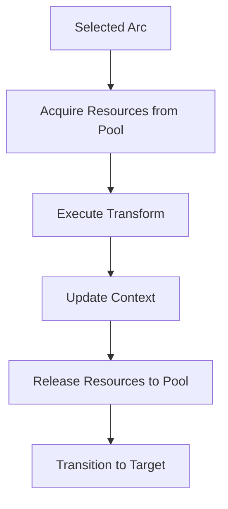

**Note on "Allocate Resources"**: This step acquires existing resources from the pool or cache, not creating new ones. Resources are efficiently reused throughout the FSM execution.

#### Arc Transform Functions

Transform functions modify data during transition:

```python
# Function signature for arc transforms
def transform(data: Dict[str, Any], context: FunctionContext) -> Dict[str, Any]:
    # Transform data during transition
    return transformed_data
```

**Arguments passed**:
- `data`: Current data before transition
- `context`: Enhanced FunctionContext including:
  - Source and target state information
  - Allocated resources for the arc
  - Transition metadata

**Expected output**:
- Dictionary with transformed data
- Result becomes input for target state
- May trigger streaming if configured

### 5. State Transition

After arc execution, the engine transitions to the target state:


**Transition Process**:
1. Store current state as previous state
2. Update current state to arc's target
3. Append to state history for debugging
4. Trigger state entry processing for new state

### 6. Push Arc Execution Flow

When a push arc is encountered during execution, a special subnetwork execution process is triggered:

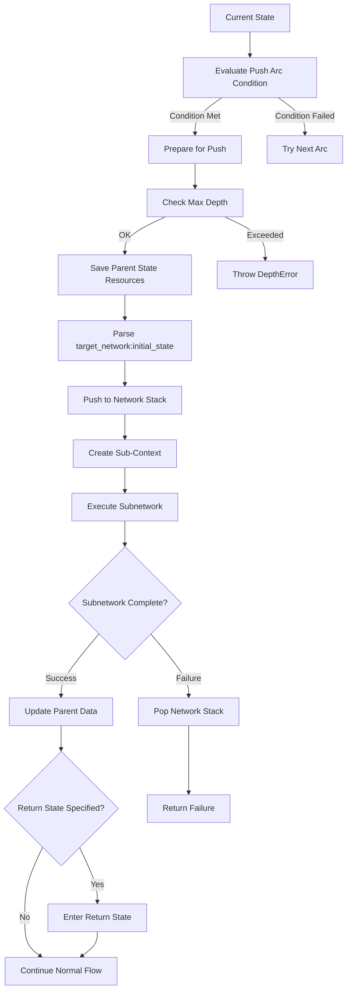

#### Detailed Push Arc Process

**1. Arc Condition Evaluation**
- Push arcs support the same conditional logic as regular arcs
- Condition functions receive current data and context
- If condition fails, push arc is skipped and next available arc is tried

**2. Depth Limit Check**
- Maximum network stack depth is enforced (default: 10 levels)
- Prevents infinite recursion in network hierarchies
- Throws `StateTransitionError` if depth exceeded

**3. Resource Context Preservation**
- Parent state resources are saved before pushing
- These resources become available to all subnetwork states
- Resources are accessed via `context.metadata['parent_state_resources']`

**4. Target Network Parsing**
- Supports `"network_name"` format (uses default initial state)
- Supports `"network_name:initial_state"` format (custom entry point)
- Validates that specified initial state exists in target network

**5. Network Stack Management**
- Current network context is pushed onto stack: `[(network_name, return_state)]`
- Stack enables proper return to parent network after subnetwork completion
- Stack is automatically popped when subnetwork reaches end state

**6. Context Isolation Modes**
- **COPY** (default): Creates new ExecutionContext with copied data
- **PARTIAL**: Clones context with shared variables
- **REFERENCE**: Uses same context (no isolation)
- Resource manager and variables are preserved across isolation modes

**7. Subnetwork Execution**
- Subnetwork executes with its own state machine logic
- Initial state can be overridden using `network_name:initial_state` syntax
- Normal state entry processing applies (pre-validators, transforms, etc.)
- Subnetwork continues until reaching an end state

**8. Result Integration**
- Successful subnetwork execution updates parent context data
- Failed execution preserves original parent data
- Data transformations in subnetwork are reflected in final result

**9. Return State Processing**
- If `return_state` specified: execution continues at that state in parent network
- If no return state: execution continues from push arc's original target
- Return state entry includes full state processing (resources, validators, transforms)

**10. Resource Cleanup**
- Parent state resources are restored/cleaned up appropriately
- Subnetwork-specific resources are released
- Resource inheritance attributes are removed from context

#### Push Arc Error Handling

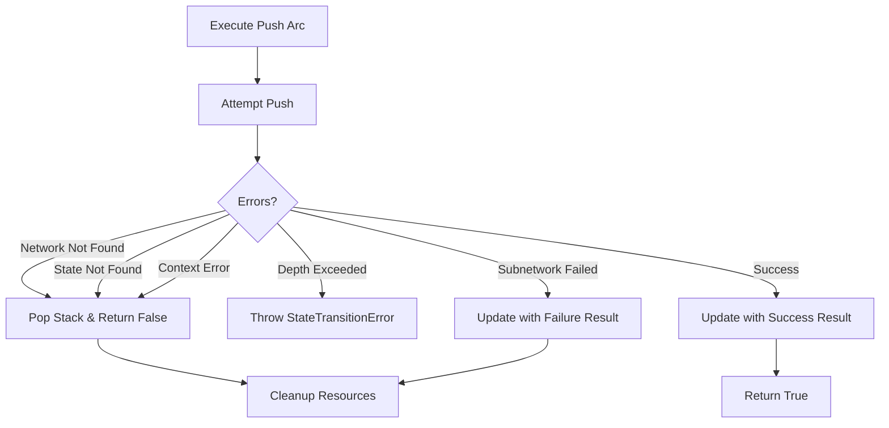

**Error Recovery**:
- Network stack is properly unwound on failures
- Resources are cleaned up even on error conditions
- Parent context remains intact after failed subnetwork execution
- Execution can continue with alternative arcs if push arc fails

### 7. Complete Execution Loop

The complete execution loop combines all phases:

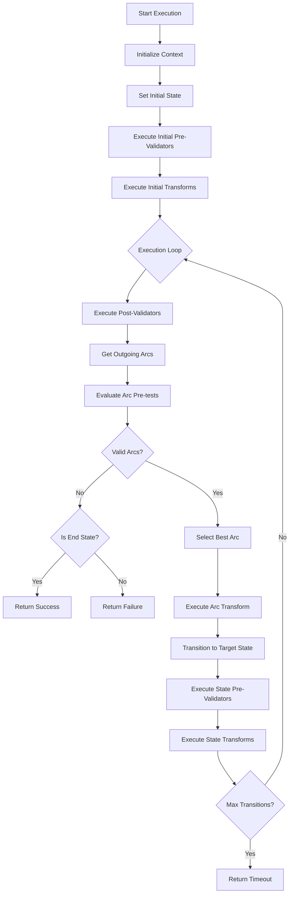

**Key Points**:
- Pre-validators run immediately upon entering a state (validate incoming data)
- State transforms run after pre-validation passes
- Post-validators run after transforms, before arc evaluation
- Arc transforms run during transition (prepare data for target state)
- The loop continues until reaching an end state or exhausting transitions

### 7. Termination Conditions

Processing terminates when:

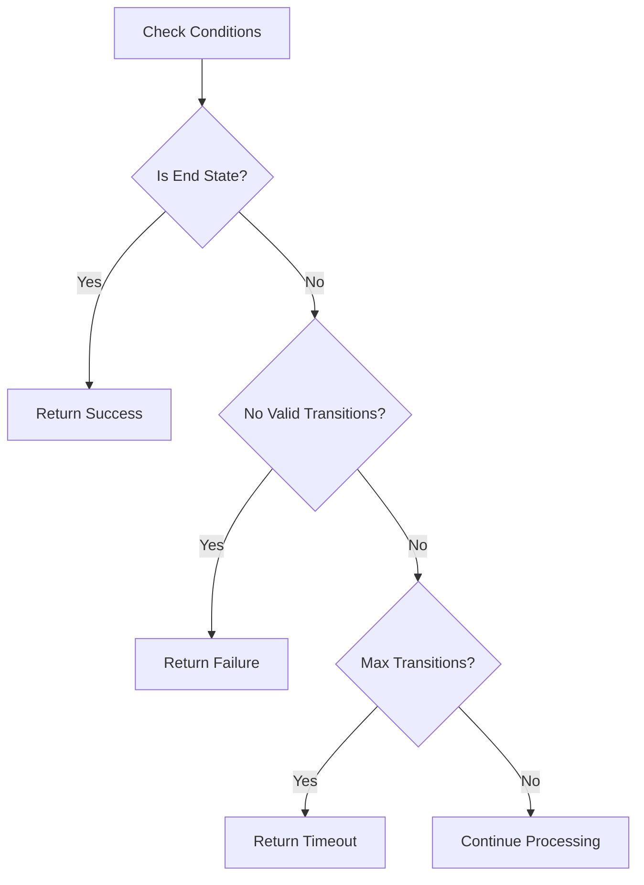

**End Conditions**:
- **End State Reached**: State marked with `is_end: true`
- **No Valid Transitions**: No arcs pass pre-test conditions
- **Maximum Transitions**: Exceeds configured transition limit
- **Stuck State Detection**: Same state/data for multiple iterations

## Configuration Elements

### State Configuration

The FSM configuration supports two formats for defining states and arcs:

#### Format 1: Canonical Schema (Arcs Under States)

This is the native format matching the schema definition:

```yaml
# Network-level configuration
networks:
  - name: "main"
    states:
      - name: "process_data"
        is_start: false
        is_end: false
        resources: ["main_db", "cache"]  # Resources for state transforms
        pre_validators:  # Validate incoming data before transforms
          - type: "builtin"
            name: "validate_input_schema"
            params:
              schema: {...}
        transforms:
          - type: "custom"
            module: "my_module"
            name: "process_transform"
        validators:  # Post-validators: validate after transforms
          - type: "builtin"
            name: "validate_output_schema"
            params:
              schema: {...}
        arcs:  # Arcs defined under the source state
          - target: "next_state"
            condition:
              type: "inline"
              code: "lambda state: state.data.get('ready', False)"
            transform:
              type: "builtin"
              name: "add_metadata"
            priority: 10
            resources: ["api_client"]  # Arc-specific resources
```

#### Format 2: Simplified Format (Arcs at Root Level)

For simpler configurations, arcs can be defined at the network/root level:

```yaml
# SimpleFSM format
name: "my_fsm"
states:
  - name: "start"
    is_start: true
  - name: "process"
  - name: "end"
    is_end: true

arcs:  # Arcs at root level with 'from' and 'to' fields
  - from: "start"
    to: "process"
    condition:
      type: "inline"
      code: "data.get('ready', False)"
    transform:
      code: "data['processed'] = True; data"
    priority: 10
  - from: "process"
    to: "end"
```

**Note**: The simplified format with root-level arcs is automatically converted to the canonical format during loading.

**Configuration Mapping to Processing**:

| Config Element | Processing Stage | Function Type |
|---------------|------------------|---------------|
| `pre_validators` | State entry, before transforms | IValidationFunction |
| `transforms` | State entry, after pre-validation | ITransformFunction |
| `validators` | After transforms, before arc evaluation | IValidationFunction |
| `arcs.condition` | Arc evaluation phase | IStateTestFunction |
| `arcs.transform` | Arc execution phase | ITransformFunction |

### Arc Configuration

Arcs connect states and control transitions. They can be defined in two ways:

#### Canonical Format (Under States):
```yaml
states:
  - name: "source_state"
    arcs:
      - target: "target_state"
        condition:  # Pre-test function
          type: "builtin"
          name: "check_threshold"
          params:
            threshold: 100
        transform:  # Arc transform function
          type: "inline"
          code: "lambda state: {...}"
        priority: 5
        resources: ["main_db", "cache_service"]  # Resource names
```

#### Simplified Format (Root Level):
```yaml
arcs:
  - from: "source_state"
    to: "target_state"
    condition:
      type: "inline"
      code: "data.get('value') > 100"
    transform:
      code: "data['processed'] = True; data"
    priority: 5
```

**Arc Processing Correspondence**:

1. **Evaluation Order**: Sorted by `priority` (higher first)
2. **Condition Check**: `condition` function determines eligibility
3. **Transform Execution**: `transform` modifies data during transition
4. **Resource Acquisition**: `resources` list specifies resource names (not types) to acquire

## Data Format and Assumptions

### Data Types and Conversion

The FSM is flexible about data formats but internally ensures consistency:

**Accepted Input Formats**:
1. **Dictionary** (most common): `{'field1': 'value1', 'field2': 123}`
2. **Object with attributes**: Custom objects with fields
3. **FSMData wrapper**: Internal wrapper supporting both dict and attribute access
4. **Any iterable**: Will be converted to dict if possible

**Internal Processing**:
- The FSM uses `ensure_dict()` to convert all data to dictionary format before passing to functions
- This conversion handles:
  - Plain dictionaries → passed through unchanged
  - FSMData/StateDataWrapper → converted via `.to_dict()`
  - Objects with `._data` or `.data` → extracted and converted
  - Other objects → converted via `dict(obj)` if possible, else empty dict

**Data Flow**:
```python
# Input can be various types
input_data = MyCustomObject()  # or dict, or FSMData

# FSM converts internally
context.data = ensure_dict(input_data)  # Always a dict

# Functions receive dict (or wrapped for lambdas)
def my_function(data: Dict[str, Any], context: FunctionContext):
    # data is always a dictionary here
    return {'processed': True, **data}
```

**Important**: While the FSM accepts various input formats, functions always receive data as a **dictionary** (except inline lambdas which receive a StateDataWrapper). This ensures consistent behavior regardless of input type.

### Data in Different Execution Modes

The data format remains consistent across execution modes, but the processing pattern differs:

#### Single Mode
- **Input**: One data record (dict or convertible to dict)
- **Processing**: Complete FSM traversal for the single record
- **Functions receive**: The single record as a dict
- **Output**: Final transformed record

```python
# Single mode execution
fsm.execute({'user_id': 123, 'action': 'login'})
# Functions work with this single record throughout
```

#### Batch Mode
- **Input**: List of records stored in `context.batch_data`
- **Processing**: Each record processed individually through FSM
- **Functions receive**: One record at a time as a dict
- **Output**: List of results in `context.batch_results`

```python
# Batch mode - input is a list
batch_data = [
    {'user_id': 123, 'action': 'login'},
    {'user_id': 456, 'action': 'logout'},
]
# Each record processed separately, functions see one at a time
```

#### Stream Mode
- **Input**: Continuous stream of data chunks
- **Processing**: Chunks processed as they arrive
- **Functions receive**: Current chunk data as dict
- **Output**: Stream of processed chunks

```python
# Stream mode - data arrives in chunks
# Functions process one chunk at a time
# Each chunk is still a dict when passed to functions
```

**Key Point**: Regardless of execution mode, individual functions always work with a single data dictionary at a time. The execution engine handles the iteration and aggregation.

### Resource Management

Resources are external systems or services that states and arcs can access during execution.

#### Resource Types

The FSM provides built-in resource adapters for:

1. **Database Resources** (`database`):
   - Wraps dataknobs_data database backends
   - Supports memory, file, postgres, sqlite, etc.
   - Provides connection pooling and transaction support

2. **File System Resources** (`filesystem`):
   - File and directory operations
   - Stream processing support
   - Path validation and safety checks

3. **HTTP Resources** (`http`):
   - REST API clients
   - Connection pooling
   - Retry and timeout handling

4. **LLM Resources** (`llm`):
   - Language model integrations
   - Token management
   - Response caching

5. **Custom Resources** (`custom`):
   - User-defined resource providers
   - Must implement IResourceProvider interface

#### Resource Definition

Resources are defined in the FSM configuration:

```yaml
resources:
  - name: "main_db"
    type: "database"
    config:
      backend: "postgres"
      host: "localhost"
      database: "myapp"
    connection_pool_size: 10
    timeout_seconds: 30

  - name: "api_client"
    type: "http"
    config:
      base_url: "https://api.example.com"
      auth_token: "${API_TOKEN}"
    retry_attempts: 3
```

#### Resource Allocation and Scope

Resources can be defined at two levels with different scopes:

1. **State Resources** (`resources` field in state config):
   - Allocated when entering a state
   - Available to all state functions (pre-validators, transforms, post-validators)
   - Released when leaving the state
   - Shared across all state operations

2. **Arc Resources** (`resources` field in arc config):
   - Allocated when executing the arc
   - **ADDITIVE** to state resources (merged, not replacing)
   - Available to arc functions (condition, transform)
   - Released after arc execution completes
   - Arc gets both state and arc-specific resources

**Resource Merging Strategy**:
```yaml
states:
  - name: "data_processor"
    resources: ["database", "cache"]  # State resources
    transforms:
      - type: "custom"
        name: "process_with_db"  # Gets: database, cache
    arcs:
      - target: "next_state"
        resources: ["api_client"]  # Arc-specific resources
        transform:
          name: "enrich_via_api"
          # Arc transform gets: database, cache (from state) + api_client (from arc)
```

**Important Considerations**:

1. **Resource Naming**: Use unique names to avoid conflicts
   - ❌ Bad: State has `"database"`, Arc also has `"database"` (conflict!)
   - ✅ Good: State has `"main_db"`, Arc has `"analytics_db"`

2. **Resource Reuse**: If arc needs same resource as state, don't re-declare
   - ❌ Redundant: State has `["main_db"]`, Arc has `["main_db"]`
   - ✅ Efficient: State has `["main_db"]`, Arc has `[]` (inherits state's)

3. **Conflict Resolution**: If same resource name appears in both:
   - State resource takes precedence (already allocated)
   - Arc resource request is ignored with warning
   - Prevents double-allocation of same resource

#### Resource Access in Functions

Resources are acquired by the execution engine and passed to functions via the FunctionContext:

```python
def my_transform(data: Dict[str, Any], context: FunctionContext) -> Dict[str, Any]:
    # Access resources from context
    db = context.resources.get('main_db')  # Returns database connection
    api = context.resources.get('api_client')  # Returns HTTP client

    if db:
        # Use database resource
        result = db.query("SELECT * FROM users WHERE id = ?", [data['user_id']])
        data['user'] = result.first()

    if api:
        # Use HTTP resource
        response = api.get(f"/users/{data['user_id']}")
        data['api_data'] = response.json()

    return data
```

**Resource Lifecycle and Efficiency**:

Resources are efficiently managed through pooling and caching mechanisms:

1. **Initial Creation**: Resources are created once when first needed
   - Resource pools pre-initialize minimum connections at startup
   - Database connections, HTTP clients etc. are created and reused

2. **Arc Execution Pattern**:
   ```
   Arc needs resource → Check if already cached for this owner
                     → If cached: Return existing instance
                     → If not: Acquire from pool or create new
   Arc executes     → Resource available in context.resources
   Arc completes    → Resource released back to pool (not destroyed)
   ```

3. **Caching Strategy**:
   - ResourceManager caches resources by `owner_id` (combination of arc identifier and execution ID)
   - Within same execution, if same arc executes multiple times, it reuses the same resource instance
   - Resources are returned to pool after arc completion but remain available for reuse

4. **Pool Management**:
   - Connection pools maintain min/max resource instances
   - Idle resources are kept alive for configured timeout
   - Resources are validated periodically and replaced if unhealthy
   - Pool handles acquisition/release transparently

**Important**: Despite the term "Resource Allocation" in arc execution, resources are NOT rebuilt on each arc execution. The system efficiently reuses pooled resources. The "allocation" refers to checking out a resource from the pool, not creating a new one.

### Context Parameters

Functions receive context information through the `FunctionContext` dataclass:

```python
@dataclass
class FunctionContext:
    state_name: str          # Name of current state
    function_name: str       # Name of function being executed
    metadata: Dict[str, Any] # Additional metadata
    resources: Dict[str, Any] # Acquired resource instances
```

#### Context Details

**`state_name`** (str):
- The name of the current state where the function is executing
- Example: `"validate_input"`, `"process_data"`

**`function_name`** (str):
- The name of the function being executed
- For registered functions: the registered name
- For inline lambdas: usually `"transform"` or `"validate"`

**`metadata`** (Dict[str, Any]):
- Additional execution context information
- Common fields:
  - `'state'`: Current state name (duplicate of state_name)
  - `'source_state'`: Source state for arc transitions
  - `'target_state'`: Target state for arc transitions
  - `'is_end_state'`: Boolean if current state is an end state
  - Custom metadata from state/arc configuration

**`resources`** (Dict[str, Any]):
- Dictionary mapping resource names to acquired resource instances
- Keys are resource names from configuration (e.g., `"main_db"`, `"api_client"`)
- Values are the actual resource objects:
  - Database resources → database connection/instance
  - HTTP resources → configured HTTP client
  - File system resources → file handler
  - LLM resources → model client
- Empty dict if no resources required/available

#### Context Usage Examples

```python
# Validator with resource access
def validate_with_db(data: Dict[str, Any], context: FunctionContext) -> Dict[str, Any]:
    db = context.resources.get('validation_db')
    if db and data.get('user_id'):
        exists = db.exists('users', {'id': data['user_id']})
        data['user_exists'] = exists

    # Access metadata
    if context.metadata.get('is_end_state'):
        data['final_validation'] = True

    return data

# Arc transform with state information
def arc_transform(data: Dict[str, Any], context: FunctionContext) -> Dict[str, Any]:
    # Use state transition information
    data['from_state'] = context.metadata.get('source_state')
    data['to_state'] = context.metadata.get('target_state')
    data['transition_time'] = time.time()

    return data
```

**Important Notes**:
- The `context` parameter for class-based functions (IValidationFunction, etc.) is a plain `Dict[str, Any]` or None
- The `context` parameter for regular functions is always a `FunctionContext` dataclass instance
- Resources must be defined in configuration and requested by states/arcs to be available
- Resource acquisition failures will prevent state/arc execution

## Hierarchical Networks and Push Arcs

### Overview

FSMs support hierarchical composition through **subnetworks** and **push arcs**. This allows complex state machines to be decomposed into reusable, modular components.

### Network Configuration

Networks are defined as separate entities within the FSM configuration:

```yaml
name: "order_processing"
networks:
  - name: "main"
    states:
      - name: "validate_order"
        transforms: ["validate_order_data"]
        arcs:
          - target: "process_payment"  # Regular arc
          - target_network: "inventory_check"  # Push arc to subnetwork
            return_state: "ship_order"
            data_isolation: "copy"
      - name: "ship_order"
        # ... state config ...

  - name: "inventory_check"  # Subnetwork
    states:
      - name: "check_stock"
        is_start: true
        # ... state config ...
      - name: "reserve_items"
        is_end: true
        # ... state config ...

main_network: "main"
```

### Push Arc Configuration

Push arcs are special arcs that transfer execution to a subnetwork:

```yaml
arcs:
  - target_network: "validation_subnet"  # Required: target network name
    return_state: "continue_processing"  # Optional: state to return to
    data_isolation: "copy"                # Data handling mode
    pre_test: "should_validate"           # Optional: condition for push
    transform: "prepare_validation_data"  # Optional: transform before push
    priority: 10                           # Arc priority
```

#### Custom Initial State Specification

Push arcs support specifying a custom initial state in the target network using the `network_name:initial_state` syntax:

```yaml
arcs:
  # Standard push arc - uses target network's default initial state
  - target_network: "validation_subnet"
    return_state: "continue_processing"

  # Push arc with custom initial state - skip to specific state
  - target_network: "validation_subnet:advanced_validation"
    return_state: "continue_processing"
    condition:
      type: "inline"
      code: "lambda state: state.data.get('requires_advanced_validation')"
```

**Syntax**: `"<network_name>:<initial_state>"`
- `network_name`: Name of the target subnetwork
- `initial_state`: Specific state to start execution at (bypasses default initial state)

**Use Cases**:
- **Conditional Entry Points**: Different entry points based on data conditions
- **Workflow Optimization**: Skip initial setup states when not needed
- **Error Recovery**: Jump to specific recovery states in subnetworks
- **Multi-Phase Processing**: Enter subnetworks at different stages

**Important Notes**:
- The specified initial state must exist in the target network
- Normal state entry processing applies (pre-validators, transforms, etc.)
- If the initial state doesn't exist, execution fails with an error
- Backward compatible: existing `target_network` without colon syntax continues to work

### Data Flow in Push Arcs

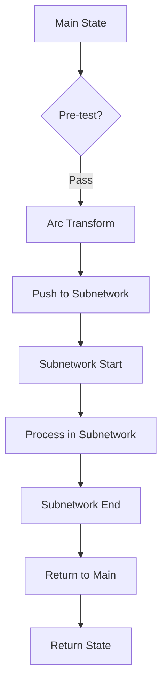

#### Execution Sequence

1. **Pre-test Evaluation**: Push arc's pre-test determines if subnetwork should be invoked
2. **Arc Transform**: If present, transform executes BEFORE pushing to subnetwork
   - Prepares data for subnetwork processing
   - Can filter, reshape, or augment data
3. **Data Isolation**: Based on `data_isolation` mode:
   - `copy`: Subnetwork gets a copy of data (default)
   - `share`: Subnetwork operates on same data instance
   - `partial`: Selected fields are copied
4. **Subnetwork Execution**: Subnetwork processes from its start to end states
5. **Result Integration**: Subnetwork's final data replaces or merges with original
6. **Return Transition**: Execution continues at `return_state` (if specified)

### Data Mapping (Future Enhancement)

The current implementation passes the entire data record to subnetworks. Future enhancements could include:

```yaml
arcs:
  - target_network: "validation"
    data_mapping:           # Map parent fields to child
      order_id: id
      items: products
    result_mapping:         # Map child results back
      validation_status: is_valid
      error_messages: validation_errors
```

### Transform Application on Push Arcs

**Important**: Arc transforms on push arcs execute BEFORE pushing to the subnetwork:

```python
def prepare_for_validation(data: Dict[str, Any], context: FunctionContext) -> Dict[str, Any]:
    """Transform that prepares data before pushing to validation subnetwork."""
    return {
        'validation_request': {
            'order_id': data['id'],
            'items': data['items'],
            'timestamp': time.time()
        }
    }
```

The subnetwork receives the transformed data, not the original.

### Resource Scope in Subnetworks

Resources allocated in the parent network are available to subnetworks:
- Parent state resources remain allocated during subnetwork execution
- Subnetwork states can allocate additional resources
- All resources are properly released when returning to parent

### Shared Variables and Subnetworks

**Current Behavior**: Variables are part of ExecutionContext and persist through subnetwork calls.

**Recommended Scope** (for implementation):
1. **Global Variables**: Accessible across all networks in the execution
2. **Network Variables**: Scoped to a specific network and its subnetworks
3. **Local Variables**: Exist only within a single network (not passed to subnetworks)

Example usage:
```python
def track_subnet_calls(data: Dict[str, Any], context: FunctionContext) -> Dict[str, Any]:
    # Increment subnet call counter (global variable)
    context.variables['subnet_calls'] = context.variables.get('subnet_calls', 0) + 1

    # Set network-specific variable
    context.variables[f'{context.state_name}_processed'] = True

    return data
```

## State Communication and Data Flow

### Communication Between States

**Important**: States communicate PRIMARILY through the data being processed. The only shared mutable context between states is through shared variables as described in the "Cross-State Communication via Shared Variables" section below. All other contextual data modifications will be transient.

#### What Functions CAN Modify

1. **The Data Dictionary** (`context.data`):
   - Functions return modified data that becomes the new `context.data`
   - This is the PRIMARY way to pass information between states
   - Example:
     ```python
     def transform(data: Dict[str, Any], context: FunctionContext) -> Dict[str, Any]:
         # Add a field that next state can see
         data['processed_by'] = context.state_name
         data['processing_timestamp'] = time.time()
         return data
     ```

#### What Functions CANNOT Modify

1. **FunctionContext** (Read-Only):
   - Created fresh for each function call
   - Changes to `context.metadata` or `context.resources` are NOT persisted
   - Modifications have no effect beyond the current function execution

2. **ExecutionContext** (Not Accessible):
   - Functions don't have direct access to ExecutionContext
   - Cannot modify: `current_state`, `state_history`, `network_stack`, etc.
   - These are managed exclusively by the execution engine

#### Protected Execution Engine Fields

The following ExecutionContext fields are critical for engine operation and must NEVER be modified by user code (even if exposed):

| Field | Purpose | Why Protected |
|-------|---------|---------------|
| `current_state` | Tracks current FSM position | Engine relies on this for transitions |
| `previous_state` | Enables state history | Used for debugging and rollback |
| `network_stack` | Manages subnetwork calls | Critical for push/pop operations |
| `state_history` | Audit trail of execution | Used for loop detection |
| `current_transaction` | Transaction management | Database consistency depends on this |
| `resource_manager` | Resource allocation | Prevents resource leaks |
| `data_mode` | Processing mode (SINGLE/BATCH/STREAM) | Affects entire execution strategy |

#### Design Implications

1. **Stateless Functions**: Each function should be stateless, relying only on input data
2. **No Side Channels**: No hidden communication between states
3. **Explicit Data Flow**: All state communication is visible in the data
4. **Predictable Behavior**: Same input always produces same output

### Cross-State Communication via Shared Variables

In addition to data flow, the FSM supports shared variables for cross-state communication:

#### How Shared Variables Work

1. **Access Through FunctionContext**:
   ```python
   def transform(data: Dict[str, Any], context: FunctionContext) -> Dict[str, Any]:
       # Read a variable set by previous state
       cached_data = context.variables.get('expensive_lookup', {})

       # Set a variable for later states
       context.variables['processing_stage'] = 'enrichment_complete'

       # Accumulate statistics across states
       stats = context.variables.get('stats', {'count': 0})
       stats['count'] += 1
       context.variables['stats'] = stats

       return data
   ```

2. **Variable Scoping**:
   - **Execution Scope**: Variables persist for entire FSM execution
   - **Network Scope**: Variables can be scoped to current network
   - **Cleanup**: Network-scoped variables cleared when exiting network

3. **Use Cases**:
   - **Caching**: Load expensive data once, reuse across states
   - **Statistics**: Accumulate metrics throughout execution
   - **State Coordination**: Share flags or signals between states
   - **Resource Handles**: Store connections for reuse

#### Important Considerations

1. **Not for Primary Data Flow**: Use data dictionary for main data
2. **State Independence**: States should still work without variables
3. **Memory Management**: Clear large cached data when done
4. **Thread Safety**: Variables are shared references (be careful with concurrent access)

## Function Types and Interfaces

### Function Categories

The FSM supports four primary function types:

#### 1. Validation Functions (IValidationFunction)

**Purpose**: Verify data integrity and business rules

**Interface**:
```python
def validate(data: Dict[str, Any], context: FunctionContext) -> Dict[str, Any]
```

**Available Information**:
- `data`: Complete current data dictionary
- `context.state_name`: Current state name
- `context.metadata`: Execution and state metadata
- `context.resources`: Allocated resource handles

**Expected Behavior**:
- Return validated/cleaned data dictionary
- Raise exception to halt processing
- May add validation flags to data

#### 2. Transform Functions (ITransformFunction)

**Purpose**: Modify, enrich, or restructure data

**Interface**:
```python
def transform(data: Dict[str, Any], context: FunctionContext) -> Dict[str, Any]
```

**Available Information**:
- Same as validation functions
- Additional transition context for arc transforms

**Expected Behavior**:
- Return transformed data dictionary
- May add, remove, or modify fields
- Can trigger side effects (logging, external calls)

#### 3. State Test Functions (IStateTestFunction)

**Purpose**: Determine arc eligibility (pre-test conditions)

**Interface**:
```python
def test(data: Dict[str, Any], context: FunctionContext) -> bool
```

**Available Information**:
- Current data state
- Execution context and history
- Resource availability status

**Expected Behavior**:
- Return `True` if condition met
- Return `False` to skip arc
- Should be side-effect free

#### 4. End State Test Functions (IEndStateTestFunction)

**Purpose**: Determine if processing should terminate

**Interface**:
```python
def should_end(data: Dict[str, Any], context: FunctionContext) -> Tuple[bool, str]
```

**Available Information**:
- Complete execution context
- State history and transitions
- Performance metrics

**Expected Behavior**:
- Return `(True, reason)` to terminate
- Return `(False, None)` to continue
- Reason logged for debugging

### Function Context Structure

All functions receive a FunctionContext with:

```python
@dataclass
class FunctionContext:
    state_name: str          # Current state name
    function_name: str       # Function being executed
    metadata: Dict[str, Any] # Execution metadata
    resources: Dict[str, Any] # Resource handles
```

**Metadata Contents**:
- `state`: Current state name
- `is_end_state`: Boolean end state flag (when applicable)
- Custom metadata from state configuration
- Additional execution context metadata

## Execution Modes

### Single Mode (ProcessingMode.SINGLE)

Processes one data record through the network:


**Characteristics**:
- One input record, one output result
- Complete state traversal per record
- Transaction spans entire execution

### Batch Mode (ProcessingMode.BATCH)

Processes multiple records as a batch:

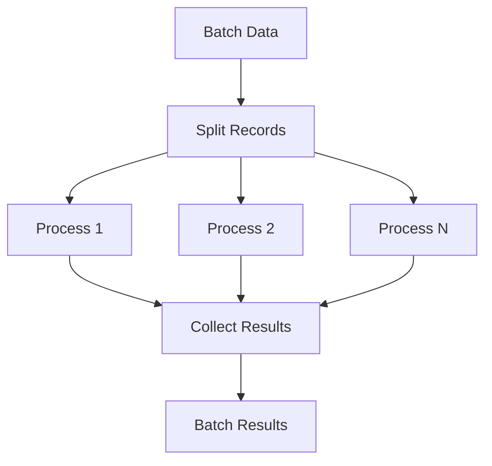

**Characteristics**:
- Multiple records processed together
- Shared transaction across batch
- Error collection for failed records
- Results aggregated in `context.batch_results`

### Stream Mode (ProcessingMode.STREAM)

Processes continuous data stream:

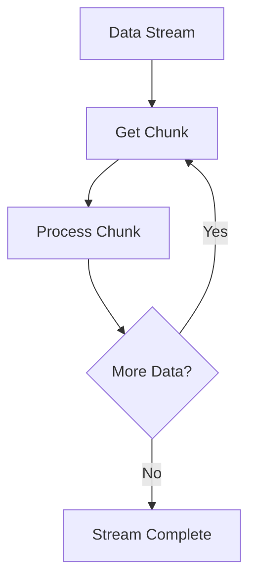

**Characteristics**:
- Chunked processing with backpressure
- Streaming transforms and aggregations
- Memory-efficient for large datasets
- Progressive result emission

## Network Stack and Subnetworks

### Push Arc Execution

Push arcs enable hierarchical FSM composition:

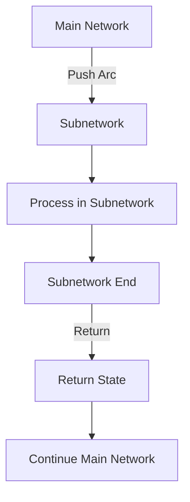

### Network Stack Management

The execution context maintains a network stack:

```python
# Push operation
context.push_network(network_name="validation_subnet", return_state="continue_main")

# Stack structure
context.network_stack = [
    ("main_network", None),
    ("validation_subnet", "continue_main"),
    # ... nested networks
]

# Pop operation
network, return_state = context.pop_network()
```

**Push Arc Processing**:

1. **Data Isolation**: Based on `isolation_mode`
   - `COPY`: Deep copy data for subnetwork
   - `REFERENCE`: Share data reference
   - `SERIALIZE`: Serialize/deserialize for isolation

2. **Data Mapping**: Transform data for subnetwork
   ```python
   # Configuration
   data_mapping: {'parent_field': 'child_field'}

   # Execution
   child_data = map_data(parent_data, data_mapping)
   ```

3. **Result Mapping**: Extract results back to parent
   ```python
   # Configuration
   result_mapping: {'child_result': 'parent_field'}

   # Execution
   parent_data.update(map_data(child_result, result_mapping))
   ```

4. **Return Processing**: Continue at specified return state
   - If `return_state` specified: transition to that state
   - Otherwise: continue from push arc's target state

### Subnetwork Execution Flow

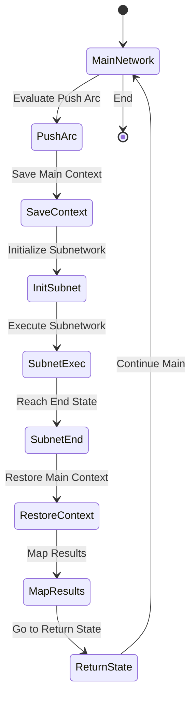

## Error Handling and Recovery

### Function Error Handling

Functions may encounter errors during execution:

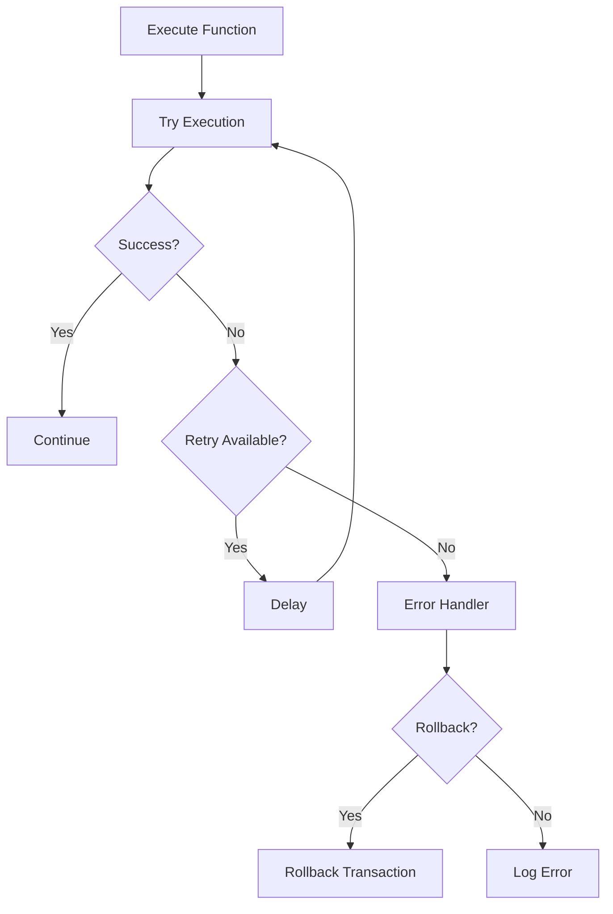

**Error Categories**:

1. **Validation Errors**: Data doesn't meet requirements
   - Logged and processing halts
   - No retry attempted

2. **Transform Errors**: Processing failures
   - Retry with exponential backoff
   - Resource re-allocation attempted

3. **Resource Errors**: External system failures
   - Circuit breaker patterns
   - Fallback to alternate resources

4. **System Errors**: Infrastructure issues
   - Transaction rollback
   - State recovery attempted

### Transaction Management

Transactions span different scopes based on mode:

**Transaction Strategies**:

- `SINGLE`: One transaction per execution
- `BATCH`: One transaction per batch
- `MANUAL`: Explicit transaction control
- `NONE`: No transaction management

**Transaction Flow**:

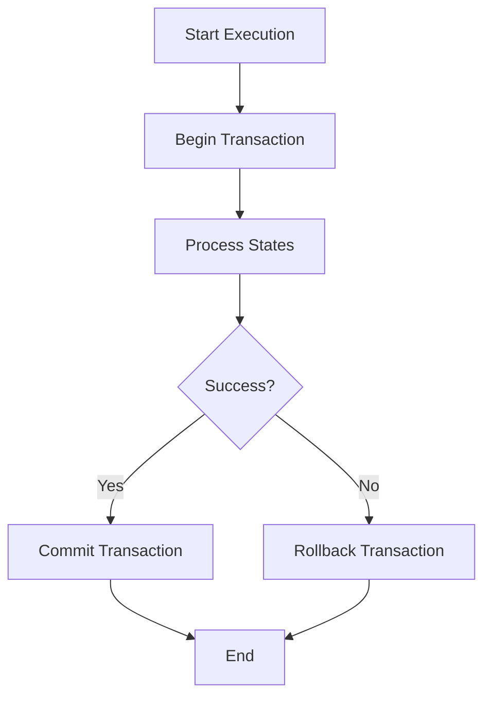

## Performance Considerations

### State Timing Tracking

The execution context tracks performance metrics:

```python
context.state_timings = {
    'validate': 0.125,
    'process': 0.847,
    'complete': 0.023
}

context.function_call_count = {
    'validate_schema': 3,
    'transform_data': 5,
    'check_condition': 12
}
```

### Optimization Strategies

1. **Arc Priority Optimization**: Order arcs by likelihood
2. **Resource Pooling**: Reuse connections and handles
3. **Batch Processing**: Group similar operations
4. **Stream Buffering**: Optimize chunk sizes
5. **Parallel Paths**: Execute independent branches concurrently

## Practical Examples

### Example 1: Simple Data Validation and Enrichment

Consider a simple data validation and enrichment FSM:

#### Configuration Example

```yaml
# Using simplified format for clarity
name: "validation_enrichment_fsm"
states:
  - name: "validate_input"
    is_start: true
    pre_validators:  # Check required fields exist
      - type: "inline"
        code: "lambda state: 'user_id' in state.data"
    transforms:
      - type: "inline"
        code: "lambda state: {**state.data, 'validated': True, 'timestamp': __import__('time').time()}"
    validators:  # Post-transform validation
      - type: "inline"
        code: "lambda state: state.data.get('validated') and state.data.get('timestamp')"

  - name: "enrich_data"
    pre_validators:  # Ensure we have valid input
      - type: "inline"
        code: "lambda state: state.data.get('validated') == True"
    transforms:
      - type: "builtin"
        name: "fetch_user_details"
    validators:  # Verify enrichment succeeded
      - type: "inline"
        code: "lambda state: 'user_details' in state.data"

  - name: "complete"
    is_end: true

arcs:
  - from: "validate_input"
    to: "enrich_data"
    condition:
      type: "inline"
      code: "lambda state: state.data.get('validated') == True"
    transform:
      type: "inline"
      code: "lambda state: {**state.data, 'timestamp': __import__('time').time()}"
    priority: 10

  - from: "enrich_data"
    to: "complete"
    condition:
      type: "inline"
      code: "lambda state: 'user_details' in state.data"
```

### Execution Flow

```
1. Input: {'user_id': 123, 'action': 'login'}

2. Enter "validate_input":
   - Pre-validator: Check 'user_id' exists ✓
   - Transform: Add 'validated': True and timestamp
   - Data: {'user_id': 123, 'action': 'login', 'validated': True, 'timestamp': 1234567890}
   - Post-validator: Check 'validated' and 'timestamp' exist ✓
   - Evaluate arc condition: validated == True ✓

3. Arc transition to "enrich_data":
   - Arc transform: (none in this example)
   - Data unchanged during transition

4. Enter "enrich_data":
   - Pre-validator: Check validated == True ✓
   - Transform: Fetch and add user details
   - Data: {'user_id': 123, 'action': 'login', 'validated': True, 'timestamp': 1234567890, 'user_details': {...}}
   - Post-validator: Check 'user_details' exists ✓
   - Evaluate arc condition: 'user_details' in data ✓

5. Transition to "complete":
   - End state reached
   - Return final data
```

### Example 2: Conditional Push Arcs with Custom Initial States

This example demonstrates conditional execution with different entry points in a subnetwork:

#### Configuration Example

```yaml
name: "order_processing_fsm"
networks:
  - name: "main"
    states:
      - name: "start"
        is_start: true
        arcs:
          # Path 1: Standard customer orders
          - target: "standard_processing"
            condition:
              type: "inline"
              code: "lambda state: state.data.get('customer_type') == 'standard'"
          # Path 2: Premium customer orders
          - target: "premium_processing"
            condition:
              type: "inline"
              code: "lambda state: state.data.get('customer_type') == 'premium'"

      - name: "standard_processing"
        arcs:
          # Push to validation network at basic validation state
          - target_network: "validation:basic_validation"
            return_state: "fulfillment"

      - name: "premium_processing"
        arcs:
          # Push to validation network at premium validation state (skips basic)
          - target_network: "validation:premium_validation"
            return_state: "priority_fulfillment"

      - name: "fulfillment"
        is_end: true

      - name: "priority_fulfillment"
        is_end: true

  - name: "validation"
    states:
      - name: "basic_validation"
        is_start: true  # Default entry point
        arcs:
          - target: "premium_validation"
        transforms:
          - type: "inline"
            code: "lambda state: {**state.data, 'basic_validated': True}"

      - name: "premium_validation"
        is_end: true
        transforms:
          - type: "inline"
            code: "lambda state: {**state.data, 'premium_validated': True}"
```

#### Execution Flow Examples

**Standard Customer Path**:
```
1. Input: {'customer_type': 'standard', 'order_id': 123}
2. start → standard_processing (condition: customer_type == 'standard')
3. Push to validation:basic_validation (enters at basic_validation state)
4. validation: basic_validation → premium_validation → end
5. Return to main:fulfillment
6. Final result: {'customer_type': 'standard', 'order_id': 123, 'basic_validated': True, 'premium_validated': True}
```

**Premium Customer Path**:
```
1. Input: {'customer_type': 'premium', 'order_id': 456}
2. start → premium_processing (condition: customer_type == 'premium')
3. Push to validation:premium_validation (skips basic_validation, enters directly at premium_validation)
4. validation: premium_validation → end
5. Return to main:priority_fulfillment
6. Final result: {'customer_type': 'premium', 'order_id': 456, 'premium_validated': True}
```

**Key Benefits**:
- **Efficiency**: Premium customers skip basic validation steps
- **Flexibility**: Different workflows based on data conditions
- **Modularity**: Validation logic contained in reusable subnetwork
- **Conditional Entry**: Push arcs support conditional execution with custom initial states

## Summary

The FSM processing flow provides a flexible, modular approach to data processing through:

- **Structured State Transitions**: Clear progression through processing stages
- **Function Composition**: Validators, transforms, and conditions at each level
- **Hierarchical Networks**: Modular subnetwork composition via push arcs
- **Multiple Execution Modes**: Single, batch, and stream processing
- **Resource Management**: Controlled allocation and release
- **Error Recovery**: Retry logic and transaction support

This architecture enables complex workflow orchestration while maintaining clarity and maintainability through well-defined interfaces and processing stages.
